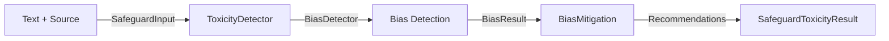

# KALDRA-Safeguard App — Specification v1.0

**Status:** v1.0  
**Modules:** `src/apps/safeguard/toxicity_detector.py`

## 1. Overview
KALDRA-Safeguard provides toxicity detection and narrative risk analysis for content moderation. It integrates with the KALDRA Bias Engine to detect harmful content, assess multi-dimensional bias, and provide actionable recommendations for mitigation.

**Key Capabilities:**
- Multi-dimensional toxicity scoring (toxicity, political, gender, racial bias)
- Severity classification (low/medium/high/critical)
- Automated flagging and recommendations
- Integration with Bias Engine (BiasDetector + BiasMitigation)

## 2. Architecture



## 3. API

### ToxicityDetector
```python
from src.apps.safeguard.toxicity_detector import ToxicityDetector

detector = ToxicityDetector(provider="heuristic", correction_factor=0.85)
result = detector.analyze(
    text="User-generated content to moderate",
    source="chat"
)

print(f"Toxicity: {result.toxicity}")
print(f"Severity: {result.severity}")
print(f"Flags: {result.flags}")
print(f"Recommendations: {result.recommendations}")
```

### SafeguardToxicityResult Structure
- `toxicity`: Overall toxicity score (0.0-1.0)
- `bias_dimensions`: Dict with toxicity, political, gender, racial scores
- `severity`: "low" | "medium" | "high" | "critical"
- `flags`: List of triggered flags (e.g., "high_toxicity", "gender_bias")
- `recommendations`: List of mitigation suggestions

## 4. Future Implementations
- **Real-time Moderation API**: Webhook integration for live chat/social platforms
- **Custom Bias Models**: Train domain-specific bias detectors (e.g., gaming, healthcare)
- **User Reputation Scoring**: Track user toxicity history
- **Automated Actions**: Auto-hide, auto-flag, or auto-escalate based on severity

## 5. Enhancements (Short/Medium Term)
- **Context-Aware Scoring**: Adjust toxicity based on source (internal docs vs. public social)
- **Multi-lingual Support**: Extend bias detection to non-English content
- **Explainability**: Highlight specific phrases triggering flags
- **Appeal Workflow**: Allow users to contest automated flags

## 6. Research Track (Long Term)
- **Adversarial Robustness**: Detect obfuscated toxicity (e.g., leetspeak, emojis)
- **Cultural Sensitivity**: Adapt bias thresholds by cultural context
- **Narrative Toxicity**: Detect subtle narrative manipulation beyond explicit toxicity
- **Generative Detoxification**: Auto-rewrite toxic content to neutral tone

## 7. Known Limitations
- **Heuristic Provider**: Default provider uses simple keyword-based detection; less accurate than ML models
- **No Persistence**: Results are not stored; each analysis is stateless
- **English-Only**: No multi-lingual support in v1.0
- **Context-Blind**: Does not consider conversation history or user intent

## 8. Testing
**Location**: `tests/apps/safeguard/`
**Files**:
- `test_toxicity_detector.py`: Toxicity detection, severity levels, recommendations

**Command**: `pytest tests/apps/safeguard -v`

## 9. Next Steps
- [ ] Integrate Perspective API or Detoxify for improved accuracy
- [ ] Add context-aware scoring based on source type
- [ ] Implement user reputation tracking
- [ ] Create Safeguard moderation dashboard

## 10. Related Documentation
- `docs/core/BIAS_ENGINE_SPEC.md`
- `docs/apps/ALPHA_APP_SPEC.md`
- `src/bias/` (Bias Engine implementation)

## 11. Version History
- **v1.0** (2025-11-27): Initial implementation with heuristic bias detection
