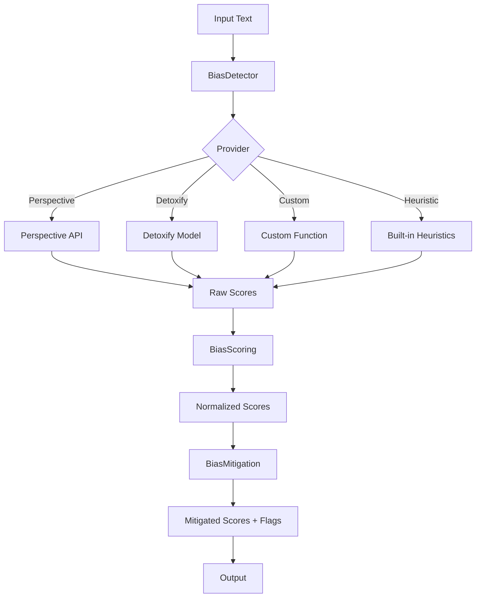

# KALDRA Bias Engine — Specification v1.0

**Version:** 1.0  
**Status:** Production-Ready  
**Last Updated:** 2025-11-27  
**Module:** `src/bias/`

---

## 1. Overview

The **KALDRA Bias Engine v1.0** provides comprehensive bias detection, scoring, and mitigation capabilities for narrative and cultural data analysis. It operates as a standalone module that can be integrated into any KALDRA pipeline to ensure fair, balanced, and bias-aware analysis.

### Key Capabilities

- **Multi-Provider Detection**: Support for Perspective API, Detoxify, custom classifiers, and built-in heuristics
- **Multi-Dimensional Scoring**: Analysis across toxicity, political, gender, and racial bias dimensions
- **Mitigation Strategies**: Correction, flagging, and confidence shaping
- **Zero Dependencies**: Core functionality works without external dependencies
- **Backward Compatible**: Preserves existing API for seamless integration

### Design Principles

1. **Modularity**: Each component (detection, scoring, mitigation) is independent
2. **Extensibility**: Easy to add new providers and dimensions
3. **Graceful Degradation**: Falls back to heuristics when external providers unavailable
4. **Transparency**: Clear explanations and recommendations for detected bias

---

## 2. Architecture

### Component Diagram



### Module Structure

```
src/bias/
├── __init__.py          # Module exports
├── detector.py          # BiasDetector class + heuristic function
├── scoring.py           # BiasScoring class + classification function
├── mitigation.py        # BiasMitigation class
└── bias_schema.json     # Configuration schema
```

---

## 3. Pipeline

### Standard Flow

```python
from src.bias.detector import BiasDetector
from src.bias.scoring import BiasScoring
from src.bias.mitigation import BiasMitigation

# 1. Detection
detector = BiasDetector(provider="heuristic")
raw_scores = detector.detect("This is absolutely the worst thing ever!")

# 2. Scoring
scorer = BiasScoring()
normalized_scores = scorer.compute(raw_scores)

# 3. Mitigation
mitigator = BiasMitigation()
result = mitigator.apply(normalized_scores)

print(result)
# {
#   'mitigated_scores': {'toxicity': 0.68, 'political': 0.0, ...},
#   'flags': ['toxicity'],
#   'severity': 'high'
# }
```

### Integration with KALDRA Master Engine

```python
from src.core.kaldra_master_engine import KaldraMasterEngineV2
from src.bias.detector import BiasDetector
from src.bias.mitigation import BiasMitigation

# Optional: Add bias detection to pipeline
detector = BiasDetector(provider="heuristic")
mitigator = BiasMitigation()

text = "User input text"
bias_scores = detector.detect(text)
mitigation_result = mitigator.apply(bias_scores)

# Proceed with Master Engine if bias is acceptable
if mitigation_result['severity'] in ['low', 'medium']:
    engine = KaldraMasterEngineV2()
    # ... continue with normal processing
else:
    # Handle high-bias content
    print(f"High bias detected: {mitigation_result['flags']}")
```

---

## 4. API Documentation

### 4.1 BiasDetector

**Location**: `src/bias/detector.py`

#### Class: `BiasDetector`

Multi-provider bias detection wrapper.

**Constructor**:
```python
BiasDetector(
    provider: str = "heuristic",
    perspective_client: Optional[Any] = None,
    detoxify_model: Optional[Any] = None,
    custom_fn: Optional[Callable[[str], Dict[str, float]]] = None
)
```

**Parameters**:
- `provider`: Detection provider (`"perspective"`, `"detoxify"`, `"custom"`, `"heuristic"`)
- `perspective_client`: Optional Perspective API client
- `detoxify_model`: Optional Detoxify model instance
- `custom_fn`: Optional custom detection function

**Methods**:

##### `detect(text: str) -> Dict[str, float]`

Detect bias in text using configured provider.

**Returns**: Dictionary with scores for each dimension:
- `toxicity`: [0.0, 1.0]
- `political`: [0.0, 1.0]
- `gender`: [0.0, 1.0]
- `racial`: [0.0, 1.0]

**Example**:
```python
detector = BiasDetector(provider="heuristic")
scores = detector.detect("This is terrible!")
# {'toxicity': 0.5, 'political': 0.15, 'gender': 0.1, 'racial': 0.1}
```

#### Function: `compute_bias_score_from_text(text: str) -> Dict[str, Any]`

Legacy heuristic bias detection (preserved for backward compatibility).

**Returns**: Dictionary with:
- `bias_score`: Overall score [0.0, 1.0]
- `features`: Extracted features (length, exclamations, caps, keywords)

---

### 4.2 BiasScoring

**Location**: `src/bias/scoring.py`

#### Class: `BiasScoring`

Multi-dimensional bias scoring and aggregation.

**Methods**:

##### `compute(raw_scores: Dict[str, float]) -> Dict[str, float]`

Normalize raw scores to [0.0, 1.0] across all dimensions.

**Example**:
```python
scorer = BiasScoring()
normalized = scorer.compute({'toxicity': 1.5, 'political': -0.2})
# {'toxicity': 1.0, 'political': 0.0, 'gender': 0.0, 'racial': 0.0}
```

##### `aggregate(scores: Dict[str, float], weights: Dict[str, float] = None) -> float`

Compute weighted aggregate bias score.

**Example**:
```python
scores = {'toxicity': 0.8, 'political': 0.3, 'gender': 0.1, 'racial': 0.0}
aggregate = scorer.aggregate(scores)  # 0.3 (equal weights)

# Custom weights
weights = {'toxicity': 0.5, 'political': 0.2, 'gender': 0.15, 'racial': 0.15}
aggregate = scorer.aggregate(scores, weights)  # 0.475
```

#### Function: `classify_bias(score: float) -> str`

Legacy classification function (preserved for backward compatibility).

**Returns**: `"neutral"`, `"negative"`, `"positive"`, or `"extreme"`

---

### 4.3 BiasMitigation

**Location**: `src/bias/mitigation.py`

#### Class: `BiasMitigation`

Bias mitigation strategies.

**Constructor**:
```python
BiasMitigation(
    correction_factor: float = 0.85,
    flag_threshold: float = 0.8,
    extreme_threshold: float = 0.7
)
```

**Methods**:

##### `apply(bias_scores: Dict[str, float]) -> Dict[str, Any]`

Apply mitigation strategies to bias scores.

**Returns**: Dictionary with:
- `mitigated_scores`: Corrected scores
- `flags`: List of flagged dimensions
- `severity`: Overall severity (`"low"`, `"medium"`, `"high"`, `"critical"`)

**Example**:
```python
mitigator = BiasMitigation()
result = mitigator.apply({'toxicity': 0.9, 'political': 0.3})
# {
#   'mitigated_scores': {'toxicity': 0.765, 'political': 0.3},
#   'flags': ['toxicity'],
#   'severity': 'critical'
# }
```

##### `shape_confidence(confidence: float, bias_scores: Dict[str, float]) -> float`

Adjust confidence score based on detected bias.

**Example**:
```python
adjusted = mitigator.shape_confidence(0.9, {'toxicity': 0.8})
# 0.72 (reduced due to high toxicity)
```

##### `generate_recommendations(flags: List[str]) -> List[str]`

Generate human-readable mitigation recommendations.

**Example**:
```python
recommendations = mitigator.generate_recommendations(['toxicity', 'gender'])
# ['Review content for toxic language', 'Check for gender bias or stereotyping']
```

---

## 5. Future Implementations

### 5.1 Persistent Bias Tracking

**Database Storage**:
- PostgreSQL for bias history tracking
- MongoDB for flexible bias event storage
- Time-series analysis of bias trends

**Features**:
- Track bias evolution over time
- Source-level bias profiling
- Anomaly detection in bias patterns

### 5.2 Real-Time Bias Monitoring

**Streaming Integration**:
- Kafka/Pulsar for real-time bias detection
- WebSocket streaming for live dashboards
- Alert system for bias threshold violations

**Use Cases**:
- Live content moderation
- Real-time narrative monitoring
- Automated flagging systems

### 5.3 Advanced Model Integration

**Fine-Tuned Models**:
- BERT-based bias classifiers trained on KALDRA domain data
- Multi-language bias detection (Portuguese, Spanish, etc.)
- Domain-specific models (finance, geopolitics, etc.)

**Model Serving**:
- GPU-accelerated inference
- Batch processing optimization
- Model versioning and A/B testing

### 5.4 De-Biasing Preprocessor

**Automatic Rewriting**:
- Neutralize detected bias before analysis
- Preserve semantic meaning while reducing bias
- Configurable de-biasing strategies

**Integration**:
- Optional pipeline step before Kindra scoring
- Preserve original text for audit trail
- Compare biased vs. de-biased results

---

## 6. Enhancements (Short/Medium Term)

### 6.1 Explainability

**Feature Importance**:
- Highlight specific words/phrases triggering bias scores
- Provide contextual explanations
- Generate bias reports with evidence

**Example Output**:
```json
{
  "toxicity": 0.8,
  "evidence": ["worst", "terrible", "hate"],
  "explanation": "High toxicity due to negative emotional language"
}
```

### 6.2 Configurable Thresholds

**User-Defined Sensitivity**:
- Adjust flag thresholds per use case
- Domain-specific bias definitions
- Custom dimension weights

**Configuration Schema**:
```json
{
  "thresholds": {
    "toxicity": 0.7,
    "political": 0.6,
    "gender": 0.8,
    "racial": 0.8
  },
  "weights": {
    "toxicity": 0.5,
    "political": 0.2,
    "gender": 0.15,
    "racial": 0.15
  }
}
```

### 6.3 Batch Processing

**Efficient Bulk Analysis**:
- Process multiple texts in parallel
- Caching for repeated content
- Batch API calls to external providers

**Performance**:
- 10-100x throughput improvement
- Reduced API costs
- Optimized resource utilization

### 6.4 Bias Dimension Expansion

**Additional Dimensions**:
- Socioeconomic bias
- Age bias
- Religious bias
- Disability bias
- Geographic bias

**Intersectionality**:
- Detect overlapping bias (e.g., race + gender)
- Multi-dimensional bias patterns
- Compound bias scoring

---

## 7. Research Track (Long Term)

### 7.1 Counterfactual Fairness

**Methodology**:
- Test if output changes when sensitive attributes are flipped
- Example: "He is a great leader" vs. "She is a great leader"
- Measure bias through counterfactual analysis

**Applications**:
- Validate bias detection accuracy
- Identify hidden biases
- Improve model fairness

### 7.2 Unsupervised Bias Discovery

**Techniques**:
- Clustering to identify bias patterns
- Anomaly detection for emerging biases
- Topic modeling for bias themes

**Goals**:
- Discover previously unknown bias forms
- Adapt to evolving cultural narratives
- Proactive bias identification

### 7.3 Cultural Relativism

**Context-Aware Bias**:
- Adjust bias definitions based on cultural context
- What is biased in US vs. Japan vs. Brazil
- Multi-cultural bias models

**Implementation**:
- Culture-specific bias classifiers
- Contextual bias thresholds
- Cross-cultural bias analysis

### 7.4 Adversarial Robustness

**Attack Resistance**:
- Detect attempts to bypass bias filters
- Adversarial training for robustness
- Evasion technique identification

**Defense Strategies**:
- Character-level perturbation detection
- Semantic similarity checks
- Multi-model ensemble voting

### 7.5 Bias in Embeddings

**Embedding Analysis**:
- Detect bias in embedding spaces
- Measure geometric bias (e.g., gender direction in word2vec)
- De-bias embedding representations

**Integration**:
- Analyze KALDRA embedding layer for bias
- Apply de-biasing transformations
- Validate embedding fairness

---

## 8. Known Limitations

### 8.1 Context Sensitivity

**Issue**: Simple classifiers may flag neutral discussions of sensitive topics as biased.

**Example**: Academic discussion of historical racism may be flagged as racially biased.

**Mitigation**: Use context-aware models and human review for edge cases.

### 8.2 Language Support

**Current State**: Heuristic detector is English-centric.

**Limitation**: Keyword-based detection doesn't work well for other languages.

**Future**: Multi-language models (Perspective API supports 17+ languages).

### 8.3 Definition Ambiguity

**Challenge**: "Bias" is subjective and context-dependent.

**Impact**: Engine's definition may not match every user's definition.

**Approach**: Configurable thresholds and custom classifiers for domain-specific needs.

### 8.4 Optional Dependencies

**Perspective API**:
- Requires API key and quota management
- Rate limiting considerations
- Cost implications for high-volume usage

**Detoxify**:
- Requires PyTorch installation (~1GB)
- GPU recommended for performance
- Model loading overhead

**Fallback**: Heuristic detector always available as zero-dependency option.

### 8.5 Performance Considerations

**Heuristic Detector**:
- Fast but less accurate
- Good for real-time applications
- Limited to keyword/feature-based detection

**External Providers**:
- Higher accuracy but slower
- API latency (100-500ms)
- Cost and quota management

**Trade-off**: Choose provider based on accuracy vs. speed requirements.

---

## Architecture (v2.3)

The Bias Engine uses a provider-based architecture for modularity and extensibility.

### Components

1. **BiasDetector** (`src/bias/detector.py`)
   - Main facade accepting injected `BiasProvider`
   - Defaults to `HeuristicProvider` if no provider specified

2. **BiasProvider** (`src/bias/providers/base.py`)
   - Abstract interface defining `detect(text) -> Dict[str, float]`

3. **HeuristicProvider** (`src/bias/providers/heuristic.py`)
   - Built-in keyword and feature-based detection
   - No external dependencies
   - Fallback for all scenarios

4. **PerspectiveProvider** (`src/bias/providers/perspective.py`)
   - Google Perspective API integration via `requests`
   - Configured via `PERSPECTIVE_API_KEY`

### Configuration

Environment variables:
```bash
KALDRA_BIAS_PROVIDER=perspective  # or heuristic
PERSPECTIVE_API_KEY=YOUR_KEY
```

### Usage

```python
from src.bias import BiasDetector
from src.bias.providers.perspective import PerspectiveProvider

# Default (heuristic)
detector = BiasDetector()
result = detector.detect("Text to analyze")

# With Perspective API
perspective = PerspectiveProvider(api_key="YOUR_KEY")
detector = BiasDetector(provider=perspective)
result = detector.detect("Text to analyze")
```

## 9. Testing Strategy

### 9.1 Unit Tests

**Coverage**:
- BiasDetector with all providers
- BiasScoring normalization and aggregation
- BiasMitigation correction and flagging

**Test Cases**:
```python
# Test heuristic detector
def test_heuristic_detector():
    detector = BiasDetector(provider="heuristic")
    scores = detector.detect("This is terrible!")
    assert 0.0 <= scores['toxicity'] <= 1.0
    assert all(dim in scores for dim in ['toxicity', 'political', 'gender', 'racial'])

# Test scoring normalization
def test_scoring_normalization():
    scorer = BiasScoring()
    scores = scorer.compute({'toxicity': 1.5, 'political': -0.2})
    assert scores['toxicity'] == 1.0
    assert scores['political'] == 0.0

# Test mitigation flagging
def test_mitigation_flagging():
    mitigator = BiasMitigation(flag_threshold=0.8)
    result = mitigator.apply({'toxicity': 0.9, 'political': 0.3})
    assert 'toxicity' in result['flags']
    assert 'political' not in result['flags']
```

### 9.2 Integration Tests

**End-to-End Pipeline**:
```python
def test_full_bias_pipeline():
    # Detection
    detector = BiasDetector(provider="heuristic")
    raw_scores = detector.detect("This is the worst!")
    
    # Scoring
    scorer = BiasScoring()
    normalized = scorer.compute(raw_scores)
    
    # Mitigation
    mitigator = BiasMitigation()
    result = mitigator.apply(normalized)
    
    assert 'mitigated_scores' in result
    assert 'flags' in result
    assert 'severity' in result
```

### 9.3 Provider-Specific Tests

**Custom Provider**:
```python
def test_custom_provider():
    def custom_fn(text):
        return {'toxicity': 0.5, 'political': 0.0, 'gender': 0.0, 'racial': 0.0}
    
    detector = BiasDetector(provider="custom", custom_fn=custom_fn)
    scores = detector.detect("Test")
    assert scores['toxicity'] == 0.5
```

**Graceful Degradation**:
```python
def test_fallback_to_heuristic():
    # Provider without client should fall back
    detector = BiasDetector(provider="perspective")  # No client provided
    # Should raise ValueError
    with pytest.raises(ValueError):
        detector.detect("Test")
```

### 9.4 Backward Compatibility Tests

**Existing Functions**:
```python
def test_backward_compatibility():
    from src.bias.detector import compute_bias_score_from_text
    from src.bias.scoring import classify_bias
    
    # Legacy heuristic function
    result = compute_bias_score_from_text("Test text")
    assert "bias_score" in result
    assert "features" in result
    
    # Legacy classification function
    label = classify_bias(0.5)
    assert label in ["neutral", "negative", "positive", "extreme"]
```

---

## 10. Next Steps

### 10.1 Immediate (Sprint 2.3)

- [x] Implement BiasDetector with multi-provider support
- [x] Implement BiasScoring with multi-dimensional analysis
- [x] Implement BiasMitigation with correction and flagging
- [x] Create comprehensive documentation
- [ ] Add unit tests for all modules
- [ ] Add integration tests for full pipeline
- [ ] Update `src/bias/__init__.py` with exports

### 10.2 Short Term (v2.4)

- [ ] Integrate Perspective API (real implementation)
- [ ] Integrate Detoxify model (real implementation)
- [ ] Add explainability features (evidence highlighting)
- [ ] Implement configurable thresholds
- [ ] Create bias reporting dashboard

### 10.3 Medium Term (v2.5)

- [ ] Fine-tune BERT-based bias classifier on KALDRA data
- [ ] Add multi-language support (Portuguese, Spanish)
- [ ] Implement batch processing optimization
- [ ] Add persistent bias tracking (PostgreSQL)
- [ ] Create de-biasing preprocessor

### 10.4 Long Term (v3.0+)

- [ ] Counterfactual fairness testing
- [ ] Unsupervised bias discovery
- [ ] Cultural relativism models
- [ ] Adversarial robustness training
- [ ] Embedding bias analysis and de-biasing

---

## 11. Related Documentation

- [KALDRA Core Master Roadmap](./KALDRA_CORE_MASTER_ROADMAP_V2.2.md)
- [Master Engine README](./README_MASTER_ENGINE_V2.md)
- [Kindra Scoring Specification](../kindras/KINDRA_DEVELOPER_GUIDE.md)
- [TW369 Engine Specification](./TW369_ENGINE_SPEC.md)

---

## 12. Version History

- **v1.0** (2025-11-27): Initial implementation
  - Multi-provider BiasDetector (Perspective, Detoxify, Custom, Heuristic)
  - Multi-dimensional BiasScoring (toxicity, political, gender, racial)
  - BiasMitigation with correction, flagging, confidence shaping
  - Comprehensive documentation with future roadmap
  - Backward compatibility preserved

---

**Document Status**: Complete and Production-Ready  
**Location**: `docs/core/BIAS_ENGINE_SPEC.md`  
**Maintainer**: KALDRA Core Team
