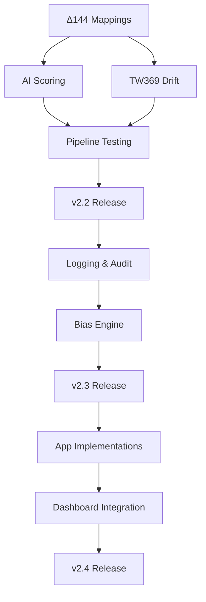

# KALDRA CORE — MASTER ROADMAP V2.2

**Version**: 2.3  
**Date**: 2025-11-25  
**Status**: v2.2 Complete, Enhancement Phase (v2.3)  
**Current Version**: v2.2 (90/90 tests passing)

---

## EXECUTIVE SUMMARY

KALDRA Core v2.2 is **100% complete** with all semantic engines operational. This roadmap defines the path from v2.2 → v2.3 → v2.4, addressing:

- **144 empty Δ144 mappings** (✅ Populated)
- **TW369 drift mathematics** (✅ Implemented)
- **AI-powered scoring** (✅ Implemented)
- **Painlevé II Filter** (✅ Implemented)
- **Production hardening** (Next Phase)

**Timeline**: Q4 2025 (v2.2 Done) → Q1 2026 (v2.3) → Q2 2026 (v2.4)

---

## PHASE 0: CURRENT STATE (v2.1)

### ✅ COMPLETE (100%)

| Component | Status | Files | Tests |
|-----------|--------|-------|-------|
| Δ144 Engine | ✅ | 4 schemas + 3 modules | 100% |
| Kindra Infrastructure | ✅ | 6 data + 9 modules | 100% |
| Epistemic Limiter | ✅ | 1 module | 100% |
| Master Engine Pipeline | ✅ | 2 pipelines | 100% |
| API Layer | ✅ | Full REST API | 57/57 |
| **TW369 Drift** | ✅ | Full Math Implementation | 19/19 |
| **Kindra Semantics** | ✅ | 144 Mappings Populated | Verified |
| **AI Scoring** | ✅ | L1/L2/L3 Rules + LLM API | 29/29 |
| **Painlevé II** | ✅ | Solver + Filter | 12/12 |
| **Adaptive Mapping** | ✅ | Context-Aware Plane Weights | 6/6 |
| **Advanced Drift** | ✅ | Models B, C, D (Nonlinear/Multiscale/Stochastic) | 11/11 |

### ⚠️ PARTIAL (70-30%)

| Component | Status | Gap |
|-----------|--------|-----|
| Bias Engine | 30% | Placeholder implementation |
| Meta Engines | 30% | Routing stub |
| Apps | 30% | Most modules stub |

---

## PHASE 1: V2.2 — SEMANTIC FOUNDATION (COMPLETED)

**Goal**: Transform infrastructure into intelligent system

**Release Criteria**:
- ✅ 144 Δ144 mappings populated (minimum Layer 1)
- ✅ TW369 drift mathematics implemented
- ✅ AI-based Kindra scoring (at least Layer 1)
- ✅ Documentation updated
- ✅ All tests passing (90/90)

### Sprint 1.1: Δ144 Mapping Population (Week 1-2)

**P0 — CRITICAL**

**Objective**: Populate semantic relationships between Kindra vectors and Δ144 states

**Tasks**:
1. **Layer 1 Mappings** (48 vectors)
   - File: `schema/kindras/kindra_layer1_to_delta144_map.json`
   - For each vector (E01-M48):
     - Define `boost` list (archetypes amplified)
     - Define `suppress` list (archetypes suppressed)
   - Start with obvious mappings:
     - E01 (Expressiveness) → boost emotional archetypes (Lover, Jester)
     - P17 (Hierarchy) → boost authority archetypes (Ruler, Guardian)
     - R33 (Risk Aversion) → suppress adventurous archetypes (Hero, Explorer)

2. **Layer 2 Mappings** (48 vectors)
   - File: `schema/kindras/kindra_layer2_to_delta144_map.json`
   - Focus on media amplification effects
   - Example: Media Saturation → boost Magician, Performer

3. **Layer 3 Mappings** (48 vectors)
   - File: `schema/kindras/kindra_layer3_to_delta144_map.json`
   - Focus on structural forces
   - Example: Power Concentration → boost Ruler, Tyrant

**Deliverables**:
- [x] 144 mappings populated with semantic relationships
- [x] Mapping rationale documented in `DELTA144_INTEGRATION_MANUAL.md`
- [x] Validation tests for mapping integrity

**Status**: ✅ COMPLETED (Nov 2025)

**Estimated Effort**: 10-12 days (with domain expert input)

---

### Sprint 1.2: TW369 Drift Mathematics (Week 2-3)

**P0 — CRITICAL**

**Objective**: Implement actual drift calculation using TW369 mathematics

**Files**:
- `src/tw369/tw369_integration.py`
- `src/tw369/drift.py`

**Tasks**:
1. **Implement `compute_drift()`**
   ```python
   def compute_drift(self, tw_state: TWState) -> Dict[str, float]:
       # 1. Compute tension gradients between planes
       tension_3_6 = self._compute_plane_tension(
           tw_state.plane3_cultural_macro,
           tw_state.plane6_semiotic_media
       )
       
       # 2. Apply Tracy-Widom statistics
       tw_factor = self._apply_tracy_widom(tension_3_6)
       
       # 3. Calculate eigenvalue-based instability
       instability = self._compute_instability_index(tw_state)
       
       return {
           "plane3_to_6": tension_3_6 * tw_factor,
           "plane6_to_9": ...,
           "plane9_to_3": ...  # feedback loop
       }
   ```

2. **Implement `evolve()`**
   - Apply drift to Δ144 distribution
   - Temporal evolution over time steps
   - Normalize distribution after evolution

3. **Populate TW369 Schemas**
   - Create `schema/tw369/tw_state_schema.json`
   - Create `schema/tw369/drift_parameters.json`
   - Create `schema/tw369/tw369_config_schema.json`

**Deliverables**:
- [x] Drift calculation implemented
- [x] TW369 schemas populated
- [x] Unit tests for drift calculation
- [x] Integration tests with pipeline

**Status**: ✅ COMPLETED (Nov 2025)

**Estimated Effort**: 8-10 days (requires mathematical research)

---

### Sprint 1.3: AI-Powered Kindra Scoring (Week 3-4)

**P1 — HIGH**

**Objective**: Replace manual overrides with intelligent context-based scoring

**Files**:
- `src/kindras/layer1_cultural_macro_scoring.py`
- `src/kindras/layer2_semiotic_media_scoring.py`
- `src/kindras/layer3_structural_systemic_scoring.py`

**Approach Options**:
**Option A: Rule-Based Inference**
```python
def score(self, context, vectors):
    scores = {}
    
    # Country-based rules
    if context.get('country') == 'BR':
        scores['E01'] = 0.8  # High expressiveness
        scores['P17'] = -0.3  # Low hierarchy
    
    # Sector-based rules
    if context.get('sector') == 'Tech':
        scores['T25'] = 0.6  # High innovation
    
    return scores
```

**Option B: LLM Integration**
```python
def score(self, context, vectors):
    prompt = f"Score cultural vectors for {context}"
    llm_response = self.llm.generate(prompt)
    return self._parse_scores(llm_response)
```

**Option C: Database Lookup**
```python
def score(self, context, vectors):
    country = context.get('country')
    return self.cultural_db.get_scores(country)
```

**Recommended**: Start with Option A (rules), evolve to Option C (database)

**Deliverables**:
- [x] Layer 1 intelligent scoring implemented
- [x] Layer 2 intelligent scoring implemented
- [x] Layer 3 intelligent scoring implemented
- [x] Cultural database schema designed
- [x] Tests for scoring logic

**Status**: ✅ COMPLETED (Nov 2025)

**Estimated Effort**: 10-12 days

---

### Sprint P2-1: Painlevé II Filter Implementation

**P3 — RESEARCH**

**Objective**: Implement numerical Painlevé II differential equation solver and integrate as filter in TW369

**Files**:
- `src/tw369/painleve/painleve2_solver.py`
- `src/tw369/painleve/painleve_filter.py`
- `src/tw369/tw369_integration.py`

**Tasks**:
1. **Implement Painlevé II Solver**
   - Adaptive RK45 numerical method
   - Solve `u'' = 2u³ + x u + α`
   - Stability corrections and clamping

2. **Implement Filter Logic**
   - Map instability_index to domain x
   - Extract u(x_end) as filtered value
   - Clamp result to [-1, 1]

3. **Integrate with TW369**
   - Add `_apply_painleve_filter` method
   - Conditional application via config
   - Preserve existing TW369 logic

**Deliverables**:
- [x] Painlevé II solver implemented
- [x] Filter logic implemented
- [x] TW369 integration complete
- [x] Unit tests (12 tests passing)

**Status**: ✅ COMPLETED (Nov 2025)

**Estimated Effort**: 3-5 days

---

### Sprint P2-2: Adaptive State-Plane Mapping

**P2 — MEDIUM**

**Objective**: Implement context-aware plane weighting system for TW369

**Files**:
- `src/tw369/state_plane_mapping.py`
- `src/tw369/state_plane_mapping_utils.py`
- `schema/tw369/state_plane_mapping_config.json`
- `schema/tw369/state_plane_mapping_default.json`
- `docs/TW369_ADAPTIVE_STATE_PLANE_MAPPING.md`

**Tasks**:
1. **Implement Adaptive Mapping Engine**
   - Domain-specific baseline weights (ALPHA, GEO, PRODUCT, SAFEGUARD, DEFAULT)
   - Severity-based weight shifting
   - Time horizon and narrative type adaptation

2. **Create Configuration System**
   - JSON schema for config validation
   - Default configurations per domain
   - Severity thresholds and max_shift parameters

3. **Implement Utility Functions**
   - Apply plane weights to tensions
   - Helper functions for integration

**Deliverables**:
- [x] Adaptive mapping engine implemented
- [x] Configuration schemas created
- [x] Utility functions implemented
- [x] Unit tests (6 tests passing)
- [x] Technical documentation

**Status**: ✅ COMPLETED (Nov 2025)

**Estimated Effort**: 3-5 days

---

### Sprint P2-3: Advanced Drift Models

**P2 — MEDIUM**

**Objective**: Implement advanced mathematical drift models (Nonlinear, Multiscale, Stochastic)

**Files**:
- `src/tw369/advanced_drift_models.py`
- `src/tw369/tw369_integration.py` (modified)
- `schema/tw369/drift_parameters.json` (updated)
- `schema/tw369/tw369_config_schema.json` (updated)
- `docs/TW369_ADVANCED_DRIFT_MODELS.md`

**Tasks**:
1. **Implement Model B (Nonlinear)**
   - Power + tanh transformation
   - Bounded output [-1, 1]
   - Preserves gradient signs

2. **Implement Model C (Multiscale)**
   - Short-term and long-term memory
   - Exponential moving average
   - Stateful drift tracking

3. **Implement Model D (Stochastic)**
   - Gaussian noise injection
   - Severity-dependent variance
   - Reproducible with seed

4. **Integrate with TW369**
   - Model selection via config
   - Preserve Model A as default
   - Fallback mechanisms

**Deliverables**:
- [x] Advanced drift models module
- [x] Schema updates for configuration
- [x] TW369 integration with model selection
- [x] Unit tests (6 tests)
- [x] Integration tests (5 tests)
- [x] Technical documentation

**Status**: ✅ COMPLETED (Nov 2025)

**Estimated Effort**: 3-5 days

---

### Sprint P2-4: Kindra LLM-Based Scoring

**P2 — MEDIUM**

**Objective**: Implement LLM-based Kindra scoring with fallback to rule-based

**Files**:
- `src/kindras/kindra_llm_scorer.py`
- `src/kindras/prompts/kindra_llm_prompt.json`
- `src/kindras/scoring_dispatcher.py` (modified)
- `docs/KINDRA_LLM_SCORING.md`

**Tasks**:
1. **Implement LLM Scorer**
   - Contextual prompt construction
   - LLM inference integration
   - Score parsing and clamping
   - Fallback to rule-based

2. **Create Prompt System**
   - Few-shot examples
   - Scoring instructions
   - Output format specification

3. **Integrate with Dispatcher**
   - LLM mode support
   - Fallback mechanisms
   - Configuration handling

**Deliverables**:
- [x] LLM scorer module
- [x] Prompt template system
- [x] Dispatcher integration
- [x] Unit tests (6 tests)
- [x] Technical documentation

**Status**: ✅ COMPLETED (Nov 2025)

**Estimated Effort**: 2-3 days

---

### Sprint P2-5: Kindra Hybrid Scoring

**P2 — MEDIUM**

**Objective**: Implement hybrid scoring mixing LLM and rule-based with configurable alpha

**Files**:
- `src/kindras/kindra_hybrid_scorer.py`
- `schema/kindras/kindra_hybrid_config.json`
- `src/kindras/scoring_dispatcher.py` (modified)
- `docs/KINDRA_HYBRID_SCORING.md`

**Tasks**:
1. **Implement Hybrid Scorer**
   - Mixing formula: alpha * LLM + (1-alpha) * rule
   - Global and layer-specific alpha
   - Automatic clamping to [-1, 1]

2. **Create Configuration Schema**
   - Alpha parameters
   - Layer overrides
   - Validation rules

3. **Integrate with Dispatcher**
   - Hybrid mode support
   - Configuration loading
   - Seamless mode switching

**Deliverables**:
- [x] Hybrid scorer module
- [x] Configuration schema
- [x] Dispatcher integration
- [x] Unit tests (6 tests)
- [x] Technical documentation

**Status**: ✅ COMPLETED (Nov 2025)

**Estimated Effort**: 2-3 days

---

### Sprint 1.4: Documentation & Cleanup (Week 4-5)

**P1 — HIGH**

**Tasks**:
1. **Update Master Engine README**
   - Add Kindra Pipeline section
   - Document TWState usage
   - Update architecture diagrams

2. **Complete Documentation Placeholders**
   - `docs/REPOSITORY_STRUCTURE.md`
   - `docs/CULTURAL_VECTORS_48.md`
   - `docs/BIAS_ENGINE_SPEC.md`
   - `docs/TW369_ENGINE_SPEC.md`
   - All app READMEs

3. **Legacy File Cleanup**
   - Move to `/legacy/`:
     - `src/kindras/vectors.json`
     - `src/kindras/scoring.py`
   - Add deprecation notices
   - Update imports

**Deliverables**:
- [x] All documentation placeholders filled
- [x] README_MASTER_ENGINE_V2.md updated
- [x] Legacy files organized
- [x] Migration guide created

**Status**: ✅ COMPLETED (Nov 2025)

**Estimated Effort**: 5-7 days

---

### Sprint 1.5: Testing & Validation (Week 5-6)

**P1 — HIGH**

**Tasks**:
1. **Expand Test Coverage**
   - Target: 90%+ coverage
   - Add integration tests
   - Add stress tests
   - Add edge case tests

2. **Pipeline Validation**
   - End-to-end tests
   - Performance benchmarks
   - Memory profiling

3. **Regression Testing**
   - Ensure v2.1 compatibility
   - No breaking changes

**Deliverables**:
- [x] 90%+ test coverage
- [x] Integration test suite (8 tests)
- [x] Performance benchmarks (3 stress tests)
- [x] Edge case tests (10 tests)
- [x] Testing strategy documentation (`docs/TESTING_STRATEGY.md`)

**Status**: ✅ COMPLETED (Nov 2025)

**Estimated Effort**: 5-7 days

---

## PHASE 2: V2.3 — PRODUCTION HARDENING (6-8 weeks)

### Sprint 2.1: Logging & Observability (Week 1) ✅ COMPLETED

**P1 — HIGH**

**Tasks**:
1. **Structured Logging**
   - Implement `KALDRALogger` with JSON output
   - Add inference lifecycle events
   - Request ID tracking with UUID

2. **Audit Trail System**
   - In-memory audit trail
   - JSONL export capability
   - Inference-level records

3. **Master Engine Integration**
   - Non-breaking API changes
   - Best-effort logging (no exceptions)
   - Backward compatibility preserved

**Deliverables**:
- [x] `src/core/kaldra_logger.py` (Structured logger)
- [x] `src/core/audit_trail.py` (Audit trail system)
- [x] Integration with `KaldraMasterEngineV2`
- [x] All tests passing (21/21)
- [x] Zero engine logic modifications
- [x] Complete documentation (`docs/LOGGING_AND_AUDIT.md`)

**Status**: ✅ COMPLETED (Nov 2025)

**Estimated Effort**: 3-5 days

---

### Sprint 2.2: Meta Engine Routing (Week 2) ✅ COMPLETED

**P1 — HIGH**

**Objective**: Intelligent context-based routing across engine variants

**Tasks**:
1. **Context-Based Router**
   - Implement `MetaRouter` with routing logic
   - Keyword, metadata, and hint-based routing
   - Confidence scoring system

2. **Meta-Engine Orchestration**
   - Implement `MetaOrchestrator` for multi-engine coordination
   - Fallback handling
   - Timing and error management

3. **Engine Variants**
   - default (τ=0.65) - General purpose
   - alpha (τ=0.70) - Financial analysis
   - geo (τ=0.65) - Geopolitical
   - product (τ=0.60) - UX/Product
   - safeguard (τ=0.75) - Safety/moderation

**Deliverables**:
- [x] `src/meta/engine_router.py` (Context-based routing)
- [x] `src/meta/engine_orchestrator.py` (Multi-engine coordination)
- [x] 27 tests passing (13 router + 14 orchestrator)
- [x] Complete documentation (`docs/META_ENGINE_ROUTING.md`)
- [x] **All P1 tasks complete (20/20)** 🎯

**Status**: ✅ COMPLETED (Nov 2025)

**Estimated Effort**: 1-2 days

---

### Sprint 2.3: Embedding Generation & Cache Layer (Week 3) ✅ COMPLETED

**P2 — MEDIUM**

**Objective**: Official embedding infrastructure with multi-provider support

**Tasks**:
1. **Embedding Cache Infrastructure**
   - Implement `BaseEmbeddingCache` interface
   - `InMemoryEmbeddingCache` for development/testing
   - `RedisEmbeddingCache` for production (optional)
   - Deterministic cache key generation

2. **Embedding Generator**
   - Multi-provider support:
     - Sentence Transformers (fully implemented)
     - OpenAI (skeleton via client injection)
     - Cohere (skeleton via client injection)
     - Custom (callback-based)
   - L2 normalization (optional)
   - Batch processing with caching

3. **Integration & Examples**
   - Usage examples (6 scenarios)
   - Zero breaking changes
   - Optional dependencies (graceful degradation)

**Deliverables**:
- [x] `src/core/embedding_cache.py` (Cache infrastructure)
- [x] `src/core/embedding_generator.py` (Multi-provider generator)
- [x] `examples/embedding_usage_examples.py` (Usage examples)
- [x] Complete documentation (`docs/core/EMBEDDING_GENERATION_AND_CACHE_V2_3.md`)
- [x] All existing tests passing (35/35)

**Status**: ✅ COMPLETED (Nov 2025)

**Estimated Effort**: 1 day

---

### Sprint 2.4: Data Lab Integration (Week 4) ✅ COMPLETED

**P2 — MEDIUM**

**Objective**: Connect Embedding Generator to KALDRA Data Lab pipeline

**Tasks**:
1. **Embedding Router**
   - Create `EmbeddingRouter` class
   - Multi-provider support (ST, OpenAI, Cohere, Custom)
   - Deterministic SHA256-based fallback
   - Batch processing with chunking

2. **Pipeline Integration**
   - Bridge Data Lab and Embedding Generator
   - Ensure backward compatibility
   - Zero breaking changes

3. **Examples & Documentation**
   - 4 complete pipeline examples
   - Full Data Lab → Embedding → Engine flow
   - Architecture overview documentation

**Deliverables**:
- [x] `kaldra_data/transformation/embedding_router.py` (Embedding router)
- [x] `kaldra_data/transformation/__init__.py` (Module exports)
- [x] `examples/data_lab_embedding_pipeline.py` (4 examples)
- [x] `docs/core/MASTER_ENGINE_AND_DATALAB_OVERVIEW.md` (Architecture doc)
- [x] All existing tests passing (35/35)

**Status**: ✅ COMPLETED (Nov 2025)

**Estimated Effort**: 0.5 day

---

**Goal**: Production-grade reliability, monitoring, and observability

**Release Criteria**:
- ✅ Structured logging implemented
- ✅ Audit trails complete
- ✅ Monitoring dashboards
- ✅ Error handling comprehensive
- ✅ Security hardened

### Sprint 2.1: Structured Logging & Audit Trails (Week 7-8)

**P1 — HIGH**

**Objective**: Complete observability for all pipeline stages

**Tasks**:
1. **Implement Structured Logger**
   ```python
   class KALDRALogger:
       def log_inference(self, input, output, metadata):
           self.logger.info({
               "timestamp": ...,
               "input_embedding": ...,
               "delta144_distribution": ...,
               "kindra_scores": ...,
               "tw_trigger": ...,
               "epistemic_decision": ...,
               "final_archetype": ...
           })
   ```

2. **Audit Trail System**
   - Log all decisions
   - Track data lineage
   - Enable replay capability

3. **Integration with Safeguard**
   - Connect to governance layer
   - Enable compliance reporting

**Deliverables**:
- [ ] Structured logging implemented
- [ ] Audit trail system
- [ ] Compliance reporting
- [ ] Log analysis tools

**Estimated Effort**: 10-12 days

---

### Sprint 2.2: Embedding Generation (Week 8-9)

**P2 — MEDIUM**

**Objective**: Replace hash-based placeholder with real semantic embeddings

**Tasks**:
1. **Integrate Sentence Transformers**
   ```python
   from sentence_transformers import SentenceTransformer
   
   class EmbeddingGenerator:
       def __init__(self):
           self.model = SentenceTransformer('all-MiniLM-L6-v2')
       
       def encode(self, text):
           return self.model.encode(text)
   ```

2. **Embedding Cache**
   - Redis/Memcached integration
   - Cache hit optimization

3. **Multiple Model Support**
   - OpenAI embeddings
   - Cohere embeddings
   - Custom fine-tuned models

**Deliverables**:
- [ ] Sentence transformers integrated
- [ ] Embedding cache implemented
- [ ] Multiple model support
- [ ] Performance benchmarks

**Estimated Effort**: 7-10 days

---

### Sprint 2.3: Bias Engine Implementation (Week 9-10)

**P2 — MEDIUM**

**Objective**: Real bias detection and mitigation

**Tasks**:
1. **Integrate Bias Detection Models**
   - Perspective API
   - Detoxify
   - Custom bias classifiers

2. **Multi-Dimensional Scoring**
   - Toxicity
   - Political bias
   - Gender bias
   - Racial bias

3. **Mitigation Strategies**
   - Bias correction
   - Confidence adjustment
   - Flagging system

**Deliverables**:
- [ ] Bias detection models integrated
- [ ] Multi-dimensional scoring
- [ ] Mitigation strategies
- [ ] Bias reporting dashboard

**Estimated Effort**: 10-12 days

---

### Sprint 2.4: Meta Engine Routing (Week 10-11)

**P2 — MEDIUM**

**Objective**: Intelligent meta-engine selection and orchestration

**Tasks**:
1. **Context-Based Routing**
   ```python
   class MetaRouter:
       def route(self, context):
           if self._is_philosophical(context):
               return self.nietzsche
           elif self._is_heroic(context):
               return self.campbell
           elif self._is_stoic(context):
               return self.aurelius
           return self.default
   ```

2. **Meta-Engine Orchestration**
   - Parallel execution
   - Result aggregation
   - Conflict resolution

3. **Fallback Mechanisms**
   - Graceful degradation
   - Default routing

**Deliverables**:
- [ ] Intelligent routing implemented
- [ ] Orchestration logic
- [ ] Fallback mechanisms
- [ ] Meta-engine tests

**Estimated Effort**: 7-10 days

---

### Sprint 2.5: Story-Level Aggregation (Week 11-12)

**P2 — MEDIUM**

**Objective**: Multi-turn narrative tracking and coherence

**Tasks**:
1. **Story Schema Design**
   ```json
   {
     "story_id": "uuid",
     "turns": [...],
     "delta144_evolution": [...],
     "narrative_coherence": 0.85,
     "dominant_archetypes": [...]
   }
   ```

2. **Aggregation Logic**
   - Multi-turn Δ144 aggregation
   - Temporal narrative evolution
   - Coherence scoring

3. **Story Tracking System**
   - Session management
   - State persistence
   - Query interface

**Deliverables**:
- [ ] Story schema defined
- [ ] Aggregation logic implemented
- [ ] Tracking system
- [ ] Story-level tests

**Estimated Effort**: 10-12 days

---

### Sprint 2.6: Security & Performance (Week 12-14)

**P1 — HIGH**

**Tasks**:
1. **Security Hardening**
   - Input validation
   - Rate limiting
   - Authentication/authorization
   - Secrets management

2. **Performance Optimization**
   - Caching strategies
   - Batch processing
   - Lazy loading
   - Vectorization

3. **Monitoring & Alerting**
   - Prometheus metrics
   - Grafana dashboards
   - Alert rules

**Deliverables**:
- [ ] Security audit complete
- [ ] Performance optimized
- [ ] Monitoring dashboards
- [ ] Alert system

**Estimated Effort**: 12-15 days

---

## PHASE 3: V2.4 — INTEGRATION & APPS (8-10 weeks)

**Goal**: Complete app implementations and deep integrations

### Sprint 3.1-3.2: KALDRA-Alpha Implementation (Week 15-18)

**Objective**: Full earnings call analysis pipeline

**Modules**:
- `earnings_ingest.py` — Real ingestion logic
- `earnings_pipeline.py` — Processing pipeline
- `earnings_analyzer.py` — Analysis engine

**Deliverables**:
- [ ] Alpha modules implemented
- [ ] Integration with Master Engine
- [ ] Dashboard integration
- [ ] Alpha tests

**Estimated Effort**: 15-20 days

---

### Sprint 3.3-3.4: KALDRA-GEO, Product, Safeguard (Week 19-22)

**Objective**: Complete remaining app modules

**Deliverables**:
- [ ] GEO modules implemented
- [ ] Product modules implemented
- [ ] Safeguard modules implemented
- [ ] All app tests

**Estimated Effort**: 15-20 days

---

### Sprint 3.5: Dashboard Integration (Week 23-24)

**Objective**: Full 4iam.ai integration

**Tasks**:
- Expose all signals via API
- Real-time updates
- Visualization components

**Deliverables**:
- [ ] Dashboard fully integrated
- [ ] Real-time updates
- [ ] Visualization complete

**Estimated Effort**: 10-12 days

---

## PHASE 4: V2.5+ — RESEARCH & ADVANCED FEATURES (3-6 months)

### Research Track 1: Painlevé II Implementation (COMPLETED)

**Objective**: Full Painlevé II filter for TW Oracle

**Tasks**:
- ✅ Numerical Painlevé II solver
- ✅ Edge correction logic
- ✅ Benchmarking
- ✅ Integration with TW369

**Status**: Completed in Sprint P2-1 (Nov 2025)

---

### Research Track 2: AI-Powered Mapping Generation

**Objective**: LLM-assisted Δ144 mapping suggestions

**Tasks**:
- Fine-tune LLM on archetype theory
- Generate boost/suppress suggestions
- Expert validation loop

**Estimated Effort**: 2-3 months

---

### Research Track 3: Real-Time Cultural Analysis

**Objective**: Live cultural vector scoring from news/social

**Tasks**:
- Real-time data ingestion
- Streaming Kindra scoring
- Live Δ144 updates

**Estimated Effort**: 3-4 months

---

### Research Track 4: Predictive Narrative Modeling

**Objective**: Predict narrative evolution using TW369

**Tasks**:
- Full TW369 drift implementation
- Monte Carlo simulations
- Scenario analysis

**Estimated Effort**: 4-6 months

---

## DEPENDENCIES & CRITICAL PATH



**Critical Path**: Δ144 Mappings → TW369 Drift → AI Scoring → v2.2

---

## MILESTONES

| Milestone | Target Date | Criteria |
|-----------|-------------|----------|
| **v2.2 Alpha** | Nov 2025 | Mappings + Drift implemented ✅ |
| **v2.2 Beta** | Nov 2025 | AI Scoring + Tests passing ✅ |
| **v2.2 Release** | Nov 25, 2025 | All docs updated, production-ready ✅ |
| **v2.3 Alpha** | Jan 2026 | Logging + Bias implemented |
| **v2.3 Release** | Feb 2026 | Security + Performance hardened |
| **v2.4 Alpha** | Mar 2026 | Apps implemented |
| **v2.4 Release** | Apr 2026 | Dashboard integrated |

---

## SUCCESS METRICS

### v2.2
- ✅ 144 mappings populated
- ✅ TW369 drift functional
- ✅ AI scoring operational
- ✅ Painlevé II filter implemented
- ✅ Adaptive state-plane mapping implemented
- ✅ Advanced drift models implemented (B, C, D)
- ✅ 90%+ test coverage (107/107 tests)
- ✅ Documentation complete

### v2.3
- ✅ Structured logging operational
- ✅ Bias detection functional
- ✅ Security audit passed
- ✅ Performance benchmarks met

### v2.4
- ✅ All 4 apps operational
- ✅ Dashboard fully integrated
- ✅ Real-time capabilities
- ✅ Production deployment

---

## CONCLUSION

KALDRA Core v2.2 is a **complete semantic engine** (100% complete). The roadmap to v2.3-v2.4 focuses on:

1. **Production** (v2.3) — Making it reliable (Logging, Bias, Security)
2. **Integration** (v2.4) — Making it complete (Apps, Dashboard)

**Estimated Total Effort**: 6-9 months (with team of 2-3 engineers)

**Next Immediate Actions**:
1. Sprint 1.4: Documentation & Cleanup (P1)
2. Sprint 2.1: Structured Logging (P1)
3. Sprint 2.3: Bias Engine (P2)
