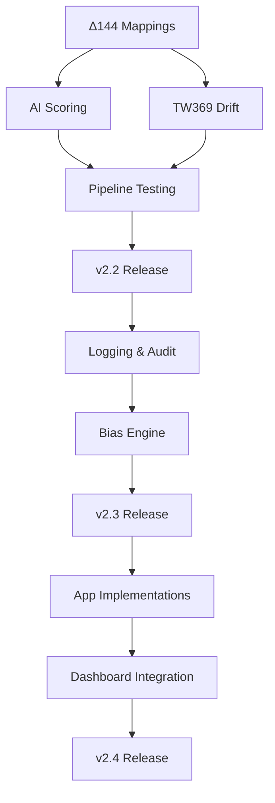

# KALDRA CORE — MASTER ROADMAP V2.2

**Version**: 2.2  
**Date**: 2025-11-24  
**Status**: Production-Ready Core, Enhancement Phase  
**Current Version**: v2.1 (57/57 tests passing)

---

## EXECUTIVE SUMMARY

KALDRA Core v2.1 is **97% complete** with all core engines operational. This roadmap defines the path from v2.1 → v2.2 → v2.3 → v2.4, addressing:

- **144 empty Δ144 mappings** (critical semantic gap)
- **TW369 drift mathematics** (placeholder → real implementation)
- **AI-powered scoring** (manual overrides → intelligent inference)
- **Production hardening** (logging, monitoring, dashboards)

**Timeline**: Q1 2025 (v2.2) → Q2 2025 (v2.3) → Q3 2025 (v2.4)

---

## PHASE 0: CURRENT STATE (v2.1)

### ✅ COMPLETE (100%)

| Component | Status | Files | Tests |
|-----------|--------|-------|-------|
| Δ144 Engine | ✅ | 4 schemas + 3 modules | 100% |
| Kindra Infrastructure | ✅ | 6 data + 9 modules | 100% |
| Epistemic Limiter | ✅ | 1 module | 100% |
| Master Engine Pipeline | ✅ | 2 pipelines | 100% |
| API Layer | ✅ | Full REST API | 57/57 |

### ⚠️ PARTIAL (70-30%)

| Component | Status | Gap |
|-----------|--------|-----|
| TW369 | 70% | Drift math placeholder |
| Kindra Semantics | 0% | 144 mappings empty |
| Bias Engine | 30% | Placeholder implementation |
| Meta Engines | 30% | Routing stub |
| Apps | 30% | Most modules stub |

---

## PHASE 1: V2.2 — SEMANTIC FOUNDATION (4-6 weeks)

**Goal**: Transform infrastructure into intelligent system

**Release Criteria**:
- ✅ 144 Δ144 mappings populated (minimum Layer 1)
- ✅ TW369 drift mathematics implemented
- ✅ AI-based Kindra scoring (at least Layer 1)
- ✅ Documentation updated
- ✅ All tests passing

### Sprint 1.1: Δ144 Mapping Population (Week 1-2)

**P0 — CRITICAL**

**Objective**: Populate semantic relationships between Kindra vectors and Δ144 states

**Tasks**:
1. **Layer 1 Mappings** (48 vectors)
   - File: `schema/kindras/kindra_layer1_to_delta144_map.json`
   - For each vector (E01-M48):
     - Define `boost` list (archetypes amplified)
     - Define `suppress` list (archetypes suppressed)
   - Start with obvious mappings:
     - E01 (Expressiveness) → boost emotional archetypes (Lover, Jester)
     - P17 (Hierarchy) → boost authority archetypes (Ruler, Guardian)
     - R33 (Risk Aversion) → suppress adventurous archetypes (Hero, Explorer)

2. **Layer 2 Mappings** (48 vectors)
   - File: `schema/kindras/kindra_layer2_to_delta144_map.json`
   - Focus on media amplification effects
   - Example: Media Saturation → boost Magician, Performer

3. **Layer 3 Mappings** (48 vectors)
   - File: `schema/kindras/kindra_layer3_to_delta144_map.json`
   - Focus on structural forces
   - Example: Power Concentration → boost Ruler, Tyrant

**Deliverables**:
- [ ] 144 mappings populated with semantic relationships
- [ ] Mapping rationale documented in `DELTA144_INTEGRATION_MANUAL.md`
- [ ] Validation tests for mapping integrity

**Estimated Effort**: 10-12 days (with domain expert input)

---

### Sprint 1.2: TW369 Drift Mathematics (Week 2-3)

**P0 — CRITICAL**

**Objective**: Implement actual drift calculation using TW369 mathematics

**Files**:
- `src/tw369/tw369_integration.py`
- `src/tw369/drift.py`

**Tasks**:
1. **Implement `compute_drift()`**
   ```python
   def compute_drift(self, tw_state: TWState) -> Dict[str, float]:
       # 1. Compute tension gradients between planes
       tension_3_6 = self._compute_plane_tension(
           tw_state.plane3_cultural_macro,
           tw_state.plane6_semiotic_media
       )
       
       # 2. Apply Tracy-Widom statistics
       tw_factor = self._apply_tracy_widom(tension_3_6)
       
       # 3. Calculate eigenvalue-based instability
       instability = self._compute_instability_index(tw_state)
       
       return {
           "plane3_to_6": tension_3_6 * tw_factor,
           "plane6_to_9": ...,
           "plane9_to_3": ...  # feedback loop
       }
   ```

2. **Implement `evolve()`**
   - Apply drift to Δ144 distribution
   - Temporal evolution over time steps
   - Normalize distribution after evolution

3. **Populate TW369 Schemas**
   - Create `schema/tw369/tw_state_schema.json`
   - Create `schema/tw369/drift_parameters.json`
   - Create `schema/tw369/tw369_config_schema.json`

**Deliverables**:
- [ ] Drift calculation implemented
- [ ] TW369 schemas populated
- [ ] Unit tests for drift calculation
- [ ] Integration tests with pipeline

**Estimated Effort**: 8-10 days (requires mathematical research)

---

### Sprint 1.3: AI-Powered Kindra Scoring (Week 3-4)

**P1 — HIGH**

**Objective**: Replace manual overrides with intelligent context-based scoring

**Files**:
- `src/kindras/layer1_cultural_macro_scoring.py`
- `src/kindras/layer2_semiotic_media_scoring.py`
- `src/kindras/layer3_structural_systemic_scoring.py`

**Approach Options**:

**Option A: Rule-Based Inference**
```python
def score(self, context, vectors):
    scores = {}
    
    # Country-based rules
    if context.get('country') == 'BR':
        scores['E01'] = 0.8  # High expressiveness
        scores['P17'] = -0.3  # Low hierarchy
    
    # Sector-based rules
    if context.get('sector') == 'Tech':
        scores['T25'] = 0.6  # High innovation
    
    return scores
```

**Option B: LLM Integration**
```python
def score(self, context, vectors):
    prompt = f"Score cultural vectors for {context}"
    llm_response = self.llm.generate(prompt)
    return self._parse_scores(llm_response)
```

**Option C: Database Lookup**
```python
def score(self, context, vectors):
    country = context.get('country')
    return self.cultural_db.get_scores(country)
```

**Recommended**: Start with Option A (rules), evolve to Option C (database)

**Deliverables**:
- [ ] Layer 1 intelligent scoring implemented
- [ ] Layer 2 intelligent scoring implemented
- [ ] Layer 3 intelligent scoring implemented
- [ ] Cultural database schema designed
- [ ] Tests for scoring logic

**Estimated Effort**: 10-12 days

---

### Sprint 1.4: Documentation & Cleanup (Week 4-5)

**P1 — HIGH**

**Tasks**:
1. **Update Master Engine README**
   - Add Kindra Pipeline section
   - Document TWState usage
   - Update architecture diagrams

2. **Complete Documentation Placeholders**
   - `docs/REPOSITORY_STRUCTURE.md`
   - `docs/CULTURAL_VECTORS_48.md`
   - `docs/BIAS_ENGINE_SPEC.md`
   - `docs/TW369_ENGINE_SPEC.md`
   - All app READMEs

3. **Legacy File Cleanup**
   - Move to `/legacy/`:
     - `src/kindras/vectors.json`
     - `src/kindras/scoring.py`
   - Add deprecation notices
   - Update imports

**Deliverables**:
- [ ] All documentation placeholders filled
- [ ] README_MASTER_ENGINE_V2.md updated
- [ ] Legacy files organized
- [ ] Migration guide created

**Estimated Effort**: 5-7 days

---

### Sprint 1.5: Testing & Validation (Week 5-6)

**P1 — HIGH**

**Tasks**:
1. **Expand Test Coverage**
   - Target: 90%+ coverage
   - Add integration tests
   - Add stress tests
   - Add edge case tests

2. **Pipeline Validation**
   - End-to-end tests
   - Performance benchmarks
   - Memory profiling

3. **Regression Testing**
   - Ensure v2.1 compatibility
   - No breaking changes

**Deliverables**:
- [ ] 90%+ test coverage
- [ ] Integration test suite
- [ ] Performance benchmarks
- [ ] Regression test suite

**Estimated Effort**: 5-7 days

---

## PHASE 2: V2.3 — PRODUCTION HARDENING (6-8 weeks)

**Goal**: Production-grade reliability, monitoring, and observability

**Release Criteria**:
- ✅ Structured logging implemented
- ✅ Audit trails complete
- ✅ Monitoring dashboards
- ✅ Error handling comprehensive
- ✅ Security hardened

### Sprint 2.1: Structured Logging & Audit Trails (Week 7-8)

**P1 — HIGH**

**Objective**: Complete observability for all pipeline stages

**Tasks**:
1. **Implement Structured Logger**
   ```python
   class KALDRALogger:
       def log_inference(self, input, output, metadata):
           self.logger.info({
               "timestamp": ...,
               "input_embedding": ...,
               "delta144_distribution": ...,
               "kindra_scores": ...,
               "tw_trigger": ...,
               "epistemic_decision": ...,
               "final_archetype": ...
           })
   ```

2. **Audit Trail System**
   - Log all decisions
   - Track data lineage
   - Enable replay capability

3. **Integration with Safeguard**
   - Connect to governance layer
   - Enable compliance reporting

**Deliverables**:
- [ ] Structured logging implemented
- [ ] Audit trail system
- [ ] Compliance reporting
- [ ] Log analysis tools

**Estimated Effort**: 10-12 days

---

### Sprint 2.2: Embedding Generation (Week 8-9)

**P2 — MEDIUM**

**Objective**: Replace hash-based placeholder with real semantic embeddings

**Tasks**:
1. **Integrate Sentence Transformers**
   ```python
   from sentence_transformers import SentenceTransformer
   
   class EmbeddingGenerator:
       def __init__(self):
           self.model = SentenceTransformer('all-MiniLM-L6-v2')
       
       def encode(self, text):
           return self.model.encode(text)
   ```

2. **Embedding Cache**
   - Redis/Memcached integration
   - Cache hit optimization

3. **Multiple Model Support**
   - OpenAI embeddings
   - Cohere embeddings
   - Custom fine-tuned models

**Deliverables**:
- [ ] Sentence transformers integrated
- [ ] Embedding cache implemented
- [ ] Multiple model support
- [ ] Performance benchmarks

**Estimated Effort**: 7-10 days

---

### Sprint 2.3: Bias Engine Implementation (Week 9-10)

**P2 — MEDIUM**

**Objective**: Real bias detection and mitigation

**Tasks**:
1. **Integrate Bias Detection Models**
   - Perspective API
   - Detoxify
   - Custom bias classifiers

2. **Multi-Dimensional Scoring**
   - Toxicity
   - Political bias
   - Gender bias
   - Racial bias

3. **Mitigation Strategies**
   - Bias correction
   - Confidence adjustment
   - Flagging system

**Deliverables**:
- [ ] Bias detection models integrated
- [ ] Multi-dimensional scoring
- [ ] Mitigation strategies
- [ ] Bias reporting dashboard

**Estimated Effort**: 10-12 days

---

### Sprint 2.4: Meta Engine Routing (Week 10-11)

**P2 — MEDIUM**

**Objective**: Intelligent meta-engine selection and orchestration

**Tasks**:
1. **Context-Based Routing**
   ```python
   class MetaRouter:
       def route(self, context):
           if self._is_philosophical(context):
               return self.nietzsche
           elif self._is_heroic(context):
               return self.campbell
           elif self._is_stoic(context):
               return self.aurelius
           return self.default
   ```

2. **Meta-Engine Orchestration**
   - Parallel execution
   - Result aggregation
   - Conflict resolution

3. **Fallback Mechanisms**
   - Graceful degradation
   - Default routing

**Deliverables**:
- [ ] Intelligent routing implemented
- [ ] Orchestration logic
- [ ] Fallback mechanisms
- [ ] Meta-engine tests

**Estimated Effort**: 7-10 days

---

### Sprint 2.5: Story-Level Aggregation (Week 11-12)

**P2 — MEDIUM**

**Objective**: Multi-turn narrative tracking and coherence

**Tasks**:
1. **Story Schema Design**
   ```json
   {
     "story_id": "uuid",
     "turns": [...],
     "delta144_evolution": [...],
     "narrative_coherence": 0.85,
     "dominant_archetypes": [...]
   }
   ```

2. **Aggregation Logic**
   - Multi-turn Δ144 aggregation
   - Temporal narrative evolution
   - Coherence scoring

3. **Story Tracking System**
   - Session management
   - State persistence
   - Query interface

**Deliverables**:
- [ ] Story schema defined
- [ ] Aggregation logic implemented
- [ ] Tracking system
- [ ] Story-level tests

**Estimated Effort**: 10-12 days

---

### Sprint 2.6: Security & Performance (Week 12-14)

**P1 — HIGH**

**Tasks**:
1. **Security Hardening**
   - Input validation
   - Rate limiting
   - Authentication/authorization
   - Secrets management

2. **Performance Optimization**
   - Caching strategies
   - Batch processing
   - Lazy loading
   - Vectorization

3. **Monitoring & Alerting**
   - Prometheus metrics
   - Grafana dashboards
   - Alert rules

**Deliverables**:
- [ ] Security audit complete
- [ ] Performance optimized
- [ ] Monitoring dashboards
- [ ] Alert system

**Estimated Effort**: 12-15 days

---

## PHASE 3: V2.4 — INTEGRATION & APPS (8-10 weeks)

**Goal**: Complete app implementations and deep integrations

### Sprint 3.1-3.2: KALDRA-Alpha Implementation (Week 15-18)

**Objective**: Full earnings call analysis pipeline

**Modules**:
- `earnings_ingest.py` — Real ingestion logic
- `earnings_pipeline.py` — Processing pipeline
- `earnings_analyzer.py` — Analysis engine

**Deliverables**:
- [ ] Alpha modules implemented
- [ ] Integration with Master Engine
- [ ] Dashboard integration
- [ ] Alpha tests

**Estimated Effort**: 15-20 days

---

### Sprint 3.3-3.4: KALDRA-GEO, Product, Safeguard (Week 19-22)

**Objective**: Complete remaining app modules

**Deliverables**:
- [ ] GEO modules implemented
- [ ] Product modules implemented
- [ ] Safeguard modules implemented
- [ ] All app tests

**Estimated Effort**: 15-20 days

---

### Sprint 3.5: Dashboard Integration (Week 23-24)

**Objective**: Full 4iam.ai integration

**Tasks**:
- Expose all signals via API
- Real-time updates
- Visualization components

**Deliverables**:
- [ ] Dashboard fully integrated
- [ ] Real-time updates
- [ ] Visualization complete

**Estimated Effort**: 10-12 days

---

## PHASE 4: V2.5+ — RESEARCH & ADVANCED FEATURES (3-6 months)

### Research Track 1: Painlevé II Implementation

**Objective**: Full Painlevé II filter for TW Oracle

**Tasks**:
- Numerical Painlevé II solver
- Edge correction logic
- Benchmarking

**Estimated Effort**: 2-3 months

---

### Research Track 2: AI-Powered Mapping Generation

**Objective**: LLM-assisted Δ144 mapping suggestions

**Tasks**:
- Fine-tune LLM on archetype theory
- Generate boost/suppress suggestions
- Expert validation loop

**Estimated Effort**: 2-3 months

---

### Research Track 3: Real-Time Cultural Analysis

**Objective**: Live cultural vector scoring from news/social

**Tasks**:
- Real-time data ingestion
- Streaming Kindra scoring
- Live Δ144 updates

**Estimated Effort**: 3-4 months

---

### Research Track 4: Predictive Narrative Modeling

**Objective**: Predict narrative evolution using TW369

**Tasks**:
- Full TW369 drift implementation
- Monte Carlo simulations
- Scenario analysis

**Estimated Effort**: 4-6 months

---

## DEPENDENCIES & CRITICAL PATH



**Critical Path**: Δ144 Mappings → TW369 Drift → AI Scoring → v2.2

---

## MILESTONES

| Milestone | Target Date | Criteria |
|-----------|-------------|----------|
| **v2.2 Alpha** | Week 4 | Mappings + Drift implemented |
| **v2.2 Beta** | Week 5 | AI Scoring + Tests passing |
| **v2.2 Release** | Week 6 | All docs updated, production-ready |
| **v2.3 Alpha** | Week 10 | Logging + Bias implemented |
| **v2.3 Release** | Week 14 | Security + Performance hardened |
| **v2.4 Alpha** | Week 20 | Apps implemented |
| **v2.4 Release** | Week 24 | Dashboard integrated |

---

## SUCCESS METRICS

### v2.2
- ✅ 144 mappings populated
- ✅ TW369 drift functional
- ✅ AI scoring operational
- ✅ 90%+ test coverage
- ✅ Documentation complete

### v2.3
- ✅ Structured logging operational
- ✅ Bias detection functional
- ✅ Security audit passed
- ✅ Performance benchmarks met

### v2.4
- ✅ All 4 apps operational
- ✅ Dashboard fully integrated
- ✅ Real-time capabilities
- ✅ Production deployment

---

## CONCLUSION

KALDRA Core v2.1 is a **solid foundation** (97% complete). The roadmap to v2.2-v2.4 focuses on:

1. **Semantics** (v2.2) — Making the system intelligent
2. **Production** (v2.3) — Making it reliable
3. **Integration** (v2.4) — Making it complete

**Estimated Total Effort**: 6-9 months (with team of 2-3 engineers)

**Next Immediate Actions**:
1. Start Δ144 mapping population (Week 1)
2. Begin TW369 drift research (Week 1)
3. Design AI scoring architecture (Week 2)
