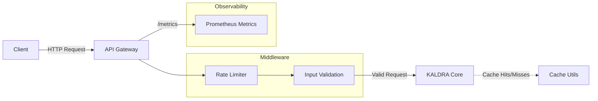

# KALDRA Security & Performance — Specification v1.0
**Version:** 1.0  
**Status:** Production Baseline (Sprint 2.6)  
**Last Updated:** 2025-11-27  
**Modules:** `kaldra_api/middleware/`, `kaldra_api/core/`, `src/core/cache_utils.py`

---

## 1. Overview

This specification defines the baseline security and performance infrastructure for the KALDRA Core API. 
The goal is to harden the API against common abuse vectors (e.g., denial of service, malformed input) and provide observability hooks, without altering the core mathematical engines (`Δ144`, `TW369`, `Kindras`).

**Scope:**
- **Input Validation:** Strict typing and constraints on critical endpoints.
- **Rate Limiting:** In-memory middleware to throttle excessive requests.
- **Caching:** Reusable utilities for memoization of expensive non-engine operations.
- **Monitoring:** Prometheus-compatible metrics endpoint.

---

## 2. Architecture



---

## 3. Core Components

### 3.1 Rate Limiter
**Location:** `kaldra_api/middleware/rate_limiter.py`
- **Type:** In-memory sliding/fixed window.
- **Config:** `requests` per `per_seconds`.
- **Integration:** FastAPI Dependency (`Depends(rate_limit_dependency)`).
- **Fallback:** Graceful degradation if FastAPI is missing.

### 3.2 Request Models
**Location:** `kaldra_api/core/request_models.py`
- **Type:** Pydantic models.
- **Usage:** Defines strict schemas for inputs (e.g., `EngineInferenceRequest`, `AlphaAnalyzeRequest`).
- **Fallback:** Degrades to simple classes if Pydantic is missing.

### 3.3 Cache Utilities
**Location:** `src/core/cache_utils.py`
- **Type:** Decorator-based in-memory TTL cache.
- **Usage:** `@ttl_cache_simple(ttl_seconds=60)`.
- **Stats:** Tracks hits/misses via `cache_stats()`.

### 3.4 Metrics
**Location:** `kaldra_api/monitoring/metrics.py`
- **Type:** Prometheus client wrapper.
- **Exports:** `kaldra_api_requests_total`, `kaldra_api_request_duration_seconds`.
- **Endpoint:** `/metrics` exposed in `router_status.py`.

---

## 4. Usage Examples

### 4.1 Activating Rate Limiting
```python
from kaldra_api.middleware.rate_limiter import rate_limit_dependency, RateLimiterConfig

limiter = rate_limit_dependency(
    RateLimiterConfig(requests=5, per_seconds=60)
)

@router.get("/sensitive", dependencies=[Depends(limiter)])
def sensitive_endpoint():
    ...
```

### 4.2 Using Request Models
```python
from kaldra_api.core.request_models import EngineInferenceRequest

@router.post("/infer")
def infer(payload: EngineInferenceRequest):
    # payload.text is guaranteed to be a non-empty string
    ...
```

### 4.3 Applying Caching
```python
from src.core.cache_utils import ttl_cache_simple

@ttl_cache_simple(ttl_seconds=300)
def fetch_heavy_config():
    # This runs once every 5 minutes
    ...
```

### 4.4 Exposing Metrics
The `/metrics` endpoint is automatically available if `prometheus_client` is installed.
```bash
curl http://localhost:8000/metrics
```

---

## 5. Future Implementations

- **Distributed Rate Limiting:** Replace in-memory storage with Redis/KeyDB for multi-instance deployments.
- **Distributed Caching:** Implement a Redis backend for `cache_utils`.
- **AuthN/AuthZ:** Integrate OAuth2/OIDC provider validation.
- **OpenTelemetry:** Full tracing support across microservices.

---

## 6. Enhancements (Short/Medium Term)

- **Security Headers:** Add Helmet-like headers (HSTS, CSP, X-Frame-Options).
- **CORS:** Configurable CORS policies via environment variables.
- **Circuit Breakers:** Protect downstream dependencies (e.g., Data Lab DB) from cascading failures.
- **Structured Error Responses:** Standardize all API errors to a common JSON schema.

---

## 7. Research Track (Long Term)

- **Adaptive Rate Limiting:** Use TW369 anomaly detection to dynamically adjust rate limits based on traffic patterns.
- **Semantic Caching:** Cache results based on semantic similarity of input text (using embeddings) rather than exact string match.
- **Anomaly Detection:** Real-time detection of malicious payloads using KALDRA signals.

---

## 8. Known Limitations

- **In-Memory State:** Rate limits and cache are local to the process. They reset on restart and are not shared across workers.
- **Metrics Dependency:** `/metrics` returns 503 if `prometheus_client` is missing.
- **Simple Caching:** `ttl_cache_simple` uses `repr()` for keys, which may not be stable for complex objects.

---

## 9. Testing

- **Unit Tests:**
  - `test_rate_limiter.py`: Verify window logic and blocking.
  - `test_cache_utils.py`: Verify TTL expiration and hit/miss counting.
  - `test_request_models.py`: Verify validation errors on invalid input.
- **Integration Tests:**
  - Verify `/status` returns 200.
  - Verify `/metrics` returns valid Prometheus format (if installed).

---

## 10. Next Steps

- [ ] Expand validation to all API endpoints.
- [ ] Integrate Redis for persistent rate limiting.
- [ ] Set up Prometheus/Grafana in staging environment.
- [ ] Conduct load testing to tune rate limits.

---

## 11. Related Documentation
- `docs/core/KALDRA_CORE_MASTER_ROADMAP_V2.2.md`
- `kaldra_api/README.md` (if exists)

## 12. Version History
- **v1.0** (2025-11-27): Initial baseline implementation.
