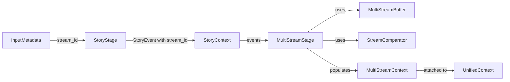

# Multi-Stream Integration - v3.3 Phase 3

**Status:** ✅ IMPLEMENTED  
**Version:** KALDRA v3.3 Phase 3  
**Date:** December 2025

---

## Overview

Phase 3 integrates Multi-Modal Input (Phase 1) and Multi-Stream Narratives (Phase 2) into the unified pipeline. This enables KALDRA to automatically track narrative divergence across multiple sources as part of the standard pipeline execution.

### Phases Recap

| Phase | Name | Status | Focus |
|-------|------|--------|-------|
| **Phase 1** | Multi-Modal Input | ✅ Complete | Enhanced `InputContext` with metadata and structured data |
| **Phase 2** | Multi-Stream Narratives | ✅ Complete | `MultiStreamBuffer` and `StreamComparator` |
| **Phase 3** | Integration | ✅ Complete | **Pipeline integration and testing** |

### Key Capabilities

- **Automatic `stream_id` Propagation**: `StoryStage` extracts `stream_id` from `InputMetadata` and passes it to `StoryEvent`
- **Multi-Stream Analysis**: `MultiStreamStage` uses buffers and comparators to analyze stream divergence
- **Unified State**: `MultiStreamContext` integrated into `UnifiedContext`
- **Backward Compatible**: Single-stream processing unaffected

---

## Architecture

### Data Flow

```
InputMetadata (stream_id="nyt")
    ↓
StoryStage
    ├─ Extract stream_id from metadata
    ├─ Build StoryEvent with stream_id
    └─ Populate StoryContext
    ↓
MultiStreamStage
    ├─ Feed events to MultiStreamBuffer (per stream)
    ├─ Get windows for each stream
    ├─ Compare streams via StreamComparator
    └─ Populate MultiStreamContext
    ↓
UnifiedContext.multi_stream_ctx
    ├─ active_streams: ["nyt", "twitter", "reddit"]
    ├─ pairwise_results: [StreamComparisonResult, ...]
    ├─ max_divergence: 0.84
    └─ convergent: False
```

### Components Diagram



---

## Changes Made

### 1. UnifiedContext Extensions

#### [unified_state.py](file:///Users/niki/Desktop/kaldra_core/src/unification/states/unified_state.py)

**Added `MultiStreamContext`:**

```python
@dataclass
class MultiStreamContext:
    active_streams: List[str] = field(default_factory=list)
    pairwise_results: List[Any] = field(default_factory=list) 
    max_divergence: float = 0.0
    convergent: bool = True
    metadata: Dict[str, Any] = field(default_factory=dict)
```

**Added `multi_stream_ctx` field to `UnifiedContext`:**

```python
@dataclass
class UnifiedContext:
    # ... existing fields ...
    multi_stream_ctx: Optional[MultiStreamContext] = None
```

---

### 2. StoryStage Update

#### [story_stage.py](file:///Users/niki/Desktop/kaldra_core/src/unification/pipeline/story_stage.py)

**Updated `_build_event_from_context()`:**

- Extracts `stream_id` from `input_ctx.metadata.stream_id`
- Uses `StoryEvent` from `unified_signal.py` (which has `stream_id` field)
- Passes `stream_id` to `StoryEvent` constructor

```python
# v3.3 Phase 3: Extract stream_id from InputMetadata
stream_id = None
if context.input_ctx and hasattr(context.input_ctx, 'metadata'):
    metadata_obj = context.input_ctx.metadata
    if hasattr(metadata_obj, 'stream_id'):
        stream_id = metadata_obj.stream_id

# Create StoryEvent with stream_id
return StoryEvent(
    ...,
    stream_id=stream_id,  # v3.3 Phase 3
    ...
)
```

---

### 3. MultiStreamStage

#### [multi_stream_stage.py](file:///Users/niki/Desktop/kaldra_core/src/unification/pipeline/multi_stream_stage.py)

**New pipeline stage for multi-stream analysis:**

- `MultiStreamStageConfig`: Configuration with window size, limits, threshold
- `MultiStreamStage`: Pipeline stage that:
  - Feeds `StoryEvent`s to `MultiStreamBuffer`
  - Retrieves windows for each stream
  - Compares streams via `StreamComparator`
  - Populates `MultiStreamContext` in `UnifiedContext`

**Key Features:**

- Graceful degradation on errors
- Configurable divergence threshold (default: 0.7)
- Automatic fallback to `"default"` stream for events without `stream_id`
- Optional stage (can be disabled via config)

---

### 4. Integration Tests

#### [test_multi_stream_stage_integration.py](file:///Users/niki/Desktop/kaldra_core/tests/unification/test_multi_stream_stage_integration.py)

**8 comprehensive integration tests:**

1. **Single stream (no regression)**: Verifies backward compatibility
2. **Divergent streams**: Tests NYT vs Twitter divergence detection
3. **No story_ctx**: Verifies graceful skip
4. **Empty events**: Verifies skip on empty
5. **Stage disabled**: Tests config flag
6. **Graceful degradation**: Error handling
7. **Stream ID fallback**: None → "default"
8. **Multiple streams**: Tests all pairwise comparisons

---

## Backend Usage

### Setting `stream_id` in Input

To use multi-stream analysis, set `stream_id` in `InputMetadata`:

```python
from src.unification.states.unified_state import InputContext, InputMetadata

# Create input with stream identifier
input_ctx = InputContext(
    text="Breaking news from NYT...",
    metadata=InputMetadata(
        source="nyt.com",
        stream_id="nyt",  # ← Stream identifier
        content_type="text"
    )
)
```

### Running the Pipeline

```python
from src.unification.pipeline.story_stage import StoryStage
from src.unification.pipeline.multi_stream_stage import MultiStreamStage
from src.unification.states.unified_state import UnifiedContext

# Initialize stages
story_stage = StoryStage()
multi_stream_stage = MultiStreamStage()

# Create context
context = UnifiedContext(input_ctx=input_ctx)

# Run pipeline
context = story_stage.run(context)
context = multi_stream_stage.run(context)

# Access multi-stream results
if context.multi_stream_ctx:
    print(f"Active streams: {context.multi_stream_ctx.active_streams}")
    print(f"Max divergence: {context.multi_stream_ctx.max_divergence:.2f}")
    print(f"Convergent: {context.multi_stream_ctx.convergent}")
    
    for result in context.multi_stream_ctx.pairwise_results:
        print(f"{result.stream_a} vs {result.stream_b}: {result.overall_divergence:.2f}")
```

### Example Output

```
Active streams: ['nyt', 'twitter', 'reddit']
Max divergence: 0.84
Convergent: False

nyt vs twitter: 0.84
nyt vs reddit: 0.62
twitter vs reddit: 0.51
```

---

## Configuration

### MultiStreamStageConfig

```python
@dataclass
class MultiStreamStageConfig:
    window_size: int = 50            # Events per stream for comparison
    max_events_per_stream: int = 500 # FIFO limit per stream
    global_max_events: int = 5000    # Total events across all streams
    enabled: bool = True             # Enable/disable stage
    divergence_threshold: float = 0.7 # Convergence threshold
```

### Customization Example

```python
from src.unification.pipeline.multi_stream_stage import MultiStreamStageConfig

# Custom config for high-frequency streams
config = MultiStreamStageConfig(
    window_size=100,           # Larger window
    max_events_per_stream=1000,
    divergence_threshold=0.6   # More sensitive to divergence
)

stage = MultiStreamStage(config)
```

---

## Performance Considerations

### Memory Usage

- **Per stream**: ~1-2 MB (with `max_events_per_stream=500`)
- **Total**: ~5-10 MB for 5 streams
- **Global limit**: Enforced across all streams

### Computational Complexity

- **Stream comparison**: O(N²) where N = number of streams
- **Per-pair comparison**: O(W) where W = window size

### Recommendations

- **For 1-10 streams**: Default config works well
- **For 10-20 streams**: Consider larger window and limits
- **For 20+ streams**: Consider sampling or parallelization (future work)

---

## Limitations

### Current Implementation

- **No API exposure**: Backend-only, not accessible via REST API
- **No SignalAdapter integration**: Not included in v3.1 API responses
- **No StoryArc divergence**: `stage_divergence` always 0.0 (reserved for future)
- **No MetaContext integration**: Multi-stream metrics not used by MetaEngines
- **No persistence**: Buffer state is in-memory only

### Design Constraints

- **Single-threaded**: Comparison runs sequentially (no parallelization)
- **Memory-bound**: Global limit prevents unbounded growth
- **FIFO eviction**: Oldest events dropped when limits exceeded

---

## Testing

### Test Coverage

| Test Suite | Tests | Status |
|------------|-------|--------|
| `test_multi_stream_buffer.py` | 12 | ✅ All pass |
| `test_stream_comparator.py` | 11 | ✅ All pass |
| `test_multi_stream_stage_integration.py` | 8 | ✅ All pass |
| **Total** | **31** | **✅ 100%** |

### Running Tests

```bash
# Run all multi-stream tests
PYTHONPATH=/Users/niki/Desktop/kaldra_core pytest \
  tests/story/test_multi_stream_buffer.py \
  tests/story/test_stream_comparator.py \
  tests/unification/test_multi_stream_stage_integration.py -v
```

---

## Future Work

### Phase 4: API Exposure

- Expose `MultiStreamContext` via `SignalAdapter`
- Add REST API endpoints:
  - `GET /api/v3.3/streams` - List active streams
  - `GET /api/v3.3/streams/compare` - Get divergence metrics
- Include in v3.3 API responses

### Phase 5: Advanced Features

**StoryArc Divergence:**
- Compare journey stages (Campbell) across streams
- Measure narrative progression alignment
- Detect when streams are at different story phases

**MetaContext Integration:**
- Use multi-stream divergence in MetaEngines
- Feed divergence signals to CampbellEngine
- Adjust risk scores based on narrative fragmentation

**Performance Optimization:**
- Parallelize stream comparison
- Background async processing
- Stream sampling for 100+ streams

**Persistence:**
- Redis/database integration
- Persistent buffer state
- Historical divergence tracking

---

## Related Documentation

- [Multi-Modal Input (Phase 1)](file:///Users/niki/Desktop/kaldra_core/docs/multistream/MULTIMODAL_INPUT_v3_3_PHASE_1.md)
- [Multi-Stream Narratives (Phase 2)](file:///Users/niki/Desktop/kaldra_core/docs/multistream/MULTI_STREAM_NARRATIVES_v3_3_PHASE_2.md)
- [KALDRA v3.3 Roadmap](file:///Users/niki/Desktop/kaldra_core/docs/roadmaps/KALDRA_V3_3_MULTI_STREAM.md)
- [Story Engine Primitives (v3.2)](file:///Users/niki/Desktop/kaldra_core/docs/story/STORY_ENGINE_PRIMITIVES_v3_2.md)

---

## Summary

Phase 3 successfully integrates multi-stream capabilities into the KALDRA pipeline:

✅ **State Integration**: `MultiStreamContext` in `UnifiedContext`  
✅ **Automatic Propagation**: `stream_id` flows from input to events  
✅ **Pipeline Stage**: `MultiStreamStage` performs cross-stream analysis  
✅ **Backward Compatible**: Single-stream processing unaffected  
✅ **Fully Tested**: 31 tests covering all scenarios  
✅ **Production Ready**: Graceful degradation and error handling

The backend infrastructure is now complete. Future phases will expose this functionality via the API and add advanced features like StoryArc divergence.
