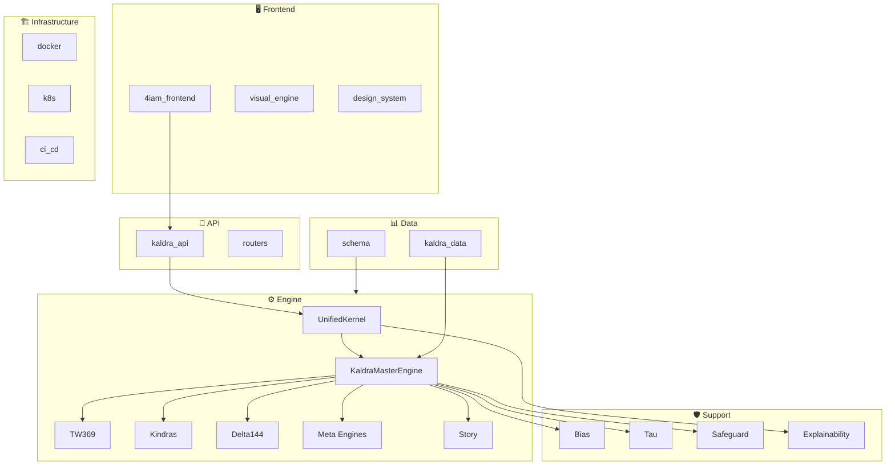

# 🗺️ KALDRA Domain Map

> **Version**: v2.0 | **Generated**: 2024-12-17 | **Status**: Discovery Phase

Groups all components into domains: Engine, App, API, Data, Infra, Frontend.

---

## Domain Overview

---

## 1. 🎯 Engine Domain

Core symbolic intelligence processing.

| Component | Path | Role | Status |
|-----------|------|------|--------|
| **UnifiedKernel** | `packages/engine/kaldra_engine/unification/` | v3.0 entry point, loads all engines | ✅ Active |
| **KaldraMasterEngineV2** | `packages/engine/kaldra_engine/core/` | v2 orchestrator, inference pipeline | ✅ Active |
| **TW369 Integrator** | `packages/engine/kaldra_engine/tw369/` | Tracy-Widom drift, temporal evolution | ✅ Active |
| **Kindra Engine** | `packages/engine/kaldra_engine/kindras/` | 3×48 cultural/semiotic scoring | ✅ Active |
| **Delta144 Engine** | `packages/engine/kaldra_engine/archetypes/` | 12 archetypes × 12 states | ✅ Active |
| **Meta Engines** | `packages/engine/kaldra_engine/meta/` | Aurelius, Nietzsche, Campbell | ✅ Active |
| **Story Engine** | `packages/engine/kaldra_engine/story/` | Narrative arc, temporal patterns | ✅ Active |
| **Learning Engine** | `packages/engine/kaldra_engine/learning/` | Weight learning, priors | 🔶 Partial |
| **Delta144 (learning)** | `packages/engine/kaldra_engine/delta144/` | Empty/stub | ⚠️ Stub |

---

## 2. 🛡️ Support Engine Domain

Supporting engines for bias, safety, and interpretation.

| Component | Path | Role | Status |
|-----------|------|------|--------|
| **Bias Engine** | `packages/engine/kaldra_engine/bias/` | Bias detection & mitigation | ✅ Active |
| **Tau Layer** | `packages/engine/kaldra_engine/tau/` | Epistemic reliability limiter | ✅ Active |
| **Safeguard Engine** | `packages/engine/kaldra_engine/safeguard/` | Safety & risk mitigation | ✅ Active |
| **Explainability** | `packages/engine/kaldra_engine/explainability/` | Human-readable explanations | ✅ Active |

---

## 3. 📱 App Domain

Domain-specific applications built on engines.

| App | Path | Domain | Status |
|-----|------|--------|--------|
| **Alpha** | `packages/engine/kaldra_engine/apps/alpha/` | Financial analysis | ✅ Active |
| **Geo** | `packages/engine/kaldra_engine/apps/geo/` | Geopolitical analysis | ✅ Active |
| **Product** | `packages/engine/kaldra_engine/apps/product/` | Product intelligence | ✅ Active |
| **Safeguard App** | `packages/engine/kaldra_engine/apps/safeguard/` | Safety-focused analysis | ✅ Active |
| **Archive** | `packages/engine/kaldra_engine/apps/_ARCHIVE/` | Deprecated apps | ⚠️ Archived |

---

## 4. 🔌 API Domain

REST API layer exposing engines and apps.

### Main API (`kaldra_api/`)

| Component | Path | Purpose |
|-----------|------|---------|
| **main.py** | `kaldra_api/main.py` | FastAPI entry point |
| **dependencies** | `kaldra_api/dependencies.py` | DI container |
| **middleware** | `kaldra_api/middleware/` | Request middleware |
| **monitoring** | `kaldra_api/monitoring/` | Observability |

### Routers (`kaldra_api/routers/`)

| Router | Prefix | Purpose |
|--------|--------|---------|
| `router_engine` | `/engine` | Core engine endpoints |
| `router_alpha` | `/alpha` | Alpha app endpoints |
| `router_geo` | `/geo` | Geo app endpoints |
| `router_product` | `/product` | Product app endpoints |
| `router_safeguard` | `/safeguard` | Safeguard app endpoints |
| `router_news` | `/kaldra` | News analysis |
| `router_v3_1` | `/api` | v3.1 API endpoints |
| `router_signals` | `/signals` | Supabase signals |
| `router_story_events` | `/story-events` | Story event endpoints |
| `router_status` | `/status` | Status endpoints |

### Schemas (`kaldra_api/schemas/`)

12 files defining API request/response schemas

### Clients (`kaldra_api/clients/`)

16 files for external service clients

---

## 5. 📊 Data Domain

Data ingestion, transformation, and pipeline.

### kaldra_data (`kaldra_data/`)

| Component | Path | Purpose |
|-----------|------|---------|
| **datasets** | `kaldra_data/datasets/` | Dataset definitions (4 files) |
| **ingestion** | `kaldra_data/ingestion/` | Data ingestion (17 files) |
| **pipeline** | `kaldra_data/pipeline/` | Data pipelines |
| **preprocessing** | `kaldra_data/preprocessing/` | Data preprocessing (11 files) |
| **transformation** | `kaldra_data/transformation/` | Data transformation (4 files) |
| **workers** | `kaldra_data/workers/` | Background workers |
| **schemas** | `kaldra_data/schemas/` | Data schemas (8 files) |

### Pipelines (`kaldra_data/pipeline/`)

| Pipeline | Purpose |
|----------|---------|
| `pipeline_alpha.py` | Alpha data pipeline |
| `pipeline_geo.py` | Geo data pipeline |
| `pipeline_product.py` | Product data pipeline |
| `pipeline_safeguard.py` | Safeguard data pipeline |

### Schema Directory (`schema/`)

| Schema Area | Path | Files |
|-------------|------|-------|
| Archetypes | `schema/archetypes/` | 4 |
| Kindras | `schema/kindras/` | 6 |
| TW369 | `schema/tw369/` | 10 |
| Unified | `schema/unified/` | 8 |
| Story | `schema/story/` | 1 |
| Tau | `schema/tau/` | 0 (empty) |
| Safeguard | `schema/safeguard/` | 0 (empty) |

### Other Data

| Path | Purpose |
|------|---------|
| `data/` | Runtime data (2 files) |
| `mock_data/` | Mock data for testing |
| `configs/` | Configuration files |

---

## 6. 🏗️ Infrastructure Domain

Deployment, CI/CD, and infrastructure.

### Docker (`infra/docker/`)

| File | Purpose |
|------|---------|
| Dockerfile variants | Container builds |
| docker-compose files | Local development |

### Kubernetes (`infra/k8s/`)

5 files for K8s deployment manifests

### CI/CD (`infra/ci_cd/`)

2 files for CI/CD pipelines

### Scripts

| Path | Purpose |
|------|---------|
| `infra/scripts/` | Infrastructure scripts (4 files) |
| `scripts/` | Utility scripts (17 files) |
| `tools/` | Development tools (3 files) |

### Root Infrastructure Files

| File | Purpose |
|------|---------|
| `Dockerfile` | Main container build |
| `render.yaml` | Render.com deployment |
| `requirements.txt` | Python dependencies |

### Supabase (`supabase/`)

5 files for Supabase integration

---

## 7. 🖥️ Frontend Domain

User interface and visualization.

### 4IAM Frontend (`4iam_frontend/`)

| Component | Path | Purpose |
|-----------|------|---------|
| **app** | `4iam_frontend/app/` | Next.js pages (46 files) |
| **components** | `4iam_frontend/components/` | React components (15 files) |
| **lib** | `4iam_frontend/lib/` | Utilities (9 files) |
| **styles** | `4iam_frontend/styles/` | CSS (3 files) |
| **public** | `4iam_frontend/public/` | Static assets |

### Design System (`4iam_frontend/design_system/`)

39 files for design tokens and components

### Visual Engine (`4iam_frontend/visual_engine/`)

46 files for data visualization

### Frontend Docs (`4iam_frontend/docs/`)

| Doc | Purpose |
|-----|---------|
| `CONTENT_MODEL.md` | Content structure |
| `DASHBOARD_OVERVIEW.md` | Dashboard guide |
| `EXPLORER_OVERVIEW.md` | Explorer guide |
| `INTEGRATION_GUIDE.md` | API integration |
| `UX_ARCHITECTURE.md` | UX patterns |
| + 6 more files | |

### Legacy Frontend (`frontend/`)

Minimal legacy frontend (1 subdir)

---

## 🟡 Grey Zones

Components that don't fit cleanly into a single domain.

| Component | Path | Issue | Recommendation |
|-----------|------|-------|----------------|
| `packages/engine/kaldra_engine/common/` | Common utilities | Shared across all | Keep as shared |
| `packages/engine/kaldra_engine/domain/` | Domain models | Unclear scope | Merge into relevant engines |
| `packages/engine/kaldra_engine/embeddings/` | Embedding utils | Overlaps with core | Merge into `packages/engine/kaldra_engine/core/` |
| `packages/engine/kaldra_engine/data/` | Data handling | Overlaps with kaldra_data | Clarify boundary |
| `packages/engine/kaldra_engine/infrastructure/` | Execution | Overlaps with infra | Rename to `execution` |
| `packages/engine/kaldra_engine/infra/` | Infra utils | Overlaps with top-level infra | Merge or clarify |
| `packages/engine/kaldra_engine/scripts/` | Scripts | Mix of utils | Review and categorize |
| `archive/` | Archived code | Legacy | Keep archived |
| `examples/` | Examples | Documentation | Move to docs |
| `perf/` | Performance | Testing | Move to tests/perf |
| `proto/` | Protobuf | Schema | Move to schema |

---

## Future Implementations

1. **Clear Domain Boundaries** - Eliminate grey zones
2. **Domain Interface Contracts** - Explicit API contracts between domains
3. **Microservice Extraction** - Extract domains as separate services

---

## Enhancements (Short/Medium Term)

1. **Domain README Files** - Add README to each domain root
2. **Dependency Inversion** - Engines depend on abstractions
3. **Cross-Domain Metrics** - Unified observability
4. **Schema Consolidation** - Merge overlapping schemas

---

## Research Track (Long Term)

1. **Domain-Driven Design** - Full DDD implementation
2. **Event Sourcing** - Cross-domain event bus
3. **Multi-Tenant Support** - Domain isolation per tenant

---

## Known Limitations

1. **Overlapping Concerns** - `packages/engine/kaldra_engine/data/` vs `kaldra_data/`
2. **Naming Inconsistency** - `infra/` vs `infrastructure/`
3. **Empty Schemas** - `schema/tau/`, `schema/safeguard/`
4. **Missing Frontend Tests** - No frontend test directory visible
5. **Legacy Code** - `archive/` and `_ARCHIVE` directories

---

## Testing

| Domain | Test Path | Coverage |
|--------|-----------|----------|
| Engine | `tests/core/`, `tests/tw369/`, etc. | High |
| Support | `tests/bias/`, `tests/safeguard/`, `tests/tau/` | Low |
| App | `tests/apps/` | 26 files |
| API | `tests/api/` | 18 files |
| Integration | `tests/integration/` | 20 files |
| E2E | `tests/e2e/` | 2 files |

---

## Next Steps

1. [ ] Review EDGES_DRAFT.csv for dependency relationships
2. [ ] Resolve grey zone assignments
3. [ ] Create domain-level README files
4. [ ] Define cross-domain API contracts
