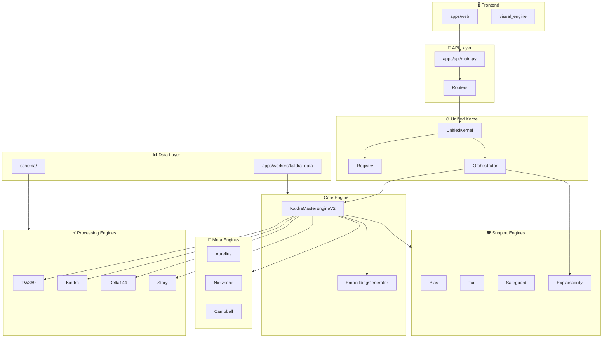
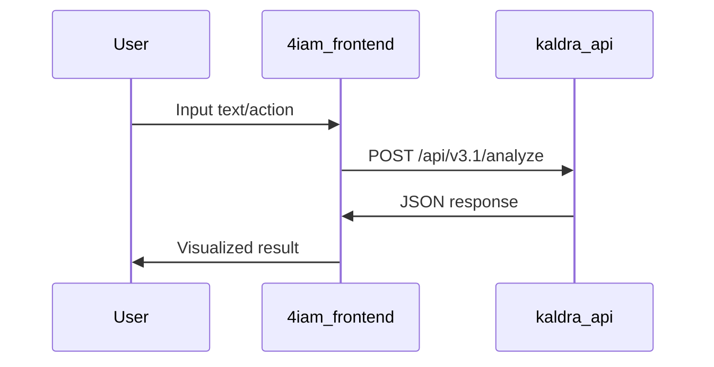
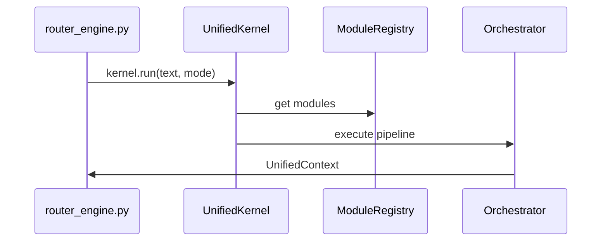
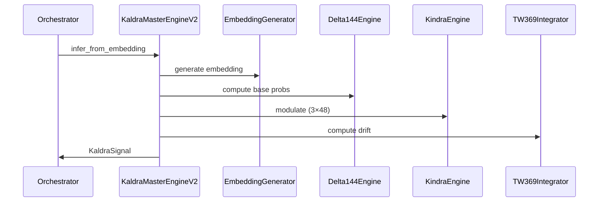
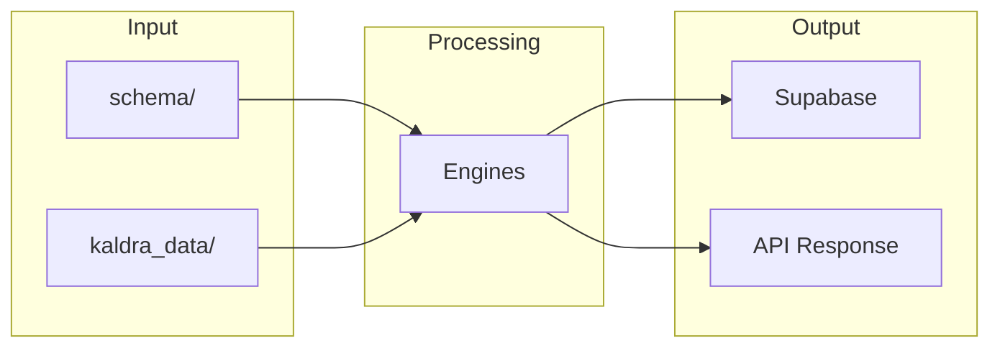
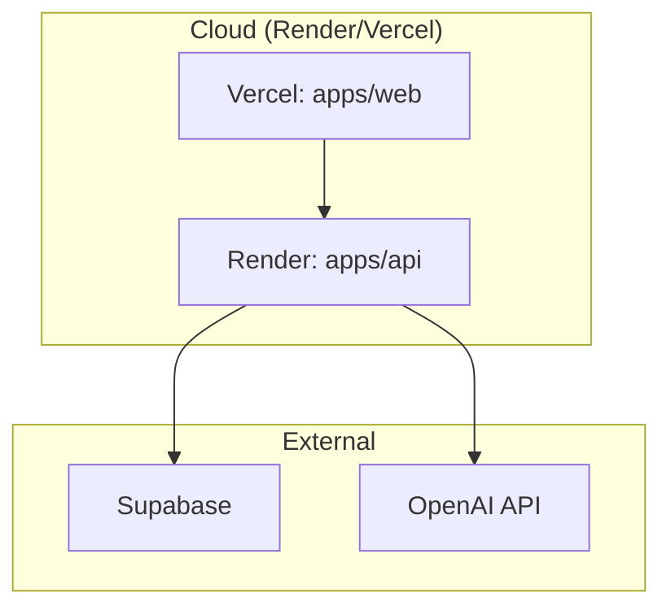

# 🏗️ System Overview

> **Version**: v2.0 | **Source**: [[DOMAIN_MAP]]

How the KALDRA system flows from frontend to engines.

---

## High-Level Architecture

---

## Request Flow

### 1. Frontend → API

The user interacts with `4iam_frontend` (Next.js).

**Components**:
- [[../02_ENGINES/UnifiedKernel/ENGINE_OVERVIEW|UnifiedKernel]] receives the request
- API routes via `router_v3_1.py` or `router_engine.py`

---

### 2. API → Unified Kernel

The API layer routes to the [[UnifiedKernel/ENGINE_OVERVIEW|UnifiedKernel]].

**Modes**:
| Mode | Description |
|------|-------------|
| `signal` | Fast, core pipeline only |
| `story` | Full temporal analysis |
| `full` | Complete analysis (default) |
| `safety-first` | Strict safety checks |
| `exploratory` | Maximum depth |

---

### 3. Kernel → Core Engine

The [[Core/ENGINE_OVERVIEW|KaldraMasterEngineV2]] orchestrates inference.

---

### 4. Core → Processing Engines

Processing engines run in parallel or sequence:

| Engine | Role | Output |
|--------|------|--------|
| [[Delta144/ENGINE_OVERVIEW|Delta144]] | Base archetype probabilities | 144 state distribution |
| [[Kindra/ENGINE_OVERVIEW|Kindra]] | Cultural/semiotic modulation | 3×48 layer scores |
| [[TW369/ENGINE_OVERVIEW|TW369]] | Temporal drift calculation | Drift state, severity |
| [[Story/ENGINE_OVERVIEW|Story]] | Narrative arc detection | Motion vectors, inflections |

---

### 5. Core → Meta Engines

Meta engines provide philosophical analysis:

| Engine | Philosophy | Output |
|--------|-----------|--------|
| [[Meta/ENGINE_OVERVIEW|Aurelius]] | Stoic | 12 axes, 4 virtues |
| [[Meta/ENGINE_OVERVIEW|Nietzsche]] | Will-to-power | Power dynamics |
| [[Meta/ENGINE_OVERVIEW|Campbell]] | Hero's journey | Arc progression |

---

### 6. Core → Support Engines

Support engines handle safety and interpretation:

| Engine | Role | Output |
|--------|------|--------|
| [[Bias/ENGINE_OVERVIEW|Bias]] | Detect/mitigate bias | Bias scores |
| [[Tau/ENGINE_OVERVIEW|Tau]] | Epistemic limits | Reliability score |
| [[Safeguard/ENGINE_OVERVIEW|Safeguard]] | Safety checks | Risk assessment |
| [[Explainability/ENGINE_OVERVIEW|Explainability]] | Human output | Explanations |

---

### 7. Data Flow

---

## Pipeline Stages

The [[UnifiedKernel/ENGINE_OVERVIEW|Unified Pipeline]] has these stages:

| Stage | File | Purpose |
|-------|------|---------|
| Input | `input_stage.py` | Parse and validate input |
| Core | `core_stage.py` | Run KaldraMasterEngineV2 |
| Meta | `meta_stage.py` | Run meta engines |
| Story | `story_stage.py` | Run story analysis |
| Safeguard | `safeguard_stage.py` | Safety checks |
| MultiStream | `multi_stream_stage.py` | Multi-source handling |
| Output | `output_stage.py` | Format response |

---

## Deployment Architecture

---

## Future Implementations

1. GraphQL API layer
2. WebSocket real-time updates
3. Distributed engine execution
4. Multi-region deployment

---

## Enhancements (Short/Medium Term)

1. Add request tracing (OpenTelemetry)
2. Cache layer for embeddings
3. Rate limiting per endpoint
4. API versioning strategy

---

## Research Track (Long Term)

1. Event sourcing architecture
2. CQRS pattern implementation
3. Serverless engine execution
4. Edge computing for inference

---

## Known Limitations

1. Single API instance (no horizontal scaling yet)
2. Synchronous pipeline (no streaming)
3. Embedding generation is slow without cache
4. No circuit breaker between engines

---

## Testing

| Layer | Test Type | Coverage |
|-------|-----------|----------|
| API | Integration | `tests/api/` |
| Engines | Unit | `tests/<engine>/` |
| E2E | End-to-end | `tests/e2e/` |

---

## Next Steps

1. [ ] Add request flow tracing
2. [ ] Document error handling paths
3. [ ] Create runbook for common issues

---

## Related

- [[MOC_HOME]]
- [[REPO_MAP]]
- [[TESTING_MAP]]
