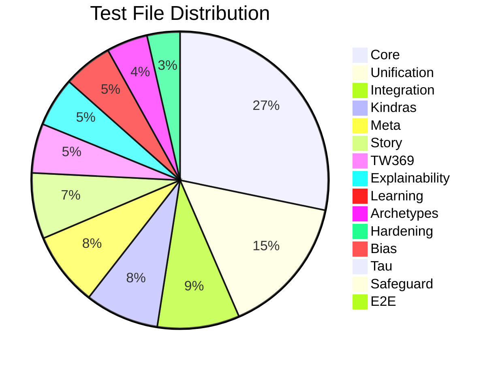

# 🧪 Testing Map

> **Version**: v2.0 | **Source**: [[MODULE_INVENTORY]]

Test coverage per engine and identification of low-coverage areas.

---

## Coverage Overview

---

## Test Coverage by Engine

### High Coverage (✅ 10+ test files)

| Engine | Test Path | File Count | Status |
|--------|-----------|------------|--------|
| [[Core/ENGINE_OVERVIEW\|Core]] | `tests/core/` | 63 | ✅ Excellent |
| [[UnifiedKernel/ENGINE_OVERVIEW\|Unification]] | `tests/unification/` | 34 | ✅ Excellent |
| Integration | `tests/integration/` | 20 | ✅ Good |
| [[Kindra/ENGINE_OVERVIEW\|Kindras]] | `tests/kindras/` | 18 | ✅ Good |
| [[Meta/ENGINE_OVERVIEW\|Meta]] | `tests/meta/` | 18 | ✅ Good |
| [[Story/ENGINE_OVERVIEW\|Story]] | `tests/story/` | 16 | ✅ Good |
| [[TW369/ENGINE_OVERVIEW\|TW369]] | `tests/tw369/` | 12 | ✅ Good |
| [[Explainability/ENGINE_OVERVIEW\|Explainability]] | `tests/explainability/` | 12 | ✅ Good |
| Learning | `tests/learning/` | 12 | ✅ Good |
| [[Delta144/ENGINE_OVERVIEW\|Archetypes]] | `tests/archetypes/` | 10 | ✅ Good |

### Medium Coverage (🔶 5-9 test files)

| Engine | Test Path | File Count | Status |
|--------|-----------|------------|--------|
| Hardening | `tests/hardening/` | 8 | 🔶 Medium |
| Performance | `tests/performance/` | 5 | 🔶 Medium |
| Perf | `tests/perf/` | 6 | 🔶 Medium |
| Chaos | `tests/chaos/` | 6 | 🔶 Medium |

### Low Coverage (⚠️ <5 test files)

| Engine | Test Path | File Count | Status | Risk |
|--------|-----------|------------|--------|------|
| [[Bias/ENGINE_OVERVIEW\|Bias]] | `tests/bias/` | 2 | ⚠️ Low | **HIGH** |
| [[Tau/ENGINE_OVERVIEW\|Tau]] | `tests/tau/` | 2 | ⚠️ Low | **HIGH** |
| [[Safeguard/ENGINE_OVERVIEW\|Safeguard]] | `tests/safeguard/` | 2 | ⚠️ Low | **HIGH** |
| E2E | `tests/e2e/` | 2 | ⚠️ Low | **MEDIUM** |
| Input | `tests/input/` | 4 | ⚠️ Low | Low |
| Embeddings | `tests/embeddings/` | 2 | ⚠️ Low | Low |
| Delta144 | `tests/delta144/` | 2 | ⚠️ Low | Low |

---

## Critical Coverage Gaps

### 🚨 Bias Engine

**Current**: 2 test files  
**Risk**: High — bias detection is critical for safe operation  
**Required Tests**:
- [ ] Detector edge cases
- [ ] Multiple bias types
- [ ] Mitigation effectiveness
- [ ] Provider fallbacks

### 🚨 Tau Layer

**Current**: 2 test files  
**Risk**: High — epistemic limits affect all outputs  
**Required Tests**:
- [ ] Policy enforcement
- [ ] Risk model accuracy
- [ ] State transitions
- [ ] Edge case handling

### 🚨 Safeguard Engine

**Current**: 2 test files  
**Risk**: High — safety is mission-critical  
**Required Tests**:
- [ ] Risk detection accuracy
- [ ] Policy enforcement
- [ ] Integration with pipeline
- [ ] Failure modes

### 🔶 E2E Tests

**Current**: 2 test files  
**Risk**: Medium — system-level validation  
**Required Tests**:
- [ ] Full pipeline happy path
- [ ] Error handling paths
- [ ] Performance under load
- [ ] Multi-mode testing

---

## Test Types

### Unit Tests

Location: `tests/<engine>/`

**Purpose**: Test individual modules in isolation

**Engines with good unit tests**:
- Core (63 files)
- TW369 (12 files)
- Kindras (18 files)
- Meta (18 files)

### Integration Tests

Location: `tests/integration/`

**Purpose**: Test engine interactions

**Current**: 20 files

**Coverage**:
- [ ] Core → Delta144
- [ ] Core → Kindra
- [ ] Core → TW369
- [ ] API → Kernel
- [ ] Kernel → All engines

### E2E Tests

Location: `tests/e2e/`

**Purpose**: Test complete user flows

**Current**: 2 files

**Gaps**:
- [ ] Full analysis flow
- [ ] Multi-mode execution
- [ ] Error recovery

### Performance Tests

Locations: `tests/performance/`, `tests/perf/`

**Purpose**: Benchmark and stress testing

**Current**: 11 files total

### Chaos Tests

Location: `tests/chaos/`

**Purpose**: Failure injection and resilience testing

**Current**: 6 files

---

## Test Infrastructure

### Root Test Files

| File | Purpose |
|------|---------|
| `tests/__init__.py` | Test package init |
| `test_news_apis.py` | News API tests (root) |
| `test_delta144_engine.py` | Delta144 tests (root) |
| `test_epistemic_limiter.py` | Epistemic tests (root) |
| `test_integration_master_engine.py` | Integration (root) |
| `test_kindra_maps_alignment.py` | Kindra alignment (root) |
| `test_kindra_mod.py` | Kindra mod (root) |
| `test_master_engine_v2.py` | Master engine (root) |
| `test_tw_oracle.py` | TW oracle (root) |

### Test Data

| Location | Purpose |
|----------|---------|
| `mock_data/` | Mock data for tests |
| `tests/input/` | Input test fixtures |

---

## Coverage Priorities

### P0 — Critical (Immediate)

| Engine | Action |
|--------|--------|
| Bias | Add 8+ test files |
| Tau | Add 8+ test files |
| Safeguard | Add 8+ test files |

### P1 — High (This Sprint)

| Engine | Action |
|--------|--------|
| E2E | Add 4+ test files |
| API | Improve integration tests |

### P2 — Medium (Next Sprint)

| Engine | Action |
|--------|--------|
| Delta144 | Add edge case tests |
| Embeddings | Add cache tests |

---

## Future Implementations

1. Automated coverage reporting
2. Coverage gates in CI/CD
3. Mutation testing
4. Property-based testing

---

## Enhancements (Short/Medium Term)

1. Add coverage badges per engine
2. Create test templates
3. Add test running documentation
4. Integrate with GitHub Actions

---

## Research Track (Long Term)

1. AI-assisted test generation
2. Continuous fuzzing
3. Visual regression testing
4. Performance regression detection

---

## Known Limitations

1. No coverage metrics (e.g., line coverage %)
2. Some tests may be outdated
3. No test quality metrics
4. Missing integration between some engines

---

## Testing

| Aspect | Status |
|--------|--------|
| Coverage mapped | ✅ Done |
| Gaps identified | ✅ Done |
| Priorities set | ✅ Done |

---

## Next Steps

1. [ ] Add coverage tooling (pytest-cov)
2. [ ] Create P0 test tickets
3. [ ] Set coverage thresholds
4. [ ] Add to CI/CD pipeline

---

## Related

- [[MOC_HOME]]
- [[SYSTEM_OVERVIEW]]
- [[MODULE_INVENTORY]]
