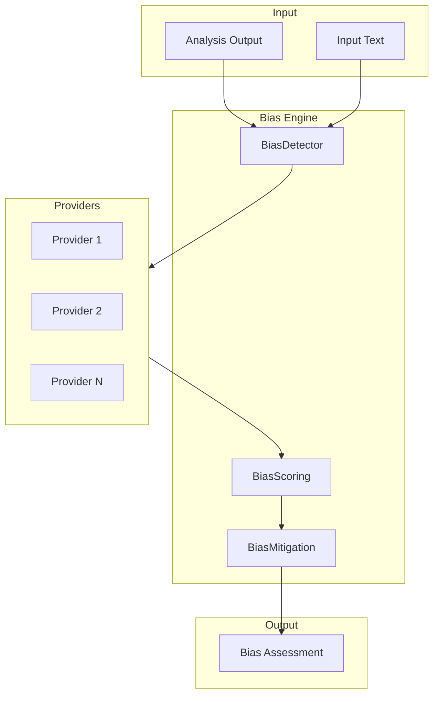

# ⚙️ Bias Engine Overview

> **Engine**: `Bias / BiasDetector`  
> **Path**: `src/bias/`  
> **Node ID**: `engine_bias`  
> **Status**: ✅ Active

---

## What It Is

The Bias engine provides **bias detection and mitigation** for KALDRA outputs. It identifies potential biases in analysis results and applies mitigation strategies to ensure balanced outputs.

Components:
- **Detector**: Main bias detection logic
- **Scoring**: Bias scoring algorithms
- **Mitigation**: Bias mitigation strategies
- **Providers**: Detection providers (8 files)

---

## Repo Paths & Entry Points

| Component | Path | Description |
|-----------|------|-------------|
| Main Directory | `src/bias/` | All bias engine code |
| Entry Point | `detector.py` | `BiasDetector` class |
| Scoring | `scoring.py` | Bias scoring |
| Mitigation | `mitigation.py` | Mitigation strategies |
| Providers | `providers/` | 8 provider files |
| Schema | `bias_schema.json` | Bias schema |

---

## Core Modules

| Module | Path | Purpose | Module Card |
|--------|------|---------|-------------|
| Detector | `detector.py` | Main detection | [[modules/bias_detector]] |
| Scoring | `scoring.py` | Bias scoring | [[modules/bias_scoring]] |
| Mitigation | `mitigation.py` | Mitigation | [[modules/bias_mitigation]] |

---

## Flow Diagram

---

## With What It Works

### Dependencies

| Dependency | Type | Relation |
|------------|------|----------|
| [[Core/ENGINE_OVERVIEW\|Core]] | Consumer | depends_on |
| [[UnifiedKernel/ENGINE_OVERVIEW\|Kernel]] | Registry | owned_by |

### Configurations

| Config | Path |
|--------|------|
| Bias Schema | `src/bias/bias_schema.json` |

### Schemas

| Schema | Path |
|--------|------|
| Internal | `bias_schema.json` |

### Runtime

- **Environment Variables**: None
- **External Services**: None

---

## Module Cards

- [[modules/bias_detector|Bias Detector]]
- [[modules/bias_scoring|Bias Scoring]]
- [[modules/bias_mitigation|Bias Mitigation]]

---

## Future Implementations

1. ML-based bias detection
2. Cultural bias awareness
3. Real-time bias monitoring
4. Bias explanation generation

---

## Enhancements (Short/Medium Term)

1. Add more bias types
2. Improve mitigation effectiveness
3. Add bias reporting
4. Integrate with logging

---

## Research Track (Long Term)

1. Learned bias patterns
2. Cross-cultural bias
3. Temporal bias evolution
4. Bias fairness metrics

---

## Known Limitations

1. ⚠️ **LOW TEST COVERAGE** — Only 2 test files
2. Limited bias types
3. Heuristic-based detection
4. No confidence scores

---

## Testing

| Test Directory | Files | Coverage |
|----------------|-------|----------|
| `tests/bias/` | 2 | ⚠️ LOW |

**Critical**: This engine needs significantly more test coverage.

---

## Next Steps

1. [ ] **Add 8+ test files** (P0)
2. [ ] Improve detection accuracy
3. [ ] Add bias type coverage

---

## Related

- [[MOC_HOME]]
- [[SYSTEM_OVERVIEW]]
- [[TESTING_MAP]]
