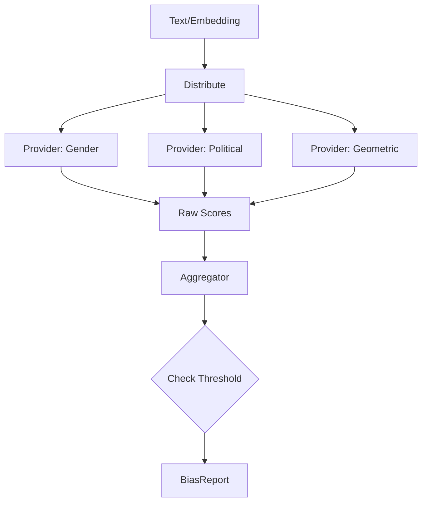

# 📦 Bias Detector Module

> **Module**: `BiasDetector`  
> **Engine**: [[../ENGINE_OVERVIEW|Bias]]  
> **Path**: `src/bias/detector.py`  
> **Node ID**: `mod_bias_detector`

---

## What It Is

The `BiasDetector` is the sentinel component responsible for identifying potentially harmful or skewed patterns in analysis outputs. It does not sensor content; rather, it flags statistical anomalies that might indicate bias in KALDRA's own processing or in the source text.

The detector operates on a **multi-provider architecture**. It doesn't rely on a single algorithm. Instead, it delegates to a collection of specialized "providers" (located in `src/bias/providers/`), each trained to detect specific types of bias (e.g., gender, racial, political, sentiment imbalance).

It aggregates scores from these providers into a unified `BiasReport`. This report includes a severity level (LOW, MEDIUM, HIGH, CRITICAL) and specific "bias markers" — snippets or vector dimensions that triggered the detection.

The detector uses **embedding-based geometric analysis**. It checks if the input text's embedding is unusually close to known "bias subspace" vectors (vectors representing stereotyped concepts). This is often more subtle and accurate than keyword matching.

It integrates with the `Safeguard` engine. While BiasDetector identifies the skew, Safeguard decides the policy action (e.g., block, warn, or append note).

The module supports **mitigation suggestions**. When bias is detected, it can propose "counter-factual" prompts or re-weighting strategies to the calling engine to balance the result.

Configuration determines which providers are active and their sensitivity thresholds. In "safety-first" mode, thresholds are lowered significantly.

---

## How It Works

### Step-by-Step Mechanics

1. **Input**: Text + Embeddings + Context
2. **load_providers()**: Initialize active detection strategies
3. **Parallel Scan**: Send input to all active providers
4. **Aggregate**: Collect scores and markers
5. **Score geometric**: Compute distance to bias centroids
6. **Threshold**: Compare aggregate score to safety config
7. **Report**: Generate `BiasReport` object

### Mermaid Diagram

---

## With What It Works

### Dependencies

| Dependency | Type | Purpose |
|------------|------|---------|
| `providers/` | uses | Specific detection logic |
| `scoring.py` | uses | Normalization math |

### Configurations

| Config | Path | Purpose |
|--------|------|---------|
| Bias Schema | `bias_schema.json` | Definitions & thresholds |

---

## Public Surface

| Item | Type | Description |
|------|------|-------------|
| `BiasDetector` | class | Main class |
| `detect(text, embedding)` | method | Run detection |
| `BiasReport` | dataclass | Output format |

---

## Future Implementations

1. Context-aware bias (is this bias appropriate for historical fiction?)
2. Real-time bias correction (rewriting text)
3. Federated bias learning

---

## Enhancements (Short/Medium Term)

1. Caching of detection results
2. More granular bias categories
3. "Explain Your Bias" feature

---

## Research Track (Long Term)

1. Automated discovery of new bias types
2. Cross-cultural bias norms
3. Adversarial bias injection protection

---

## Known Limitations

1. **Low Test Coverage** (Major Risk)
2. Can over-trigger on discussion of bias (mentioning bias vs being biased)
3. Heavy reliance on English language norms

---

## Testing

| Test File | Coverage | Notes |
|-----------|----------|-------|
| `tests/bias/` | ⚠️ Low | Critical gap |

---

## Next Steps

1. [ ] **Write tests immediately**
2. [ ] Add more geometric providers
3. [ ] Improve "mention vs use" distinction

---

## Related

- [[../ENGINE_OVERVIEW]]
- [[../Safeguard/ENGINE_OVERVIEW]]
