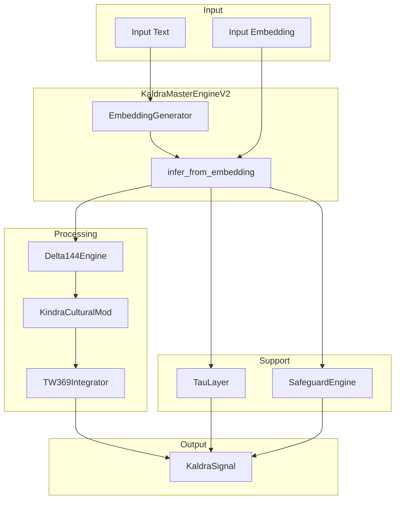

# ⚙️ Core Engine Overview

> **Engine**: `Core / KaldraMasterEngineV2`  
> **Path**: `src/core/`  
> **Node ID**: `engine_core`  
> **Status**: ✅ Active

---

## What It Is

The Core engine contains the **KaldraMasterEngineV2** — the v2.0 orchestrator that performs the primary inference pipeline. It receives text or embeddings and produces a complete `KaldraSignal` by coordinating Delta144, Kindra modulation, and TW369 drift calculation.

The master engine:
1. Generates embeddings from input text
2. Runs Delta144 for base archetype probabilities
3. Applies Kindra 3×48 cultural modulation
4. Calculates TW369 drift and severity
5. Integrates Tau and Safeguard layers

---

## Repo Paths & Entry Points

| Component | Path | Description |
|-----------|------|-------------|
| Main Directory | `src/core/` | All core engine code |
| Entry Point | `kaldra_master_engine.py` | `KaldraMasterEngineV2` class |
| Pipeline | `kaldra_engine_pipeline.py` | Pipeline runner |
| Embeddings | `embedding_generator.py` | `EmbeddingGenerator` |
| Cache | `embedding_cache.py` | Embedding caching |
| Epistemic | `epistemic_limiter.py` | Epistemic constraints |
| Logger | `kaldra_logger.py` | `KALDRALogger` |
| Audit | `audit_trail.py` | `AuditTrail` |
| Hardening | `hardening/` | Fallbacks, timeouts (8 files) |
| Observability | `observability/` | Monitoring (2 files) |

---

## Core Modules

| Module | Path | Purpose | Module Card |
|--------|------|---------|-------------|
| Master Engine | `kaldra_master_engine.py` | Main orchestrator | [[modules/master_engine]] |
| Embedding Generator | `embedding_generator.py` | Semantic embeddings | [[modules/embedding_generator]] |
| Embedding Cache | `embedding_cache.py` | Caching layer | [[modules/embedding_cache]] |
| Epistemic Limiter | `epistemic_limiter.py` | Epistemic constraints | [[modules/epistemic_limiter]] |
| Audit Trail | `audit_trail.py` | Audit logging | [[modules/audit_trail]] |
| Hardening | `hardening/` | Fallbacks/timeouts | [[modules/HARDENING_SUBSYSTEM]] |

---

## Flow Diagram



---

## With What It Works

### Dependencies

| Dependency | Engine | Relation |
|------------|--------|----------|
| [[Delta144/ENGINE_OVERVIEW\|Delta144]] | Delta144Engine | depends_on |
| [[Kindra/ENGINE_OVERVIEW\|Kindra]] | KindraCulturalMod | depends_on |
| [[TW369/ENGINE_OVERVIEW\|TW369]] | TW369Integrator | depends_on |
| [[Tau/ENGINE_OVERVIEW\|Tau]] | TauLayer | depends_on |
| [[Safeguard/ENGINE_OVERVIEW\|Safeguard]] | SafeguardEngine | depends_on |

### Configurations

| Config | Path |
|--------|------|
| Parallel Execution | `configs/execution/` |

### Schemas

| Schema | Path |
|--------|------|
| Core configs | (inline in module) |

### Runtime

- **Environment Variables**: `KALDRA_EMBEDDINGS_*`
- **External Services**: OpenAI API

---

## Output: KaldraSignal

```python
@dataclass
class KaldraSignal:
    archetype_probs: np.ndarray
    tw_trigger: bool
    tw_stats: Optional[TWStats]
    tau: Optional[Any]
    safeguard: Optional[Any]
    risk_summary: str  # "LOW" | "MEDIUM" | "HIGH"
    delta_state: Optional[Any]
    polarity_scores: Optional[Any]
    degraded: bool
```

---

## Module Cards

- [[modules/master_engine|Master Engine]]
- [[modules/embedding_generator|Embedding Generator]]
- [[modules/embedding_cache|Embedding Cache]]
- [[modules/epistemic_limiter|Epistemic Limiter]]
- [[modules/audit_trail|Audit Trail]]
- [[modules/HARDENING_SUBSYSTEM|Hardening Subsystem]]

---

## Future Implementations

1. Streaming inference
2. Batch processing
3. GPU acceleration
4. Quantized models

---

## Enhancements (Short/Medium Term)

1. Add inference caching
2. Implement request deduplication
3. Add detailed timing metrics
4. Improve parallel execution

---

## Research Track (Long Term)

1. Self-optimizing inference paths
2. Adaptive engine selection
3. Transfer learning integration
4. Multi-modal input support

---

## Known Limitations

1. Sequential fallback on parallel failure
2. Embedding generation is slow without cache
3. Single inference per request
4. No streaming output

---

## Testing

| Test Directory | Files | Coverage |
|----------------|-------|----------|
| `tests/core/` | 63 | ✅ Excellent |

---

## Next Steps

1. [ ] Profile inference pipeline
2. [ ] Add batch inference
3. [ ] Implement result caching

---

## Related

- [[MOC_HOME]]
- [[SYSTEM_OVERVIEW]]
- [[UnifiedKernel/ENGINE_OVERVIEW]]
