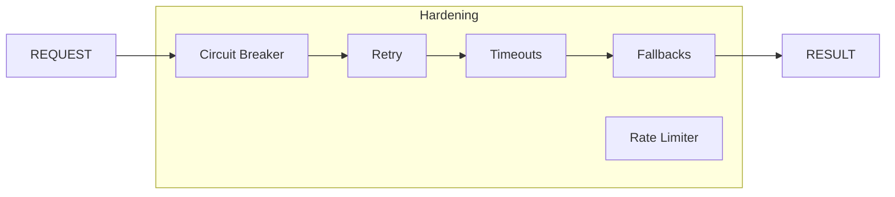

# 📦 Core Hardening Subsystem

> **Subsystem**: `hardening/`  
> **Engine**: [[../ENGINE_OVERVIEW|Core]]  
> **Path**: `packages/engine/kaldra_engine/core/hardening/`  
> **Node ID**: `mod_core_hardening_subsystem`

---

## What It Is

The Hardening Subsystem provides **production-grade resilience** for the Core engine through fallbacks, timeouts, circuit breakers, and retry logic. This Tier 2 index card describes the subsystem rather than individual files.

---

## Directory Contents (8 files)

| File | Purpose |
|------|---------|
| `__init__.py` | Package initialization |
| `fallbacks.py` | `@safe_fallback` decorator |
| `timeouts.py` | `@with_timeout` decorator |
| `circuit_breaker.py` | Circuit breaker pattern |
| `retry.py` | Retry with backoff |
| `rate_limiter.py` | Rate limiting |
| `health_checks.py` | Health check utilities |
| `config.py` | Hardening configuration |

---

## Key Decorators

### `@safe_fallback`
```python
@safe_fallback(fallback_value=None, log_errors=True)
def risky_function():
    # If this raises, return fallback_value
    pass
```

### `@with_timeout`
```python
@with_timeout(seconds=5.0, fallback=None)
def slow_function():
    # If this takes >5s, return fallback
    pass
```

---

## Architecture



---

## With What It Works

### Dependencies

| Dependency | Type | Purpose |
|------------|------|---------|
| `kaldra_master_engine.py` | used_by | Main consumer |
| `kaldra_engine_pipeline.py` | used_by | Pipeline |

---

## Future Implementations

1. Adaptive timeouts
2. ML-based circuit breaking
3. Distributed rate limiting
4. Chaos testing integration

---

## Enhancements (Short/Medium Term)

1. Add metrics per decorator
2. Improve configuration
3. Add dashboard integration
4. Document all patterns

---

## Research Track (Long Term)

1. Self-healing systems
2. Predictive failures
3. Graceful degradation ML
4. Resilience scoring

---

## Known Limitations

1. Decorators add overhead
2. Configuration is manual
3. No distributed coordination
4. Limited observability

---

## Testing

| Test File | Coverage | Notes |
|-----------|----------|-------|
| `tests/hardening/` | ✅ Good | 8 files |

---

## Next Steps

1. [ ] Add metrics
2. [ ] Improve config
3. [ ] Add chaos tests

---

## Related

- [[../ENGINE_OVERVIEW]]
- [[master_engine]]
