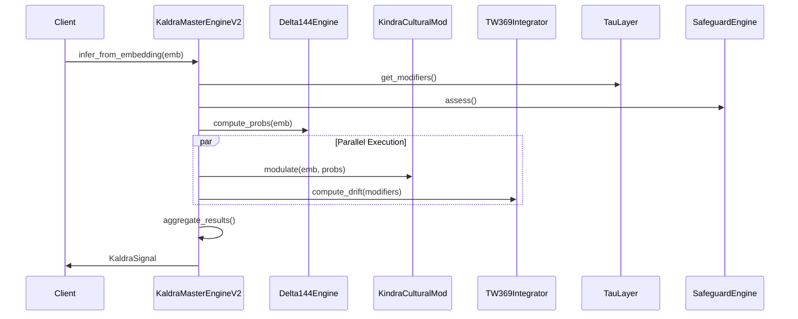

# 📦 Master Engine Module

> **Module**: `KaldraMasterEngineV2`  
> **Engine**: [[../ENGINE_OVERVIEW|Core]]  
> **Path**: `src/core/kaldra_master_engine.py`  
> **Node ID**: `mod_core_master_engine`

---

## What It Is

The `KaldraMasterEngineV2` is the core orchestrator of the KALDRA v2.0 inference pipeline. It receives text or embeddings and produces a complete `KaldraSignal` by coordinating Delta144, Kindra modulation, and TW369 drift calculation.

The master engine was designed as the "minimal orchestrator" — a lean component that delegates specialized work to purpose-built engines while managing the overall flow. This design philosophy keeps the core lightweight and testable while allowing each subsystem to evolve independently.

At its heart, the engine follows a clear processing flow: generate embeddings → compute base archetype probabilities via Delta144 → apply cultural modulation via Kindra → calculate temporal drift via TW369 → integrate safety layers. This pipeline can execute in parallel or sequential mode depending on configuration.

The engine supports **degraded mode** operation. When individual components fail, the engine can fall back to partial results rather than failing entirely. This is crucial for production reliability where some output is better than no output.

Parallel execution is handled by the `ParallelExecutor` from the infrastructure module. The engine partitions work into independent tasks (Kindra modulation and TW369 drift can run in parallel) and executes them concurrently when configured to do so. This significantly reduces inference latency.

The engine maintains an `AuditTrail` for logging inference requests. Every inference is assigned a unique `request_id`, and key metrics are logged at start and end. This enables debugging, monitoring, and compliance tracking.

Hardening is built into the core through decorators. The `@safe_fallback` decorator catches exceptions and returns degraded results. The `@with_timeout` decorator prevents runaway computations from blocking the system.

The output is a `KaldraSignal` dataclass that packages all results: archetype probabilities, TW trigger status, TW statistics, tau modifiers, safeguard status, risk summary, delta state, polarity scores, and a degraded flag.

The constructor accepts optional dependencies (delta_engine, tw_config, logger, audit_trail), making the engine testable and configurable. Default values are provided for production use.

Configuration for parallel execution is loaded from a JSON file at `configs/execution/parallel_config.json` if present. This allows runtime tuning without code changes.

---

## How It Works

### Step-by-Step Mechanics

1. **Input**: Receive embedding (d_ctx=256) and optional text
2. **Logging**: Log inference start with request_id
3. **Tau Modifiers**: Get modifiers from TauLayer
4. **Safeguard Check**: Initial safety assessment
5. **Delta144**: Compute base archetype probabilities
6. **Kindra**: Apply 3×48 cultural modulation (parallelizable)
7. **TW369**: Calculate drift state (parallelizable)
8. **Aggregate**: Combine results into KaldraSignal
9. **Logging**: Log inference end with summary
10. **Return**: KaldraSignal with all results

### Mermaid Diagram



---

## With What It Works

### Dependencies

| Dependency | Type | Purpose |
|------------|------|---------|
| `Delta144Engine` | depends_on | Base probs |
| `KaldraKindraCulturalMod` | depends_on | Modulation |
| `TW369Integrator` | depends_on | Drift |
| `TauLayer` | depends_on | Epistemic |
| `SafeguardEngine` | depends_on | Safety |
| `ParallelExecutor` | depends_on | Parallelism |
| `AuditTrail` | depends_on | Logging |

### Configurations

| Config | Path | Purpose |
|--------|------|---------|
| Parallel Config | `configs/execution/parallel_config.json` | Parallel settings |

### Runtime

- **Environment Variables**: `KALDRA_EMBEDDINGS_*`
- **External Services**: None direct (delegates to engines)

---

## Connections

### Graph Relations

```csv
from,relation,to,notes
mod_core_master_engine,depends_on,mod_delta144_engine,Uses Delta144 for base probs
mod_core_master_engine,depends_on,mod_kindra_cultural_mod,Uses Kindra for modulation
mod_core_master_engine,depends_on,mod_tw369_integrator,Uses TW369 for drift
mod_core_master_engine,depends_on,mod_tau_layer,Uses Tau for modifiers
mod_core_master_engine,depends_on,mod_safeguard_engine,Uses Safeguard for safety
```

---

## Public Surface

| Item | Type | Description |
|------|------|-------------|
| `KaldraSignal` | dataclass | Output signal |
| `KaldraMasterEngineV2` | class | Main engine |
| `__init__(delta_engine, d_ctx, tau, tw_config, logger, audit_trail)` | method | Constructor |
| `infer_from_embedding(embedding, text, tw_window)` | method | Main inference |

---

## Future Implementations

1. Streaming inference output
2. Batch processing
3. GPU acceleration
4. Quantized execution

---

## Enhancements (Short/Medium Term)

1. Add inference caching
2. Improve parallel strategy
3. Add detailed timing
4. Request deduplication

---

## Research Track (Long Term)

1. Self-optimizing pipelines
2. Adaptive parallelism
3. Transfer learning integration
4. Multi-modal inputs

---

## Known Limitations

1. Sequential fallback on parallel failure
2. Single inference per request
3. All engines required at init
4. No streaming output

---

## Testing

| Test File | Coverage | Notes |
|-----------|----------|-------|
| `tests/core/` | ✅ Excellent | 63 files |

---

## Next Steps

1. [ ] Profile bottlenecks
2. [ ] Add batch mode
3. [ ] Implement caching

---

## Related

- [[../ENGINE_OVERVIEW]]
- [[embedding_generator]]
- [[HARDENING_SUBSYSTEM]]
