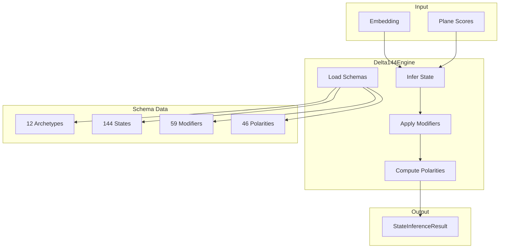

# ⚙️ Delta144 Engine Overview

> **Engine**: `Delta144 / Delta144Engine`  
> **Path**: `packages/engine/kaldra_engine/archetypes/`  
> **Node ID**: `engine_delta144`  
> **Status**: ✅ Active

---

## What It Is

The Delta144 engine implements the **12×12 archetypal matrix** — 12 archetypes × 12 states = 144 archetype-states. It receives aggregated signals and returns a coherent Δ144 state with modifiers and polarities.

Components:
- **12 Archetypes**: Creator, Sage, Ruler, Hero, ... (Jungian + Campbell)
- **144 States**: Each archetype has 12 possible states
- **59 Modifiers**: Dynamic qualifiers applied to states
- **46 Polarities**: Dimensional tensions (Light↔Shadow, Order↔Chaos)

---

## Repo Paths & Entry Points

| Component | Path | Description |
|-----------|------|-------------|
| Main Directory | `packages/engine/kaldra_engine/archetypes/` | All archetype code |
| Entry Point | `delta144_engine.py` | `Delta144Engine` class |
| Delta12 | `delta12_vector.py` | `Delta12Vector` |
| Polarity | `polarity_mapping.py` | Polarity mapping |
| API Adapter | `api_adapter.py` | API integration |
| TW Bridge | `tw_delta_bridge.py` | TW connection |

---

## Core Modules

| Module | Path | Purpose | Module Card |
|--------|------|---------|-------------|
| Delta144 Engine | `delta144_engine.py` | Main engine | [[modules/delta144_engine]] |
| Delta12 Vector | `delta12_vector.py` | 12 archetypes | [[modules/delta12_vector]] |
| Polarity Mapping | `polarity_mapping.py` | Polarities | [[modules/polarity_mapping]] |

---

## Flow Diagram



---

## With What It Works

### Dependencies

| Dependency | Type | Relation |
|------------|------|----------|
| [[Core/ENGINE_OVERVIEW\|Core]] | Consumer | depends_on |
| `EmbeddingGenerator` | Embeddings | depends_on |

### Configurations

| Config | Path |
|--------|------|
| Archetypes | `schema/archetypes/archetypes.core.json` |
| States | `schema/archetypes/delta144_states.json` |
| Modifiers | `schema/archetypes/modifiers.json` |
| Polarities | `schema/archetypes/polarities.json` |

### Schemas

| Schema | Path | Files |
|--------|------|-------|
| Archetypes | `schema/archetypes/` | 4 |

### Runtime

- **Environment Variables**: `KALDRA_EMBEDDINGS_*`
- **External Services**: None direct

---

## The 12 Archetypes

| ID | Label | Essence |
|----|-------|---------|
| A01 | CREATOR | Bringing new things into being |
| A02 | SAGE | Seeking wisdom and truth |
| A03 | MAGICIAN | Transformation and change |
| A04 | HERO | Courage and achievement |
| A05 | OUTLAW | Breaking rules, revolution |
| A06 | LOVER | Connection and intimacy |
| A07 | RULER | Control and leadership |
| A08 | CAREGIVER | Nurturing and protection |
| A09 | EVERYMAN | Belonging and authenticity |
| A10 | JESTER | Joy and humor |
| A11 | INNOCENT | Purity and optimism |
| A12 | EXPLORER | Discovery and freedom |

---

## Output: StateInferenceResult

```python
@dataclass
class StateInferenceResult:
    archetype: Archetype
    state: ArchetypeState
    active_modifiers: List[Modifier]
    scores: Dict[str, Any]
    probs: Optional[List[float]]
    polarity_scores: Dict[str, float]
```

---

## Module Cards

- [[modules/delta144_engine|Delta144 Engine]]
- [[modules/delta12_vector|Delta12 Vector]]
- [[modules/polarity_mapping|Polarity Mapping]]

---

## Future Implementations

1. Dynamic archetype weights
2. Cultural archetype variants
3. Temporal archetype evolution
4. Custom archetype definitions

---

## Enhancements (Short/Medium Term)

1. Add state transition probabilities
2. Implement modifier recommendations
3. Add polarity visualization
4. Cache state embeddings

---

## Research Track (Long Term)

1. Learned archetype embeddings
2. Cross-cultural archetypes
3. Archetype clustering
4. Generative archetype creation

---

## Known Limitations

1. Fixed 12 archetypes (not extensible)
2. State embeddings generated at init
3. Modifier inference is heuristic
4. Polarity scores are approximate

---

## Testing

| Test Directory | Files | Coverage |
|----------------|-------|----------|
| `tests/archetypes/` | 10 | ✅ Good |

---

## Next Steps

1. [ ] Add archetype API endpoints
2. [ ] Improve modifier inference
3. [ ] Enable custom archetypes

---

## Related

- [[MOC_HOME]]
- [[SYSTEM_OVERVIEW]]
- [[Core/ENGINE_OVERVIEW]]
- [[Kindra/ENGINE_OVERVIEW]]
