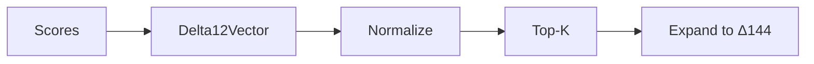

# 📦 Delta12 Vector Module

> **Module**: `Delta12Vector`  
> **Engine**: [[../ENGINE_OVERVIEW|Delta144]]  
> **Path**: `packages/engine/kaldra_engine/archetypes/delta12_vector.py`  
> **Node ID**: `mod_delta12_vector`

---

## What It Is

The `Delta12Vector` represents the 12-dimensional archetype vector — the foundational layer upon which the full Δ144 matrix is built. Each of the 12 dimensions corresponds to one of the primary archetypes.

The Delta12 layer provides a compact representation of archetypal distribution. Before expanding to the full 144 states, the system first determines which of the 12 base archetypes are most active. This hierarchical approach improves efficiency and interpretability.

Each archetype in the Δ12 has associated metadata: essence, light aspect, shadow aspect, drives, journey role, and stoic axis. This rich metadata supports both scoring and explanation generation.

The vector can be represented as a 12-element probability distribution (summing to 1.0) or as raw scores. The normalized form is used for archetypal balance analysis, while raw scores support magnitude comparisons.

The module provides utilities for vector operations: normalization, top-k selection, cosine similarity with reference vectors, and conversion to/from dictionaries.

Integration with the master engine happens through the inference pipeline: embeddings are first scored against Δ12 to determine dominant archetypes, then refined to Δ144 states.

The stoic axis mapping connects each archetype to one of the 12 Stoic axes used by the Aurelius meta-engine, enabling philosophical analysis.

The journey role mapping connects archetypes to Campbell's hero's journey stages, supporting narrative arc detection.

Light/shadow duality is fundamental — each archetype has both positive (light) and negative (shadow) manifestations. The system tracks which pole is dominant.

The file is relatively compact (~12k bytes) but foundational — it defines the archetypal vocabulary that the entire system uses.

---

## How It Works

### Step-by-Step Mechanics

1. **Initialize**: Create Δ12 vector (12 dimensions)
2. **Set Scores**: Assign scores per archetype
3. **Normalize**: Convert to probability distribution
4. **Get Top-K**: Find dominant archetypes
5. **Map to Δ144**: Expand to 144 states
6. **Return**: Vector representation

### Mermaid Diagram

---

## The 12 Archetypes

| ID | Label | Essence | Stoic Axis |
|----|-------|---------|------------|
| A01 | CREATOR | Bringing new things | Perception Clarity |
| A02 | SAGE | Seeking wisdom | Assent to Reality |
| A03 | MAGICIAN | Transformation | Right Action |
| A04 | HERO | Courage/achievement | Discipline of Will |
| A05 | OUTLAW | Breaking rules | Emotional Regulation |
| A06 | LOVER | Connection/intimacy | Desire Restraint |
| A07 | RULER | Control/leadership | Control Dichotomy |
| A08 | CAREGIVER | Nurturing/protection | Social Duty |
| A09 | EVERYMAN | Belonging | Premeditatio Malorum |
| A10 | JESTER | Joy/humor | Fate Acceptance |
| A11 | INNOCENT | Purity/optimism | Self-Mastery |
| A12 | EXPLORER | Discovery/freedom | Serenity |

---

## With What It Works

### Dependencies

| Dependency | Type | Purpose |
|------------|------|---------|
| `delta144_engine.py` | used_by | Parent engine |

---

## Public Surface

| Item | Type | Description |
|------|------|-------------|
| `Delta12Vector` | class | 12-dim vector |
| `normalize()` | method | To probabilities |
| `top_k(k)` | method | Get top archetypes |
| `to_dict()` | method | Dictionary form |

---

## Future Implementations

1. Learned archetype embeddings
2. Dynamic archetype weights
3. Cultural variants
4. Custom archetypes

---

## Enhancements (Short/Medium Term)

1. Add vector visualization
2. Improve top-k with thresholds
3. Add archetype explanations
4. Cache computations

---

## Research Track (Long Term)

1. Neural archetype encoding
2. Cross-cultural archetypes
3. Temporal evolution
4. Generative archetypes

---

## Known Limitations

1. Fixed 12 archetypes
2. Manual metadata
3. No learned weights
4. Static definitions

---

## Testing

| Test File | Coverage | Notes |
|-----------|----------|-------|
| `tests/archetypes/` | ✅ Good | Part of 10 files |

---

## Next Steps

1. [ ] Add visualization
2. [ ] Enable custom archetypes
3. [ ] Add learned weights

---

## Related

- [[../ENGINE_OVERVIEW]]
- [[delta144_engine]]
