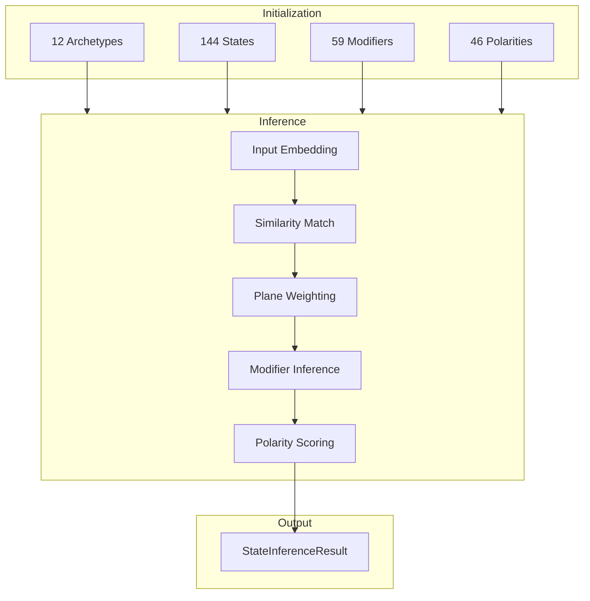

# 📦 Delta144 Engine Module

> **Module**: `Delta144Engine`  
> **Engine**: [[../ENGINE_OVERVIEW|Delta144]]  
> **Path**: `src/archetypes/delta144_engine.py`  
> **Node ID**: `mod_delta144_engine`

---

## What It Is

The `Delta144Engine` is the motor arquetípico (archetypal engine) at the heart of KALDRA's symbolic analysis. It manages the 12×12 matrix of archetype-states — 12 base archetypes each with 12 possible states, yielding 144 distinct cells representing the full spectrum of human archetypal experience.

The engine was designed around Carl Jung's archetypal theory, extended with Joseph Campbell's heroic journey framework. The 12 archetypes (Creator, Sage, Magician, Hero, Outlaw, Lover, Ruler, Caregiver, Everyman, Jester, Innocent, Explorer) represent fundamental patterns of human psychology and narrative.

Each archetype has 12 states representing different manifestations along axes of light/shadow, active/passive, and integrated/fragmented. This creates a rich 144-cell matrix where each cell has a unique profile, default modifiers, and TW plane alignment.

The engine loads its configuration from four JSON schema files: archetypes (12 definitions), states (144 cells), modifiers (59 qualifiers), and polarities (46 dimensional tensions). This separation of code and data allows updating the archetypal model without code changes.

Modifier support (v2.5+) adds dynamic qualifiers that can be applied to states. Modifiers like "EMERGING", "CRYSTALLIZED", "CONFLICTED" add nuance to the base state. Each modifier has a category and TW alignment, integrating with temporal dynamics.

Polarity support (v2.7+) introduces 46 dimensional tensions that structure experience. Polarities like LIGHT↔SHADOW, ORDER↔CHAOS, EXPANSION↔CONTRACTION create axes along which states can be modulated.

The engine generates embeddings for each of the 144 states at initialization. These reference embeddings enable semantic similarity matching — input embeddings can be compared against all 144 state embeddings to find the best match.

State inference combines multiple signals: embedding similarity, plane scores (from TW369), and contextual hints. The engine doesn't parse text directly — it receives aggregated signals and returns a coherent state.

The output is a `StateInferenceResult` containing the matched archetype, state, active modifiers, scores, probabilities, and polarity scores. This comprehensive output supports both visualization and downstream processing.

The engine supports a factory pattern via `from_schema()` which loads all data from the schema directory. This is the preferred initialization method for production use.

---

## How It Works

### Step-by-Step Mechanics

1. **Load Schemas**: Read archetypes, states, modifiers, polarities from JSON
2. **Generate Embeddings**: Create reference embeddings for 144 states
3. **Receive Signal**: Accept embedding + plane scores
4. **Compute Similarity**: Compare against 144 state embeddings
5. **Apply Plane Weights**: Weight by TW plane alignment
6. **Select State**: Choose highest-scoring state
7. **Infer Modifiers**: Determine active modifiers
8. **Compute Polarities**: Calculate polarity scores
9. **Return Result**: StateInferenceResult with all data

### Mermaid Diagram

---

## With What It Works

### Dependencies

| Dependency | Type | Purpose |
|------------|------|---------|
| `delta12_vector.py` | depends_on | 12 archetype vectors |
| `embedding_generator.py` | depends_on | State embeddings |

### Configurations

| Config | Path | Purpose |
|--------|------|---------|
| Archetypes | `schema/archetypes/archetypes.core.json` | 12 definitions |
| States | `schema/archetypes/delta144_states.json` | 144 cells |
| Modifiers | `schema/archetypes/modifiers.json` | 59 qualifiers |
| Polarities | `schema/archetypes/polarities.json` | 46 tensions |

---

## Public Surface

| Item | Type | Description |
|------|------|-------------|
| `Delta144Engine` | class | Main engine |
| `from_schema()` | classmethod | Factory from schema |
| `get_archetype(id)` | method | Get archetype |
| `get_state(id)` | method | Get state |
| `infer_state(embedding, plane_scores)` | method | Infer state |

---

## Future Implementations

1. Dynamic archetype weights
2. Cultural archetype variants
3. Temporal archetype evolution
4. Custom archetype definitions

---

## Enhancements (Short/Medium Term)

1. Add state transition probabilities
2. Implement modifier recommendations
3. Add polarity visualization
4. Cache state embeddings

---

## Research Track (Long Term)

1. Learned archetype embeddings
2. Cross-cultural archetypes
3. Archetype clustering
4. Generative archetype creation

---

## Known Limitations

1. Fixed 12 archetypes (not extensible)
2. State embeddings generated at init
3. Modifier inference is heuristic
4. Polarity scores are approximate

---

## Testing

| Test File | Coverage | Notes |
|-----------|----------|-------|
| `tests/archetypes/` | ✅ Good | 10 files |

---

## Next Steps

1. [ ] Add archetype API
2. [ ] Improve modifier inference
3. [ ] Enable custom archetypes

---

## Related

- [[../ENGINE_OVERVIEW]]
- [[delta12_vector]]
