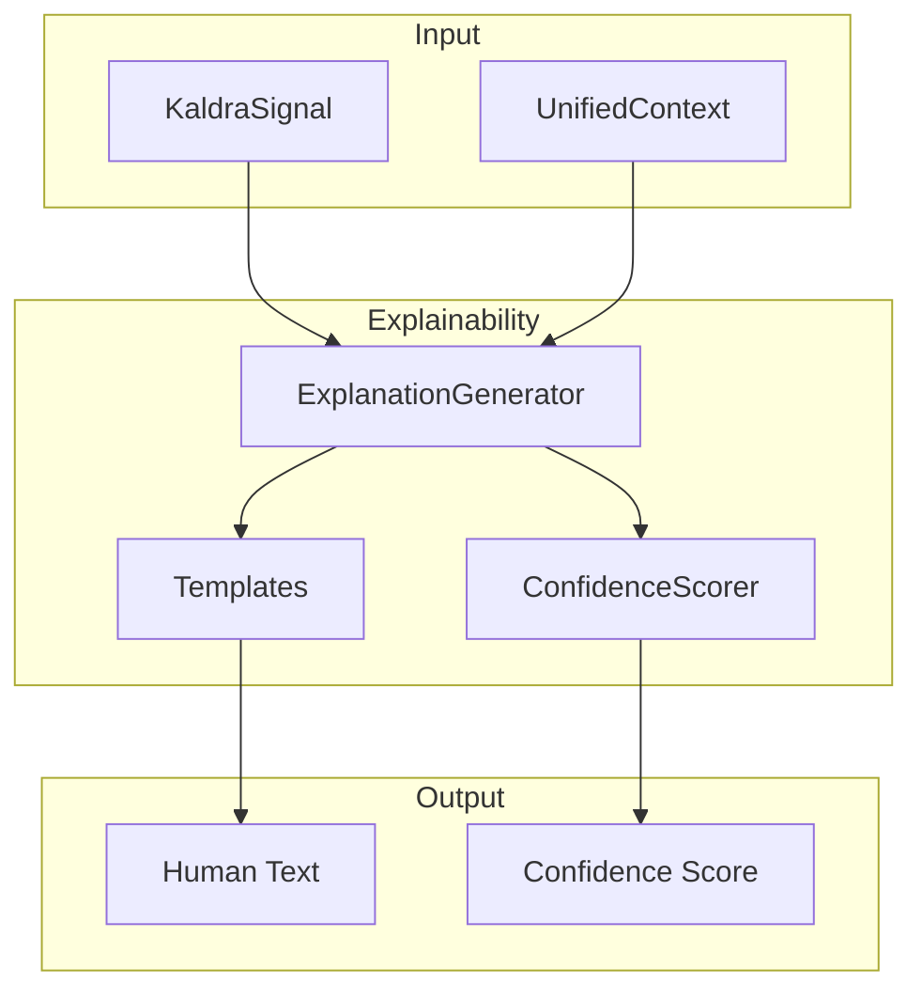

# ⚙️ Explainability Engine Overview

> **Engine**: `Explainability`  
> **Path**: `src/explainability/`  
> **Node ID**: `engine_explainability`  
> **Status**: ✅ Active

---

## What It Is

The Explainability engine generates **human-readable explanations** of KALDRA analysis results. It transforms technical outputs (archetype probabilities, drift values, etc.) into natural language explanations with confidence scoring.

Components:
- **Explanation Generator**: Main generation logic
- **Explanation Output**: Formatting and structure
- **Explanation Confidence**: Confidence scoring for explanations
- **Templates**: Explanation templates

---

## Repo Paths & Entry Points

| Component | Path | Description |
|-----------|------|-------------|
| Main Directory | `src/explainability/` | All explainability code |
| Entry Point | `explanation_generator.py` | Main generator |
| Output | `explanation_output.py` | Output formatting |
| Confidence | `explanation_confidence.py` | Confidence scoring |
| Templates | `templates/` | 3 template files |
| Proto | `proto/` | 4 protobuf files |

---

## Core Modules

| Module | Path | Purpose | Module Card |
|--------|------|---------|-------------|
| Generator | `explanation_generator.py` | Main generation | [[modules/explanation_generator]] |
| Output | `explanation_output.py` | Formatting | [[modules/explanation_output]] |
| Confidence | `explanation_confidence.py` | Scoring | [[modules/explanation_confidence]] |

---

## Flow Diagram

---

## With What It Works

### Dependencies

| Dependency | Type | Relation |
|------------|------|----------|
| [[Core/ENGINE_OVERVIEW\|Core]] | KaldraSignal | depends_on |
| [[UnifiedKernel/ENGINE_OVERVIEW\|Kernel]] | UnifiedContext | depends_on |

### Configurations

| Config | Path |
|--------|------|
| Templates | `src/explainability/templates/` |

### Schemas

| Schema | Path |
|--------|------|
| Proto | `src/explainability/proto/` |

### Runtime

- **Environment Variables**: None
- **External Services**: None

---

## Module Cards

- [[modules/explanation_generator|Explanation Generator]]
- [[modules/explanation_output|Explanation Output]]
- [[modules/explanation_confidence|Explanation Confidence]]

---

## Future Implementations

1. Multi-language explanations
2. Audience-adaptive explanations
3. Interactive explanations
4. Explanation caching

---

## Enhancements (Short/Medium Term)

1. Add explanation templates
2. Improve confidence scoring
3. Add visual explanations
4. Support markdown output

---

## Research Track (Long Term)

1. LLM-based explanations
2. Personalized explanations
3. Explanation learning
4. Multi-modal explanations

---

## Known Limitations

1. English-only explanations
2. Fixed template structure
3. Limited confidence granularity
4. No interactive drill-down

---

## Testing

| Test Directory | Files | Coverage |
|----------------|-------|----------|
| `tests/explainability/` | 12 | ✅ Good |

---

## Next Steps

1. [ ] Add more templates
2. [ ] Improve confidence
3. [ ] Add multi-language

---

## Related

- [[MOC_HOME]]
- [[SYSTEM_OVERVIEW]]
- [[Core/ENGINE_OVERVIEW]]
