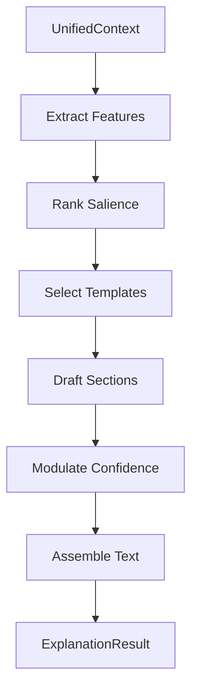

# 📦 Explanation Generator Module

> **Module**: `ExplanationGenerator`  
> **Engine**: [[../ENGINE_OVERVIEW|Explainability]]  
> **Path**: `packages/engine/kaldra_engine/explainability/explanation_generator.py`  
> **Node ID**: `mod_explanation_generator`

---

## What It Is

The `ExplanationGenerator` is the bridge between numerical analysis and human understanding. It takes the complex `UnifiedContext` or `KaldraSignal` – dense with vectors, floats, and probabilities – and synthesizes it into natural language text.

The generator operates on a **template-based strategy augmented by logic**. It doesn't just fill in blanks; it uses decision logic to select the most relevant "narrative frames" based on the data. For example, if the TW369 drift is high, it selects a template suite related to volatility and change.

It prioritizes findings. A signal contains hundreds of data points. The generator computes relevance scores for different signal components (e.g., is the Shadow archetype dominant? Is the bias score critical?) and constructs the explanation around the top 3-5 most salient features.

The module manages **confidence communication**. It explicitly calculates how confident the system is in its own analysis (based on signal strength, consistency, and missing data) and modulates the language accordingly (e.g., "suggests that" vs. "indicates that").

It supports **multi-level granularity**. It can generate:
- `Summary`: One-sentence gist.
- `Brief`: Executive summary paragraph.
- `Detailed`: Full breakdown by engine.
- `Technical`: Debug-level output with raw scores.

The generator integrates with the `Bias` engine to flag potential fairness issues in the explanation itself, identifying if the interpretation might be skewed.

It uses an `ExplanationContext` object to carry state through the generation process, allowing for coherent multi-paragraph outputs where later sentences reference earlier ones (e.g., "This tension aligns with the previously noted Shadow dominance").

---

## How It Works

### Step-by-Step Mechanics

1. **Ingest Context**: Receive `UnifiedContext`
2. **Feature Extraction**: Identify top archetypes, drift levels, outliers
3. **Template Selection**: Choose base narrative frame based on mode/intent
4. **Drafting**:
   - Generate Archetype section ("The narrative is driven by the Creator...")
   - Generate Temporal section ("...drifting towards structural tension...")
   - Generate Safety/Bias notes
5. **Confidence check**: Adjust language certainty
6. **Assembly**: Combine sections into requested format (JSON/Markdown)
7. **Return**: `ExplanationResult`

### Mermaid Diagram

---

## With What It Works

### Dependencies

| Dependency | Type | Purpose |
|------------|------|---------|
| `UnifiedContext` | input | Source data |
| `templates/` | resource | Text patterns |
| `ExplanationConfidence` | utility | Certainty scoring |

### Configurations

| Config | Path | Purpose |
|--------|------|---------|
| Templates | `packages/engine/kaldra_engine/explainability/templates/` | YAML template files |

---

## Public Surface

| Item | Type | Description |
|------|------|-------------|
| `ExplanationGenerator` | class | Main class |
| `generate(context, level)` | method | Create explanation |
| `ExplanationResult` | dataclass | Text + metadata |

---

## Future Implementations

1. LLM-based generation (replacing templates)
2. Multi-lingual support
3. Interactive "Drill-down" explanations (chat-based)

---

## Enhancements (Short/Medium Term)

1. Richer template library
2. Better connective logic ("However...", "Furthermore...")
3. Formatting options (HTML, Markdown)

---

## Research Track (Long Term)

1. Causal explanation (Why X happened)
2. Counterfactual explanation (What if X happened instead)
3. Personalized explanation (based on user expertise)

---

## Known Limitations

1. Repetitive phrasing with fixed templates
2. English-only
3. Can miss subtle cross-engine correlations

---

## Testing

| Test File | Coverage | Notes |
|-----------|----------|-------|
| `tests/explainability/` | ✅ Good | Part of 12 files |

---

## Next Steps

1. [ ] Expand template set
2. [ ] Add markdown output
3. [ ] Prototype LLM generation

---

## Related

- [[../ENGINE_OVERVIEW]]
- [[explanation_output]]
