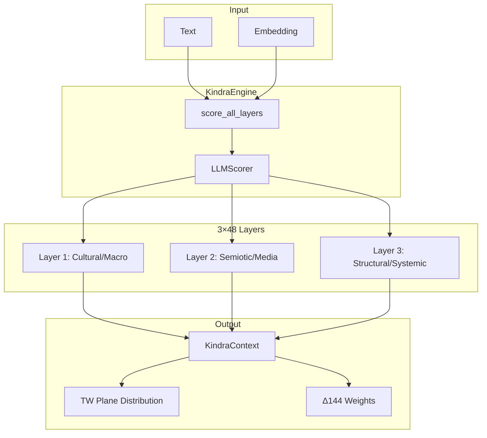

# ⚙️ Kindra Engine Overview

> **Engine**: `Kindra / KindraEngine`  
> **Path**: `src/kindras/`  
> **Node ID**: `engine_kindra`  
> **Status**: ✅ Active

---

## What It Is

The Kindra engine implements the **3×48 semantic/cultural scoring system**. It analyzes text through three layers of 48 vectors each, producing cultural modulation scores that affect the Δ144 archetype distribution.

The three layers:
1. **Layer 1 (L1)**: Cultural/Macro — 48 cultural vectors
2. **Layer 2 (L2)**: Semiotic/Media — 48 semiotic vectors
3. **Layer 3 (L3)**: Structural/Systemic — 48 structural vectors

---

## Repo Paths & Entry Points

| Component | Path | Description |
|-----------|------|-------------|
| Main Directory | `src/kindras/` | All Kindra code |
| Entry Point | `kindra_engine.py` | `KindraEngine` v3.1 |
| Cultural Mod | `kindra_cultural_mod.py` | `KaldraKindraCulturalMod` |
| Hybrid Scorer | `kindra_hybrid_scorer.py` | Hybrid scoring |
| LLM Scorer | `kindra_llm_scorer.py` | LLM-based scoring |
| Loaders | `loaders.py` | Vector/mapping loading |
| LLM Adapter | `llm_adapter.py` | `KindraLLMScorer` |
| Normalization | `normalization.py` | Score normalization |
| Scoring | `scoring/` | Scoring implementations (26 files) |

---

## Core Modules

| Module | Path | Purpose | Module Card |
|--------|------|---------|-------------|
| Kindra Engine | `kindra_engine.py` | Main engine | [[modules/kindra_engine]] |
| Cultural Mod | `kindra_cultural_mod.py` | Modulation | [[modules/kindra_cultural_mod]] |
| Loaders | `loaders.py` | Data loading | [[modules/loaders]] |
| LLM Adapter | `llm_adapter.py` | LLM scoring | [[modules/llm_adapter]] |
| Scoring | `scoring/` | Score impls | [[modules/SCORING_SUBSYSTEM]] |

---

## Flow Diagram



---

## With What It Works

### Dependencies

| Dependency | Type | Relation |
|------------|------|----------|
| [[TW369/ENGINE_OVERVIEW\|TW369]] | Consumer | feeds |
| [[Delta144/ENGINE_OVERVIEW\|Delta144]] | Consumer | feeds |

### Configurations

| Config | Path |
|--------|------|
| Layer vectors | `schema/kindras/` |
| Layer mappings | `schema/kindras/` |

### Schemas

| Schema | Path | Files |
|--------|------|-------|
| Kindras | `schema/kindras/` | 6 |

### Runtime

- **Environment Variables**: LLM API keys
- **External Services**: OpenAI/LLM API

---

## Output: KindraContext

```python
@dataclass
class KindraContext:
    layer1: KindraLayerScores
    layer2: KindraLayerScores
    layer3: KindraLayerScores
    tw_plane_distribution: Dict[int, float]  # {3: x, 6: y, 9: z}
    delta144_weights: Dict[str, float]
    metadata: Dict[str, Any]
```

---

## Module Cards

- [[modules/kindra_engine|Kindra Engine]]
- [[modules/kindra_cultural_mod|Cultural Mod]]
- [[modules/loaders|Loaders]]
- [[modules/llm_adapter|LLM Adapter]]
- [[modules/SCORING_SUBSYSTEM|Scoring Subsystem]]

---

## Future Implementations

1. Multi-language support
2. Custom vector training
3. Real-time vector updates
4. Embedding-only scoring mode

---

## Enhancements (Short/Medium Term)

1. Add scoring confidence intervals
2. Implement batch scoring
3. Add vector contribution visualization
4. Cache frequent patterns

---

## Research Track (Long Term)

1. Learned vector embeddings
2. Cross-cultural transfer
3. Temporal vector evolution
4. Multi-modal scoring

---

## Known Limitations

1. LLM calls are slow/expensive
2. Fixed 48 vectors per layer
3. No vector weighting per context
4. English-centric vectors

---

## Testing

| Test Directory | Files | Coverage |
|----------------|-------|----------|
| `tests/kindras/` | 18 | ✅ Good |

---

## Next Steps

1. [ ] Add LLM result caching
2. [ ] Implement batch scoring
3. [ ] Add vector importance ranking

---

## Related

- [[MOC_HOME]]
- [[SYSTEM_OVERVIEW]]
- [[TW369/ENGINE_OVERVIEW]]
- [[Delta144/ENGINE_OVERVIEW]]
