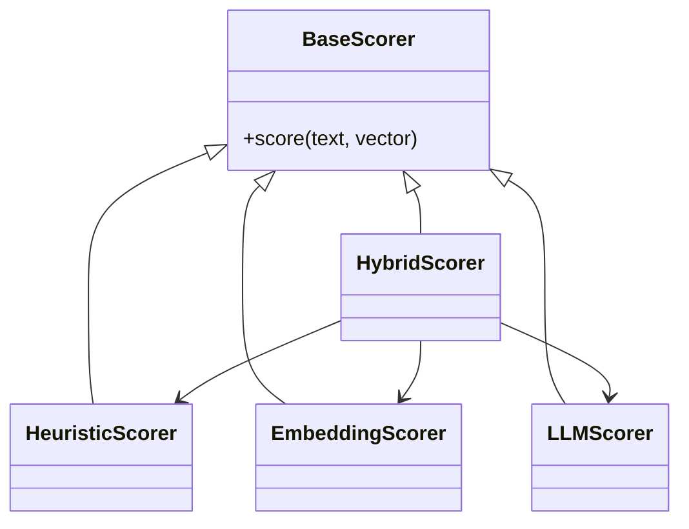

# 📦 Kindra Scoring Subsystem

> **Subsystem**: `scoring/`  
> **Engine**: [[../ENGINE_OVERVIEW|Kindra]]  
> **Path**: `src/kindras/scoring/`  
> **Node ID**: `mod_kindra_scoring_subsystem`

---

## What It Is

The Scoring Subsystem is a collection of **26 specialized scoring modules** that implement various scoring strategies for Kindra layer vectors. Rather than documenting each file individually, this index card describes the subsystem as a whole.

---

## Directory Contents

| File | Purpose |
|------|---------|
| `__init__.py` | Package initialization |
| `base_scorer.py` | Base class for scorers |
| `heuristic_scorer.py` | Keyword-based scoring |
| `embedding_scorer.py` | Embedding similarity scoring |
| `llm_scorer.py` | LLM-based scoring |
| `hybrid_scorer.py` | Combined scoring strategies |
| `layer1_*.py` | Layer 1 specific scorers |
| `layer2_*.py` | Layer 2 specific scorers |
| `layer3_*.py` | Layer 3 specific scorers |
| `normalize.py` | Score normalization |
| `aggregate.py` | Score aggregation |
| + 15 more files | Various implementations |

---

## Architecture

---

## Scoring Strategies

| Strategy | Speed | Accuracy | Cost |
|----------|-------|----------|------|
| Heuristic | ⚡ Fast | 🔶 Medium | Free |
| Embedding | 🔶 Medium | 🔶 Medium | Low |
| LLM | 🐢 Slow | ✅ High | $$ |
| Hybrid | 🔶 Medium | ✅ High | $ |

---

## With What It Works

### Dependencies

| Dependency | Type | Purpose |
|------------|------|---------|
| `kindra_engine.py` | owned_by | Parent engine |
| `loaders.py` | depends_on | Vector definitions |

---

## Future Implementations

1. Learned scoring weights
2. Custom scorer plugins
3. Async scoring
4. Batch scoring

---

## Enhancements (Short/Medium Term)

1. Add scorer benchmarks
2. Improve hybrid strategy
3. Add scorer selection API
4. Cache scoring results

---

## Research Track (Long Term)

1. Neural scoring
2. Cross-lingual scoring
3. Contextual scoring
4. Scorer ensemble

---

## Known Limitations

1. Many similar files (potential consolidation)
2. Limited documentation per module
3. Inconsistent interfaces
4. No unified testing

---

## Testing

| Test File | Coverage | Notes |
|-----------|----------|-------|
| `tests/kindras/` | Partial | Some scorer tests |

---

## Next Steps

1. [ ] Audit for consolidation
2. [ ] Add unified tests
3. [ ] Document interfaces

---

## Related

- [[../ENGINE_OVERVIEW]]
- [[kindra_engine]]
