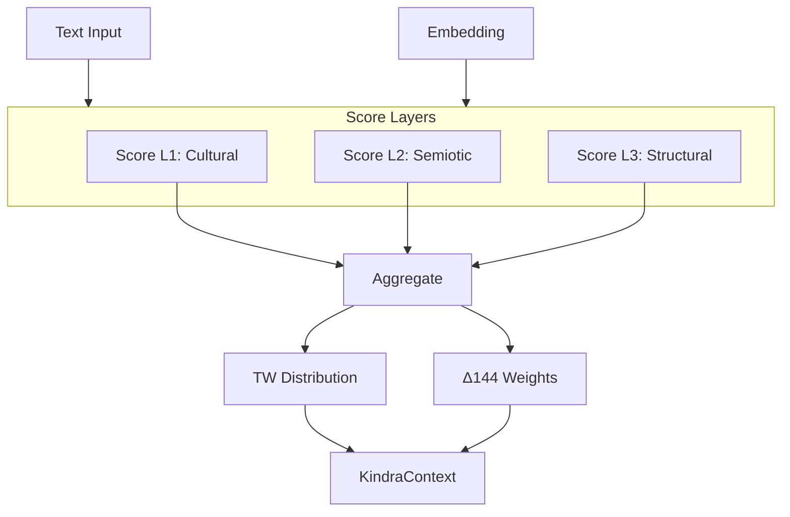

# 📦 Kindra Engine Module

> **Module**: `KindraEngine`  
> **Engine**: [[../ENGINE_OVERVIEW|Kindra]]  
> **Path**: `src/kindras/kindra_engine.py`  
> **Node ID**: `mod_kindra_engine`

---

## What It Is

The `KindraEngine` v3.1 is the core component of the Kindra 3×48 semantic/cultural scoring system. It scores text through three layers of 48 vectors each, producing cultural modulation that affects archetype distributions.

The engine was designed around the insight that cultural and symbolic meaning operates at multiple levels simultaneously. Layer 1 captures macro-cultural dynamics (nationalism, globalism, tradition vs. innovation). Layer 2 captures semiotic/media patterns (viral spread, narrative framing, symbolic resonance). Layer 3 captures structural/systemic forces (institutional power, economic systems, social hierarchies).

Each layer contains 48 carefully curated vectors representing key cultural dimensions. The engine scores input text against all 144 vectors (3×48), producing normalized scores that indicate which cultural forces are active.

The LLM scorer (`KindraLLMScorer`) provides the actual scoring logic. It can use heuristic methods, embedding similarity, or LLM-based evaluation depending on configuration. This modular design allows upgrading scoring without changing the engine interface.

The engine produces a `KindraContext` output containing all layer scores, a TW plane distribution (mapping layers to planes 3/6/9), and aggregated delta144 weights (how cultural scores influence archetype probabilities).

Vector and mapping data are loaded from JSON schemas via the `loaders.py` module. This separation allows updating cultural vectors without code changes.

The engine supports optional embedding input alongside text. When embeddings are provided, they can enhance scoring through semantic similarity comparisons.

Normalization ensures all scores fall in [0, 1] and sum appropriately for downstream processing.

The TW plane distribution is computed from average layer scores, providing a bridge to the TW369 temporal dynamics engine.

Delta144 weight aggregation uses Kindra→Δ144 mapping files to determine how cultural vectors influence specific archetypes.

---

## How It Works

### Step-by-Step Mechanics

1. **Input**: Receive text and optional embedding
2. **Load Vectors**: Access layer vectors from loaders
3. **Score Layer 1**: Score 48 Cultural/Macro vectors
4. **Score Layer 2**: Score 48 Semiotic/Media vectors
5. **Score Layer 3**: Score 48 Structural/Systemic vectors
6. **Aggregate**: Build KindraLayerScores for each layer
7. **TW Distribution**: Compute plane 3/6/9 distribution
8. **Delta144 Weights**: Aggregate archetype weights
9. **Return**: KindraContext with all results

### Mermaid Diagram

---

## With What It Works

### Dependencies

| Dependency | Type | Purpose |
|------------|------|---------|
| `loaders.py` | depends_on | Load vectors/mappings |
| `llm_adapter.py` | depends_on | LLM scoring |
| `unified_state.py` | depends_on | KindraContext type |

### Configurations

| Config | Path | Purpose |
|--------|------|---------|
| Layer 1 Vectors | `schema/kindras/layer1_vectors.json` | L1 definitions |
| Layer 2 Vectors | `schema/kindras/layer2_vectors.json` | L2 definitions |
| Layer 3 Vectors | `schema/kindras/layer3_vectors.json` | L3 definitions |
| Layer Mappings | `schema/kindras/*_mapping.json` | Δ144 mappings |

---

## Public Surface

| Item | Type | Description |
|------|------|-------------|
| `KindraEngine` | class | Main engine |
| `score_all_layers(text, embedding, delta144_state, archetype_scores)` | method | Score input |
| `layer1_vectors`, `layer2_vectors`, `layer3_vectors` | property | Vector data |
| `layer1_map`, `layer2_map`, `layer3_map` | property | Mapping data |

---

## Future Implementations

1. Multi-language support
2. Custom vector training
3. Real-time vector updates
4. Embedding-only scoring mode

---

## Enhancements (Short/Medium Term)

1. Add score confidence intervals
2. Implement batch scoring
3. Add vector contribution visualization
4. Cache frequent patterns

---

## Research Track (Long Term)

1. Learned vector embeddings
2. Cross-cultural transfer
3. Temporal vector evolution
4. Multi-modal scoring

---

## Known Limitations

1. LLM calls are slow/expensive
2. Fixed 48 vectors per layer
3. No vector weighting per context
4. English-centric vectors

---

## Testing

| Test File | Coverage | Notes |
|-----------|----------|-------|
| `tests/kindras/` | ✅ Good | 18 files |

---

## Next Steps

1. [ ] Add LLM caching
2. [ ] Batch scoring
3. [ ] Vector importance

---

## Related

- [[../ENGINE_OVERVIEW]]
- [[SCORING_SUBSYSTEM]]
- [[loaders]]
