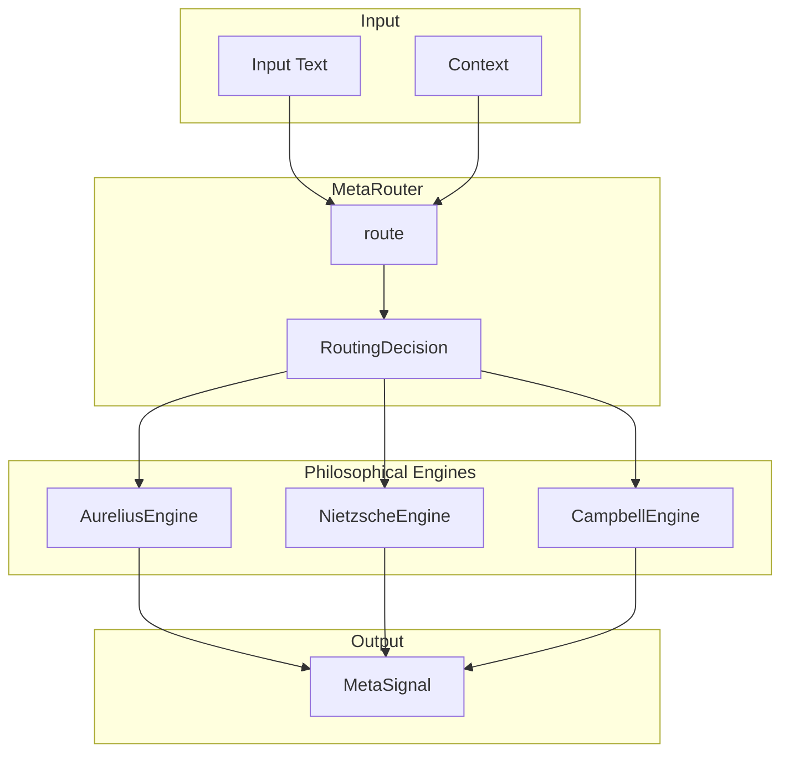

# ⚙️ Meta Engines Overview

> **Engine**: `Meta / MetaEngines`  
> **Path**: `packages/engine/kaldra_engine/meta/`  
> **Node ID**: `engine_meta`  
> **Status**: ✅ Active

---

## What It Is

The Meta engines provide **philosophical analysis** through three distinct lenses: Stoic (Aurelius), Nietzschean (Nietzsche), and Narrative (Campbell). A `MetaRouter` routes requests to the appropriate engine based on context.

Engines:
- **Aurelius**: Stoic philosophy — 12 axes, 4 Cardinal Virtues
- **Nietzsche**: Will-to-power — power dynamics, creative destruction
- **Campbell**: Hero's Journey — arc progression, narrative stages

---

## Repo Paths & Entry Points

| Component | Path | Description |
|-----------|------|-------------|
| Main Directory | `packages/engine/kaldra_engine/meta/` | All meta engine code |
| Router | `engine_router.py` | `MetaRouter` class |
| Orchestrator | `engine_orchestrator.py` | Orchestration |
| Meta Router | `meta_router.py` | Secondary router |
| Base | `meta_engine_base.py` | Base class |
| Types | `types.py` | `MetaInput` |
| Aurelius | `aurelius.py` | Stoic engine |
| Nietzsche | `nietzsche.py` | Will-to-power |
| Campbell | `campbell.py`, `campbell_engine.py` | Hero's journey |

---

## Core Modules

| Module | Path | Purpose | Module Card |
|--------|------|---------|-------------|
| Engine Router | `engine_router.py` | Routing | [[modules/engine_router]] |
| Aurelius | `aurelius.py` | Stoic analysis | [[modules/aurelius]] |
| Nietzsche | `nietzsche.py` | Will-to-power | [[modules/nietzsche]] |
| Campbell | `campbell_engine.py` | Hero's journey | [[modules/campbell]] |

---

## Flow Diagram

---

## With What It Works

### Dependencies

| Dependency | Type | Relation |
|------------|------|----------|
| [[Kindra/ENGINE_OVERVIEW\|Kindra]] | KindraContext | depends_on |
| [[TW369/ENGINE_OVERVIEW\|TW369]] | TWState | depends_on |

### Configurations

| Config | Path |
|--------|------|
| Meta docs | `docs/meta/` |

### Schemas

| Schema | Path |
|--------|------|
| None specific | — |

### Runtime

- **Environment Variables**: None
- **External Services**: None

---

## Engine Variants

### Aurelius (Stoic)

**12 Stoic Axes**:
1. Perception Clarity
2. Assent to Reality
3. Right Action
4. Discipline of Will
5. Emotional Regulation
6. Desire Restraint
7. Control Dichotomy
8. Social Duty
9. Premeditatio Malorum
10. Fate Acceptance
11. Self-Mastery
12. Serenity

**4 Cardinal Virtues**:
- Wisdom (Sophia)
- Courage (Andreia)
- Justice (Dikaiosyne)
- Temperance (Sophrosyne)

### Nietzsche (Will-to-power)

Analyzes:
- Power dynamics
- Creative destruction
- Active vs reactive forces
- Übermensch potential

### Campbell (Hero's Journey)

**12 Stages**:
1. Ordinary World
2. Call to Adventure
3. Refusal of the Call
4. Meeting the Mentor
5. Crossing the Threshold
6. Tests, Allies, Enemies
7. Approach to the Inmost Cave
8. Ordeal
9. Reward
10. The Road Back
11. Resurrection
12. Return with Elixir

---

## Routing

The `MetaRouter` routes based on:
- **Keywords**: Financial → alpha, Geopolitical → geo, etc.
- **Metadata**: Domain hints, source type
- **Domain hints**: Explicit routing

| Domain | Engine |
|--------|--------|
| alpha | Financial analysis |
| geo | Geopolitical |
| product | Product intelligence |
| safeguard | Safety-focused |
| default | General analysis |

---

## Module Cards

- [[modules/engine_router|Engine Router]]
- [[modules/aurelius|Aurelius Engine]]
- [[modules/nietzsche|Nietzsche Engine]]
- [[modules/campbell|Campbell Engine]]

---

## Future Implementations

1. Custom philosophical lenses
2. Multi-engine fusion
3. Temporal philosophy evolution
4. Cultural philosophy variants

---

## Enhancements (Short/Medium Term)

1. Add engine confidence scores
2. Implement multi-engine mode
3. Add philosophy explanation
4. Cache analysis results

---

## Research Track (Long Term)

1. Additional philosophers (Hegel, Heidegger)
2. Eastern philosophy (Tao, Buddhism)
3. Comparative philosophy
4. Dynamic routing ML

---

## Known Limitations

1. Fixed philosophical frameworks
2. Western-centric philosophy
3. No real-time philosophy updates
4. Keyword routing is heuristic

---

## Testing

| Test Directory | Files | Coverage |
|----------------|-------|----------|
| `tests/meta/` | 18 | ✅ Good |

---

## Next Steps

1. [ ] Add multi-engine mode
2. [ ] Improve routing accuracy
3. [ ] Add philosophy visualizations

---

## Related

- [[MOC_HOME]]
- [[SYSTEM_OVERVIEW]]
- [[Kindra/ENGINE_OVERVIEW]]
- [[Story/ENGINE_OVERVIEW]]
