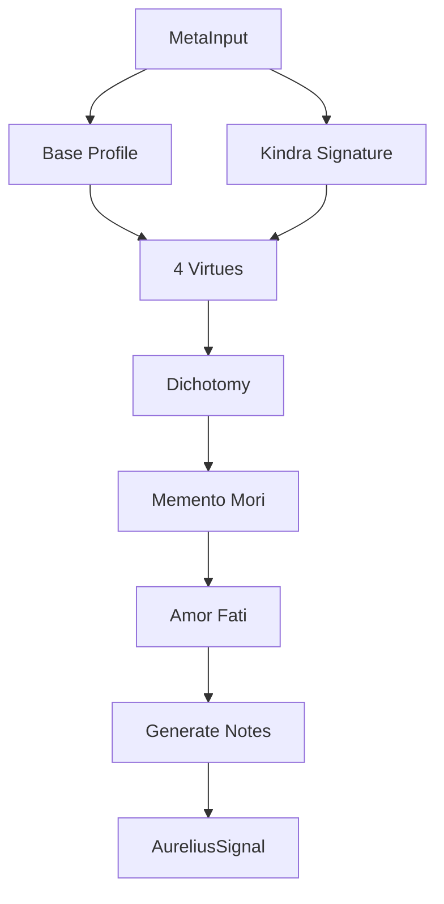

# 📦 Aurelius Engine Module

> **Module**: `AureliusEngine`  
> **Engine**: [[../ENGINE_OVERVIEW|Meta]]  
> **Path**: `src/meta/aurelius.py`  
> **Node ID**: `mod_aurelius`

---

## What It Is

The `AureliusEngine` provides Stoic philosophical analysis through 12 axes derived from Marcus Aurelius's Meditations and broader Stoic philosophy. It produces a 12-dimensional profile mapped to the 4 Cardinal Virtues.

The engine was designed to bring classical Stoic wisdom into modern symbolic analysis. Each of the 12 axes represents a key Stoic practice or principle that can be measured in text.

The 12 Stoic axes are: Perception Clarity, Assent to Reality, Right Action, Discipline of Will, Emotional Regulation, Desire Restraint, Control Dichotomy, Social Duty, Premeditatio Malorum, Fate Acceptance, Self-Mastery, and Serenity.

The 4 Cardinal Virtues (Wisdom, Courage, Justice, Temperance) are computed from combinations of the 12 axes, providing a high-level summary of Stoic alignment.

The engine integrates with Kindra 3×48 to extract semantic signals. Kindra vectors related to control, emotion, and acceptance influence the Stoic profile.

The engine integrates with TW369 to incorporate temporal dynamics. Drift and severity affect Stoic metrics like serenity and premeditatio malorum.

The dichotomy of control calculation determines focus on controllable vs. uncontrollable factors — a central Stoic concept.

Memento mori (mortality awareness) and amor fati (love of fate) are computed as specialized metrics.

Output is an `AureliusSignal` containing scores, dominant axes, virtue scores, severity, and notes.

The engine generates human-readable notes explaining the Stoic analysis.

---

## How It Works

### Step-by-Step Mechanics

1. **Receive Input**: MetaInput with text and context
2. **Calculate Base Profile**: Keyword-based 12-axis scoring
3. **Compute Kindra Signature**: Extract Stoic signals from 3×48
4. **Calculate Virtue Scores**: Derive 4 Cardinal Virtues
5. **Calculate Dichotomy**: Control vs. uncontrollable focus
6. **Calculate Memento Mori**: Mortality awareness
7. **Calculate Amor Fati**: Fate acceptance
8. **Generate Notes**: Human-readable explanation
9. **Return**: AureliusSignal

### Mermaid Diagram

---

## 12 Stoic Axes

| Axis | Description |
|------|-------------|
| Perception Clarity | Clear, unbiased perception |
| Assent to Reality | Accepting what is true |
| Right Action | Virtue-aligned behavior |
| Discipline of Will | Intentional choice |
| Emotional Regulation | Managing reactions |
| Desire Restraint | Limiting attachments |
| Control Dichotomy | Focus on controllables |
| Social Duty | Contribution to community |
| Premeditatio Malorum | Anticipating difficulties |
| Fate Acceptance | Embracing outcomes |
| Self-Mastery | Internal governance |
| Serenity | Inner peace |

---

## 4 Cardinal Virtues

| Virtue | Greek | Derived From |
|--------|-------|--------------|
| Wisdom | Sophia | Perception + Assent + Dichotomy |
| Courage | Andreia | Right Action + Will + Premeditatio |
| Justice | Dikaiosyne | Social Duty + Right Action |
| Temperance | Sophrosyne | Desire + Emotion + Serenity |

---

## With What It Works

### Dependencies

| Dependency | Type | Purpose |
|------------|------|---------|
| `KindraContext` | depends_on | Semantic signals |
| `TWState` | depends_on | Temporal context |
| `MetaSignal` | depends_on | Output format |

---

## Public Surface

| Item | Type | Description |
|------|------|-------------|
| `AureliusEngine` | class | Main engine |
| `AureliusSignal` | dataclass | Output signal |
| `AureliusProfile` | dataclass | 12-axis profile |
| `analyze(meta_input)` | method | Main analysis |

---

## Future Implementations

1. Multi-tradition Stoicism
2. Contemporary Stoic practices
3. Personalized Stoic coaching
4. Historical Stoic comparison

---

## Enhancements (Short/Medium Term)

1. Add virtue explanation
2. Improve axis scoring
3. Add visualization
4. Cache analysis

---

## Research Track (Long Term)

1. Stoic dialogue generation
2. Practice recommendations
3. Longitudinal tracking
4. Cross-philosophical comparison

---

## Known Limitations

1. Western Stoic focus
2. Keyword-based base
3. Fixed 12 axes
4. No personalization

---

## Testing

| Test File | Coverage | Notes |
|-----------|----------|-------|
| `tests/meta/` | ✅ Good | Part of 18 files |

---

## Next Steps

1. [ ] Add explanations
2. [ ] Improve keywords
3. [ ] Add visualization

---

## Related

- [[../ENGINE_OVERVIEW]]
- [[engine_router]]
- [[nietzsche]]
- [[campbell]]
