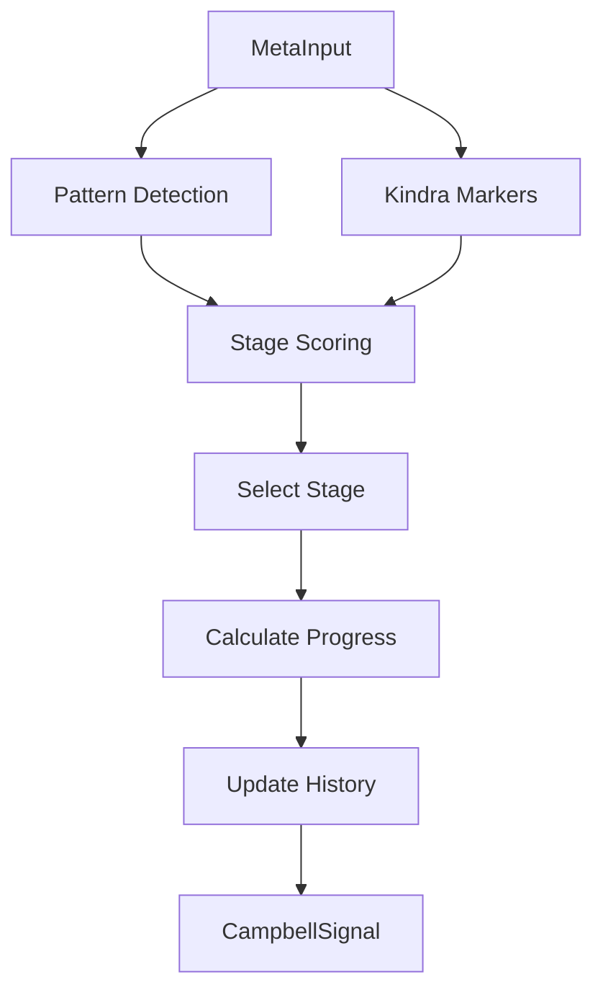

# 📦 Campbell Engine Module

> **Module**: `CampbellEngine`  
> **Engine**: [[../ENGINE_OVERVIEW|Meta]]  
> **Path**: `src/meta/campbell_engine.py`  
> **Node ID**: `mod_campbell`

---

## What It Is

The `CampbellEngine` implements Joseph Campbell's Hero's Journey framework for narrative arc detection. It tracks progression through the 12 stages of the monomyth, identifying where a narrative sits in the universal story structure.

The engine was designed to provide temporal narrative intelligence. While Delta144 captures the current state, Campbell reveals the journey — where we've been and where we're going.

The 12 stages form three acts: Departure (stages 1-5), Initiation (stages 6-9), and Return (stages 10-12). Each stage has characteristic features that can be detected in text.

Stage detection uses pattern matching for stage-specific language, combined with Kindra cultural vectors and TW369 temporal signals.

Confidence scoring indicates how certain the engine is about the current stage. Low confidence suggests transitional or ambiguous narrative position.

Arc progress is expressed as a percentage (0-100%) representing position in the complete journey.

Stage history tracking allows the engine to recognize patterns over time — forward progress, regression, or cycling.

The engine can detect multiple simultaneous arcs when text contains parallel narratives.

Integration with Story engine allows combining Campbell stages with motion vectors and inflection points.

The monomyth is cross-cultural — Campbell identified these patterns across world mythology. The engine applies this universal structure to any narrative.

Output includes current stage, confidence, progress, stage history, and interpretive notes.

---

## How It Works

### Step-by-Step Mechanics

1. **Receive Input**: MetaInput with text/history
2. **Detect Patterns**: Stage-specific language
3. **Analyze Kindra**: Cultural journey markers
4. **Check TW State**: Temporal positioning
5. **Score Stages**: Probability per stage
6. **Select Stage**: Highest confidence stage
7. **Calculate Progress**: Journey percentage
8. **Track History**: Update stage timeline
9. **Return**: CampbellSignal

### Mermaid Diagram

---

## The 12 Stages

### Act I: Departure

| Stage | Name | Description |
|-------|------|-------------|
| 1 | Ordinary World | Normal life before adventure |
| 2 | Call to Adventure | Invitation to journey |
| 3 | Refusal of the Call | Initial resistance |
| 4 | Meeting the Mentor | Finding guidance |
| 5 | Crossing the Threshold | Commitment to journey |

### Act II: Initiation

| Stage | Name | Description |
|-------|------|-------------|
| 6 | Tests, Allies, Enemies | Facing challenges |
| 7 | Approach to Inmost Cave | Preparing for ordeal |
| 8 | Ordeal | Supreme test |
| 9 | Reward | Gaining the prize |

### Act III: Return

| Stage | Name | Description |
|-------|------|-------------|
| 10 | The Road Back | Beginning return |
| 11 | Resurrection | Final test |
| 12 | Return with Elixir | Bringing wisdom home |

---

## With What It Works

### Dependencies

| Dependency | Type | Purpose |
|------------|------|---------|
| `KindraContext` | depends_on | Cultural markers |
| `TWState` | depends_on | Temporal position |
| `Story` | integrates_with | Arc tracking |

---

## Public Surface

| Item | Type | Description |
|------|------|-------------|
| `CampbellEngine` | class | Main engine |
| `analyze(meta_input)` | method | Main analysis |
| `get_arc_progress()` | method | Journey progress |

---

## Future Implementations

1. Multi-arc tracking
2. Branching narratives
3. Anti-hero journeys
4. Cultural variants

---

## Enhancements (Short/Medium Term)

1. Add stage explanations
2. Improve pattern matching
3. Add visualization
4. Track regressions

---

## Research Track (Long Term)

1. Predictive arc modeling
2. Genre-specific patterns
3. Cross-cultural variants
4. Generative storytelling

---

## Known Limitations

1. Western monomyth focus
2. Linear assumption
3. Pattern-based detection
4. Single arc default

---

## Testing

| Test File | Coverage | Notes |
|-----------|----------|-------|
| `tests/meta/` | ✅ Good | Part of 18 files |

---

## Next Steps

1. [ ] Add multi-arc
2. [ ] Improve patterns
3. [ ] Add visualization

---

## Related

- [[../ENGINE_OVERVIEW]]
- [[engine_router]]
- [[aurelius]]
- [[nietzsche]]
