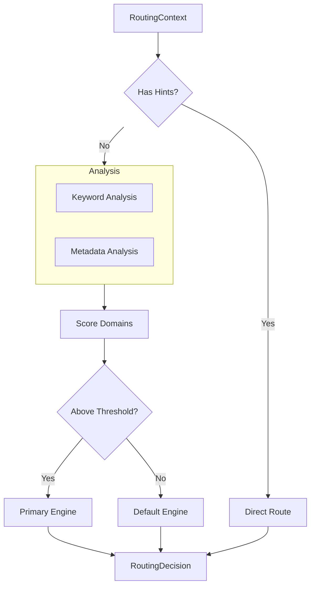

# 📦 Meta Engine Router Module

> **Module**: `MetaRouter`  
> **Engine**: [[../ENGINE_OVERVIEW|Meta]]  
> **Path**: `packages/engine/kaldra_engine/meta/engine_router.py`  
> **Node ID**: `mod_engine_router`

---

## What It Is

The `MetaRouter` is the context-based router that determines which philosophical engine variant to use for analysis. It analyzes input context and routes to the appropriate domain engine (alpha, geo, product, safeguard, or default).

The router was designed to handle the challenge of multi-domain analysis. Different contexts require different analytical lenses — financial analysis benefits from alpha engine tuning, geopolitical analysis from geo engine awareness, etc.

Routing decisions are based on three signals: keyword analysis, metadata inspection, and explicit domain hints. The router combines these signals to produce a confidence-scored routing decision.

Keyword analysis scans input text for domain-specific terms. Financial keywords (earnings, revenue, market, stock) increase alpha scores. Geopolitical keywords (diplomatic, treaty, sanction) increase geo scores. The router maintains keyword sets for each domain.

Metadata analysis looks for explicit domain markers in request metadata. Keys like "domain", "source", and "category" are inspected. A source of "earnings_call" routes to alpha; "diplomatic_statement" routes to geo.

Domain hints provide explicit routing. When the caller knows the domain, they can bypass heuristic routing by providing hints like ["finance", "earnings"].

The output is a `RoutingDecision` containing the primary engine, confidence score, secondary engines, and reasoning. This supports tiered routing where multiple engines may contribute.

Confidence thresholds determine when to use a specialized engine vs. default. Below the threshold, the default engine handles the request.

The router is stateless — each routing decision is independent. This enables parallel request handling without synchronization.

Secondary engines are identified when multiple domains show signal. The primary gets highest score; secondaries may be used for supplementary analysis.

Reasoning strings explain why a particular routing was chosen, supporting transparency and debugging.

---

## How It Works

### Step-by-Step Mechanics

1. **Receive Context**: Get RoutingContext with text/metadata/hints
2. **Check Hints**: If explicit hints, route directly
3. **Analyze Keywords**: Scan text for domain keywords
4. **Analyze Metadata**: Inspect metadata for domain markers
5. **Score Domains**: Compute scores for each domain
6. **Apply Threshold**: Check if any exceeds confidence threshold
7. **Make Decision**: Select primary and secondary engines
8. **Return**: RoutingDecision with reasoning

### Mermaid Diagram

---

## Domain Engines

| Domain | Engine Focus | Keywords |
|--------|--------------|----------|
| alpha | Financial | earnings, revenue, market, stock, profit |
| geo | Geopolitical | diplomatic, treaty, sanction, border, conflict |
| product | Product | product, feature, customer, user, feedback |
| safeguard | Safety | safety, risk, harm, threat, security |
| default | General | (fallback) |

---

## With What It Works

### Dependencies

| Dependency | Type | Purpose |
|------------|------|---------|
| `Aurelius` | routes_to | Stoic engine |
| `Nietzsche` | routes_to | Will-to-power |
| `Campbell` | routes_to | Hero's journey |

---

## Public Surface

| Item | Type | Description |
|------|------|-------------|
| `RoutingContext` | dataclass | Input context |
| `RoutingDecision` | dataclass | Output decision |
| `MetaRouter` | class | Main router |
| `route(context)` | method | Route request |

---

## Future Implementations

1. ML-based routing
2. Learned thresholds
3. Dynamic keywords
4. Multi-lingual routing

---

## Enhancements (Short/Medium Term)

1. Add routing metrics
2. Improve keyword sets
3. Add A/B testing
4. Cache routing decisions

---

## Research Track (Long Term)

1. Neural routing
2. Contextual embeddings
3. Federated routing
4. Real-time adaptation

---

## Known Limitations

1. Keyword-based heuristics
2. Fixed threshold
3. English-centric
4. No learning

---

## Testing

| Test File | Coverage | Notes |
|-----------|----------|-------|
| `tests/meta/` | ✅ Good | Part of 18 files |

---

## Next Steps

1. [ ] Add ML routing
2. [ ] Improve keywords
3. [ ] Add metrics

---

## Related

- [[../ENGINE_OVERVIEW]]
- [[aurelius]]
- [[nietzsche]]
- [[campbell]]
