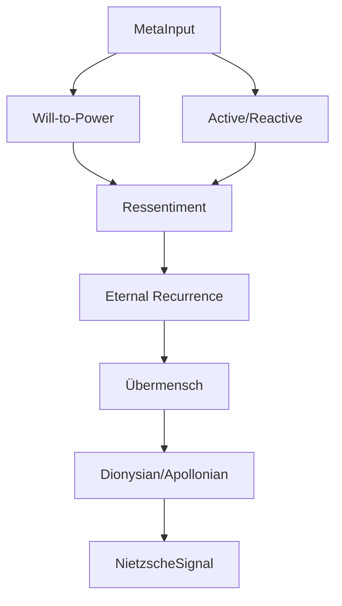

# 📦 Nietzsche Engine Module

> **Module**: `NietzscheEngine`  
> **Engine**: [[../ENGINE_OVERVIEW|Meta]]  
> **Path**: `packages/engine/kaldra_engine/meta/nietzsche.py`  
> **Node ID**: `mod_nietzsche`

---

## What It Is

The `NietzscheEngine` provides will-to-power analysis through Nietzschean philosophical categories. It examines power dynamics, creative destruction, active vs. reactive forces, and Übermensch potential in text.

The engine was designed to capture the dynamic, forceful aspects of narrative that Stoic analysis might miss. Where Aurelius seeks serenity, Nietzsche seeks power and affirmation.

Central to the analysis is the concept of will-to-power — not as domination, but as creative self-overcoming and life-affirmation. The engine scores how much a text expresses this drive.

Active vs. reactive forces are distinguished. Active forces create, affirm, and transform. Reactive forces negate, resist, and resent. The balance reveals the text's underlying dynamic.

Ressentiment detection identifies reactive emotions masquerading as morality — resentment, revenge, and slave morality patterns.

Eternal recurrence testing examines whether the text's stance could be affirmed infinitely — a key Nietzschean test of life-affirmation.

Übermensch potential measures self-overcoming, value creation, and transcendence of conventional morality.

Dionysian vs. Apollonian analysis examines the balance of chaotic/creative energy vs. ordered/structured form.

The engine integrates with Kindra to detect cultural power structures and with TW369 to incorporate temporal momentum.

Output includes power scores, force balance, ressentiment levels, and philosophical notes.

The analysis is intentionally challenging — Nietzsche provokes rather than comforts.

---

## How It Works

### Step-by-Step Mechanics

1. **Receive Input**: MetaInput with text
2. **Analyze Will-to-Power**: Score power affirmation
3. **Detect Forces**: Active vs. reactive balance
4. **Check Ressentiment**: Reactive emotion patterns
5. **Test Recurrence**: Life-affirmation potential
6. **Assess Übermensch**: Self-overcoming capacity
7. **Analyze Dionysian/Apollonian**: Energy balance
8. **Generate Notes**: Philosophical interpretation
9. **Return**: NietzscheSignal

### Mermaid Diagram

---

## Key Concepts

| Concept | Description | Score Range |
|---------|-------------|-------------|
| Will-to-Power | Creative self-overcoming | 0-1 |
| Active Forces | Creating, affirming | 0-1 |
| Reactive Forces | Negating, resenting | 0-1 |
| Ressentiment | Slave morality patterns | 0-1 |
| Recurrence | Life-affirmation test | 0-1 |
| Übermensch | Transcendence potential | 0-1 |

---

## With What It Works

### Dependencies

| Dependency | Type | Purpose |
|------------|------|---------|
| `KindraContext` | depends_on | Power dynamics |
| `TWState` | depends_on | Temporal momentum |

---

## Public Surface

| Item | Type | Description |
|------|------|-------------|
| `NietzscheEngine` | class | Main engine |
| `analyze(meta_input)` | method | Main analysis |

---

## Future Implementations

1. Genealogy of morals analysis
2. Tragedy detection
3. Amor fati integration
4. Zarathustra dialogue

---

## Enhancements (Short/Medium Term)

1. Add concept explanations
2. Improve ressentiment detection
3. Add visualization
4. Integrate with Aurelius

---

## Research Track (Long Term)

1. Nietzschean dialogue generation
2. Power dynamics mapping
3. Cross-philosopher comparison
4. Historical context

---

## Known Limitations

1. Provocative framework
2. Interpretation-heavy
3. Western philosophy focus
4. Potential misreadings

---

## Testing

| Test File | Coverage | Notes |
|-----------|----------|-------|
| `tests/meta/` | ✅ Good | Part of 18 files |

---

## Next Steps

1. [ ] Add explanations
2. [ ] Improve detection
3. [ ] Add caveats

---

## Related

- [[../ENGINE_OVERVIEW]]
- [[engine_router]]
- [[aurelius]]
- [[campbell]]
