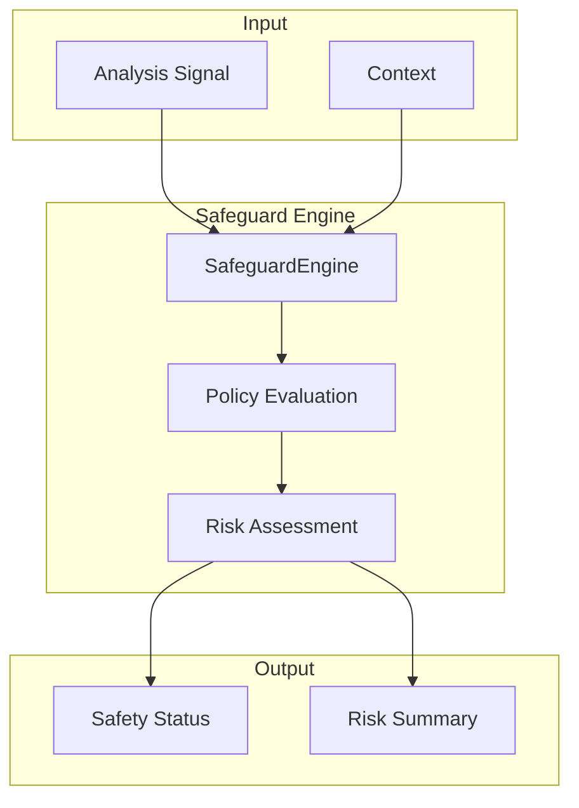

# ⚙️ Safeguard Engine Overview

> **Engine**: `Safeguard / SafeguardEngine`  
> **Path**: `src/safeguard/`  
> **Node ID**: `engine_safeguard`  
> **Status**: ✅ Active

---

## What It Is

The Safeguard engine provides **safety and risk mitigation** for KALDRA operations. It evaluates potential risks in analysis outputs and applies safety policies to ensure responsible AI behavior.

Components:
- **Safeguard Engine**: Main safety engine
- **Safeguard Policy**: Policy definitions
- **Safeguard Risk Model**: Risk assessment
- **Safeguard Integration**: Integration layer

---

## Repo Paths & Entry Points

| Component | Path | Description |
|-----------|------|-------------|
| Main Directory | `src/safeguard/` | All Safeguard code |
| Entry Point | `safeguard_engine.py` | `SafeguardEngine` class |
| Policy | `safeguard_policy.py` | Policy definitions |
| Risk Model | `safeguard_risk_model.py` | Risk assessment |
| Integration | `safeguard_integration.py` | Integration layer |

---

## Core Modules

| Module | Path | Purpose | Module Card |
|--------|------|---------|-------------|
| Safeguard Engine | `safeguard_engine.py` | Main engine | [[modules/safeguard_engine]] |
| Safeguard Policy | `safeguard_policy.py` | Policies | [[modules/safeguard_policy]] |
| Safeguard Risk Model | `safeguard_risk_model.py` | Risk | [[modules/safeguard_risk_model]] |

---

## Flow Diagram

---

## With What It Works

### Dependencies

| Dependency | Type | Relation |
|------------|------|----------|
| [[Core/ENGINE_OVERVIEW\|Core]] | Consumer | depends_on |
| [[UnifiedKernel/ENGINE_OVERVIEW\|Kernel]] | Registry | owned_by |
| [[Tau/ENGINE_OVERVIEW\|Tau]] | Epistemic | depends_on |

### Configurations

| Config | Path |
|--------|------|
| None | (inline) |

### Schemas

| Schema | Path | Files |
|--------|------|-------|
| Safeguard | `schema/safeguard/` | 0 ⚠️ Empty |

### Runtime

- **Environment Variables**: None
- **External Services**: None

---

## Safety Modes

| Mode | Description |
|------|-------------|
| `safety-first` | Strict safety checks, conservative outputs |
| `default` | Standard safety evaluation |
| `exploratory` | Relaxed safety for research |

---

## Module Cards

- [[modules/safeguard_engine|Safeguard Engine]]
- [[modules/safeguard_policy|Safeguard Policy]]
- [[modules/safeguard_risk_model|Safeguard Risk Model]]

---

## Future Implementations

1. ML-based risk detection
2. Content moderation integration
3. Real-time safety monitoring
4. Custom safety policies

---

## Enhancements (Short/Medium Term)

1. Add safeguard configuration schema
2. Improve risk scoring accuracy
3. Add safety explanations
4. Integrate with audit trail

---

## Research Track (Long Term)

1. Learned safety patterns
2. Adversarial robustness
3. Multi-stakeholder safety
4. Dynamic safety adaptation

---

## Known Limitations

1. ⚠️ **LOW TEST COVERAGE** — Only 2 test files
2. ⚠️ **MISSING SCHEMA** — `schema/safeguard/` is empty
3. Fixed safety policies
4. No confidence scoring

---

## Testing

| Test Directory | Files | Coverage |
|----------------|-------|----------|
| `tests/safeguard/` | 2 | ⚠️ LOW |

**Critical**: This engine is safety-critical but has minimal test coverage.

---

## Next Steps

1. [ ] **Add 8+ test files** (P0)
2. [ ] **Create safeguard schema** (P0)
3. [ ] Improve policy flexibility
4. [ ] Add safety auditing

---

## Related

- [[MOC_HOME]]
- [[SYSTEM_OVERVIEW]]
- [[TESTING_MAP]]
- [[Tau/ENGINE_OVERVIEW]]
