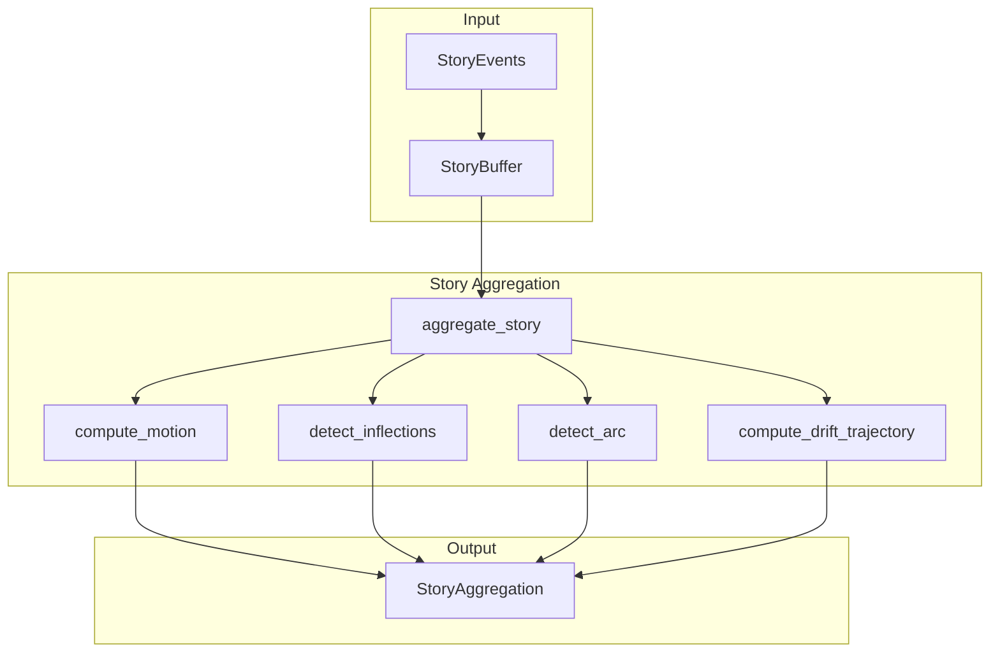

# ⚙️ Story Engine Overview

> **Engine**: `Story / StoryEngine`  
> **Path**: `src/story/`  
> **Node ID**: `engine_story`  
> **Status**: ✅ Active

---

## What It Is

The Story engine implements **temporal pattern detection** for narrative analysis. It aggregates events over time, detects motion vectors between states, identifies inflection points, and tracks arc progression through Campbell's hero's journey.

Outputs:
- **Motion Vectors**: Change between consecutive states
- **Inflection Points**: Significant trajectory changes
- **Arc Progression**: Campbell stage tracking
- **Drift Trajectory**: Temporal drift evolution

---

## Repo Paths & Entry Points

| Component | Path | Description |
|-----------|------|-------------|
| Main Directory | `src/story/` | All story engine code |
| Entry Point | `story_aggregator.py` | `aggregate_story()` function |
| Buffer | `story_buffer.py` | `StoryBuffer`, `StoryEvent` |
| Arc | `narrative_arc.py` | Arc detection |
| Detector | `arc_detector.py` | Arc detection class |
| Timeline | `archetypal_timeline.py` | Timeline tracking |
| Coherence | `coherence_scorer.py` | Narrative coherence |
| Multi-Stream | `multi_stream_buffer.py` | Multi-stream handling |
| Comparator | `stream_comparator.py` | Stream comparison |
| Builder | `timeline_builder.py` | Timeline construction |

---

## Core Modules

| Module | Path | Purpose | Module Card |
|--------|------|---------|-------------|
| Story Aggregator | `story_aggregator.py` | Main aggregation | [[modules/story_aggregator]] |
| Story Buffer | `story_buffer.py` | Event buffer | [[modules/story_buffer]] |
| Narrative Arc | `narrative_arc.py` | Arc detection | [[modules/narrative_arc]] |
| Arc Detector | `arc_detector.py` | Detection | [[modules/arc_detector]] |
| Coherence Scorer | `coherence_scorer.py` | Scoring | [[modules/coherence_scorer]] |

---

## Flow Diagram



---

## With What It Works

### Dependencies

| Dependency | Type | Relation |
|------------|------|----------|
| [[TW369/ENGINE_OVERVIEW\|TW369]] | Drift data | depends_on |
| [[Delta144/ENGINE_OVERVIEW\|Delta144]] | State transitions | depends_on |
| [[Meta/ENGINE_OVERVIEW\|Meta]] | Campbell stages | depends_on |

### Configurations

| Config | Path |
|--------|------|
| Story schemas | `schema/story/` |

### Schemas

| Schema | Path | Files |
|--------|------|-------|
| Story | `schema/story/` | 1 |

### Runtime

- **Environment Variables**: None
- **External Services**: None

---

## Key Data Classes

### MotionVector
```python
@dataclass
class MotionVector:
    from_event_id: str
    to_event_id: str
    time_delta: float
    delta12_shift_magnitude: float
    delta144_transition: Optional[Tuple[str, str]]
    drift_velocity: float
    drift_acceleration: float
    meta_deltas: Dict[str, float]
    polarity_deltas: Dict[str, float]
```

### InflectionPoint
```python
@dataclass
class InflectionPoint:
    event_id: str
    sequence_id: int
    timestamp: float
    inflection_type: str
    magnitude: float
    description: str
```

### ArcProgression
```python
@dataclass
class ArcProgression:
    current_stage: str
    stage_confidence: float
    arc_progress: float
    stage_history: List[Tuple[str, int]]
```

---

## Module Cards

- [[modules/story_aggregator|Story Aggregator]]
- [[modules/story_buffer|Story Buffer]]
- [[modules/narrative_arc|Narrative Arc]]
- [[modules/arc_detector|Arc Detector]]
- [[modules/coherence_scorer|Coherence Scorer]]

---

## Future Implementations

1. Real-time streaming aggregation
2. Multi-narrative tracking
3. Branching storylines
4. Predictive arc modeling

---

## Enhancements (Short/Medium Term)

1. Add inflection alerts
2. Implement arc visualization
3. Add narrative scoring API
4. Cache motion calculations

---

## Research Track (Long Term)

1. ML arc prediction
2. Cross-stream correlation
3. Narrative clustering
4. Temporal pattern learning

---

## Known Limitations

1. Single timeline only
2. No branching support
3. Fixed Campbell stages
4. Memory-limited buffer

---

## Testing

| Test Directory | Files | Coverage |
|----------------|-------|----------|
| `tests/story/` | 16 | ✅ Good |

---

## Next Steps

1. [ ] Add streaming mode
2. [ ] Implement arc alerts
3. [ ] Add timeline visualization

---

## Related

- [[MOC_HOME]]
- [[SYSTEM_OVERVIEW]]
- [[Meta/ENGINE_OVERVIEW]]
- [[TW369/ENGINE_OVERVIEW]]
