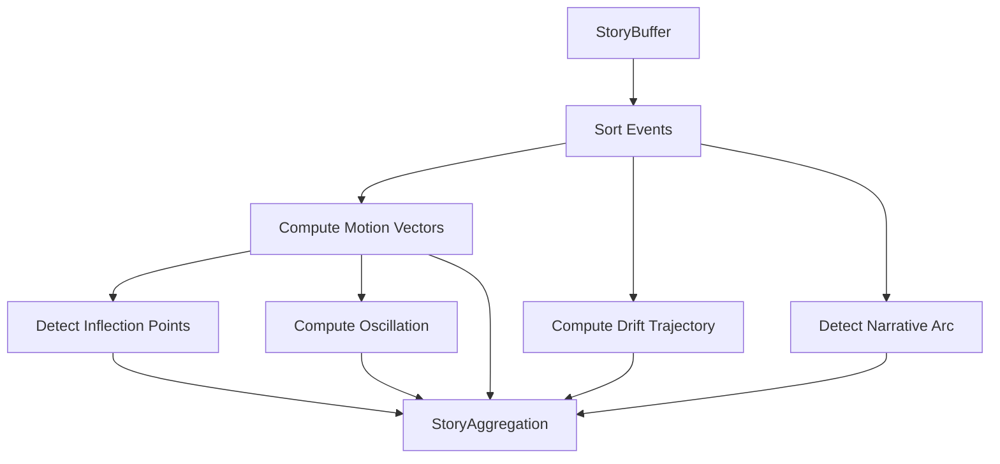

# 📦 Story Aggregator Module

> **Module**: `StoryAggregator`  
> **Engine**: [[../ENGINE_OVERVIEW|Story]]  
> **Path**: `src/story/story_aggregator.py`  
> **Node ID**: `mod_story_aggregator`

---

## What It Is

The `StoryAggregator` is the central processing unit of the Story engine. It is responsible for taking a sequence of raw events (from the `StoryBuffer`) and synthesizing them into a coherent narrative structure. It detects motion vectors, inflection points, and overall narrative progression.

The aggregator was designed to solve the problem of "temporal blindness" in static analysis. While other engines analyze a single moment, the aggregator looks at the change *between* moments. It calculates how the narrative state has shifted from event t-1 to event t.

It computes **motion vectors** which quantify the velocity and direction of narrative change. A motion vector includes the shift in Delta12 archetype weights, the transition in Delta144 states (if any), and the acceleration of drift.

**Inflection point detection** identifies moments where the narrative changes significant course. This uses a sliding window to detect spikes in the rate of change (second derivative of the state vector). These points often correspond to major plot twists or realization moments.

The aggregator integrates with the `NarrativeArc` detector (Campbell engine) to map the sequence of events onto the Hero's Journey. It tracks which stage of the monomyth the current sequence most closely resembles.

**Drift trajectory** computation maps the path of the narrative through the TW369 planes over time. This reveals whether the story is moving towards greater tension (Plane 6) or structural depth (Plane 9).

The module also computes a **narrative oscillation index**, which measures how much the story fluctuates between opposing polarities (e.g., Hope vs. Despair). high oscillation often indicates high dramatic tension.

The aggregator is stateless in execution — it takes a buffer as input and produces an aggregation object. This makes it deterministic and easy to test.

---

## How It Works

### Step-by-Step Mechanics

1. **Receive Buffer**: Input `StoryBuffer` containing ordered events
2. **Sort Events**: Ensure chronological order
3. **Compute Motion**: Calculate vectors between consecutive events
   - Delta12 shift magnitude
   - Delta144 state transitions
   - Drift velocity
4. **Detect Inflections**: Identify spikes in motion magnitude
5. **Detect Arc**: Map timeline to Campbell's stages using `ArcDetector`
6. **Compute Trajectory**: Trace TW369 plane values over time
7. **Calculate Oscillation**: Measure polarity variance
8. **Return**: `StoryAggregation` object with all metrics

### Mermaid Diagram

---

## With What It Works

### Dependencies

| Dependency | Type | Purpose |
|------------|------|---------|
| `StoryBuffer` | depends_on | Input data container |
| `ArcDetector` | depends_on | Campbell stage detection |
| `MotionVector` | depends_on | Data structure for change |

### Configurations

| Config | Path | Purpose |
|--------|------|---------|
| Thresholds | `schema/story/thresholds.json` | Inflection sensitivity |

---

## Public Surface

| Item | Type | Description |
|------|------|-------------|
| `StoryAggregator` | class | Main aggregator |
| `aggregate_story(buffer)` | method | Main processing function |
| `StoryAggregation` | dataclass | Output result |

---

## Future Implementations

1. Real-time streaming aggregation (windowed)
2. Multi-thread aggregation for long histories
3. Causal link detection between events

---

## Enhancements (Short/Medium Term)

1. Add semantic coherence checking
2. Improve inflection point precision
3. Visualization of motion vectors

---

## Research Track (Long Term)

1. Predictive narrative modeling
2. Auto-summarization of aggregations
3. Cross-story pattern matching

---

## Known Limitations

1. O(N) complexity with history length
2. Inflection detection is heuristic-based
3. Requires consistent embedding space

---

## Testing

| Test File | Coverage | Notes |
|-----------|----------|-------|
| `tests/story/test_aggregator.py` | ✅ Good | Part of 16 files |

---

## Next Steps

1. [ ] Implement partial/windowed aggregation
2. [ ] Add visualization export
3. [ ] Tune inflection thresholds

---

## Related

- [[../ENGINE_OVERVIEW]]
- [[story_buffer]]
- [[arc_detector]]
