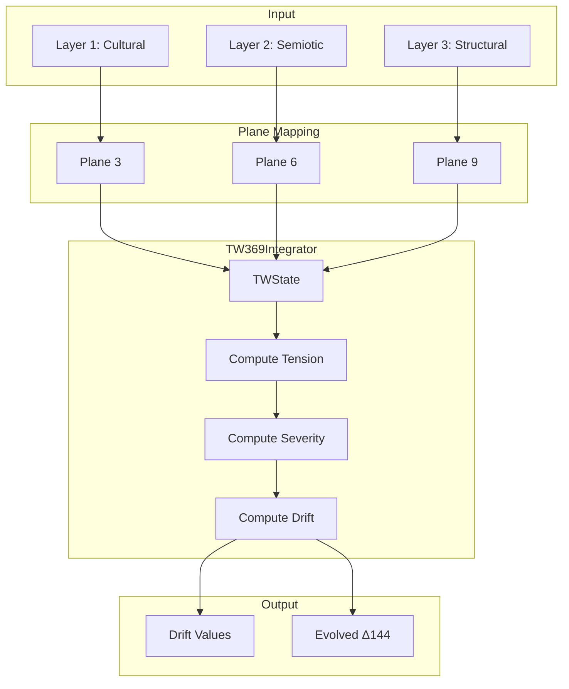

# ⚙️ TW369 Engine Overview

> **Engine**: `TW369 / TW369Integrator`  
> **Path**: `src/tw369/`  
> **Node ID**: `engine_tw369`  
> **Status**: ✅ Active

---

## What It Is

The TW369 engine implements the **Tracy-Widom statistical distribution** for drift calculation and temporal evolution. It integrates Kindra 3×48 layers into planes 3, 6, and 9, computing energy flow and narrative drift across time.

The engine:
1. Maps Kindra layers to TW planes (3=Cultural, 6=Semiotic, 9=Structural)
2. Computes tension gradients between planes
3. Calculates drift using Tracy-Widom severity factors
4. Evolves Δ144 distributions over time
5. Tracks drift history and topology

---

## Repo Paths & Entry Points

| Component | Path | Description |
|-----------|------|-------------|
| Main Directory | `src/tw369/` | All TW369 code |
| Entry Point | `tw369_integration.py` | `TW369Integrator`, `TWState` |
| Tracy-Widom | `tracy_widom.py` | TW statistics |
| Drift | `drift.py` | Drift calculation |
| History | `drift_history.py` | `DriftHistory` |
| Topology | `drift_topology.py` | `TW369Topology` |
| Memory | `drift_memory.py` | Drift memory |
| State | `drift_state.py` | State management |
| Advanced | `advanced_drift_models.py` | Models A/B/C/D |
| Mapping | `state_plane_mapping.py` | State→plane mapping |
| Regime | `regime_utils.py` | Regime detection |
| Painlevé | `painleve/` | Painlevé subdirectory |

---

## Core Modules

| Module | Path | Purpose | Module Card |
|--------|------|---------|-------------|
| Integrator | `tw369_integration.py` | Main integrator | [[modules/tw369_integrator]] |
| Tracy-Widom | `tracy_widom.py` | TW statistics | [[modules/tracy_widom]] |
| Drift Topology | `drift_topology.py` | Topological analysis | [[modules/drift_topology]] |
| Drift History | `drift_history.py` | History tracking | [[modules/drift_history]] |
| Advanced Models | `advanced_drift_models.py` | Drift models | [[modules/advanced_drift_models]] |

---

## Flow Diagram

---

## With What It Works

### Dependencies

| Dependency | Engine | Relation |
|------------|--------|----------|
| [[Kindra/ENGINE_OVERVIEW\|Kindra]] | Layer scores | feeds |
| [[Delta144/ENGINE_OVERVIEW\|Delta144]] | State distribution | modulates |

### Configurations

| Config | Path |
|--------|------|
| TW369 Config | `schema/tw369/tw369_default_config.json` |
| Drift Parameters | `schema/tw369/drift_parameters.json` |

### Schemas

| Schema | Path | Files |
|--------|------|-------|
| TW369 | `schema/tw369/` | 10 |

### Runtime

- **Environment Variables**: None specific
- **External Services**: None

---

## TW Planes

| Plane | Kindra Layer | Domain | Energy Flow |
|-------|--------------|--------|-------------|
| 3 | L1: Cultural/Macro | Material/Surface | Cultural forces |
| 6 | L2: Semiotic/Media | Relational/Tension | Symbolic tension |
| 9 | L3: Structural/Systemic | Abstract/Deep | Structural depth |

---

## Drift Dimensions

| Drift | Direction | Meaning |
|-------|-----------|---------|
| `plane3_to_6` | Surface → Tension | Cultural forces creating tension |
| `plane6_to_9` | Tension → Deep | Tension crystallizing into structure |
| `plane9_to_3` | Deep → Surface | Structural patterns emerging |

---

## Module Cards

- [[modules/tw369_integrator|TW369 Integrator]]
- [[modules/tracy_widom|Tracy-Widom]]
- [[modules/drift_topology|Drift Topology]]
- [[modules/drift_history|Drift History]]
- [[modules/advanced_drift_models|Advanced Drift Models]]
- [[modules/PAINLEVE_SUBSYSTEM|Painlevé Subsystem]]

---

## Future Implementations

1. Real-time drift streaming
2. Predictive drift modeling
3. Multiple drift regimes
4. 3D topology visualization

---

## Enhancements (Short/Medium Term)

1. Add drift alerts/thresholds
2. Implement drift caching
3. Add regime detection API
4. Improve severity calculation

---

## Research Track (Long Term)

1. Tracy-Widom extensions (TW-β)
2. Random matrix theory integration
3. Quantum drift modeling
4. Topological data analysis

---

## Known Limitations

1. Tracy-Widom approximation (not exact)
2. Drift history memory limits
3. Single time-step evolution
4. No real-time updates

---

## Testing

| Test Directory | Files | Coverage |
|----------------|-------|----------|
| `tests/tw369/` | 12 | ✅ Good |

---

## Next Steps

1. [ ] Improve TW accuracy
2. [ ] Add streaming drift
3. [ ] Implement regime alerts

---

## Related

- [[MOC_HOME]]
- [[SYSTEM_OVERVIEW]]
- [[Kindra/ENGINE_OVERVIEW]]
