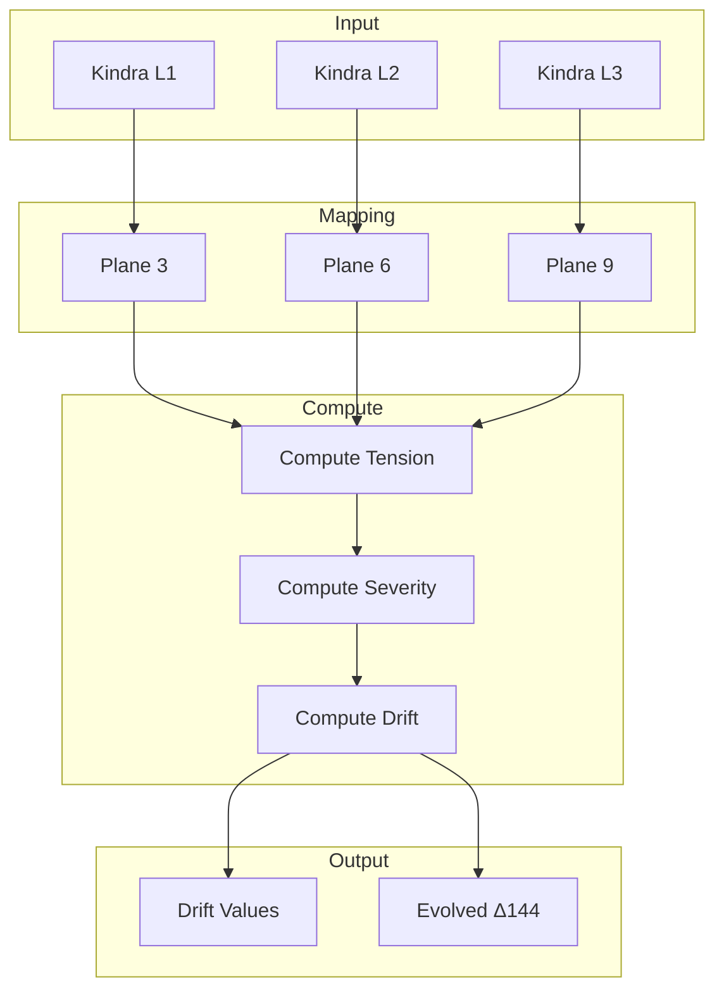

# 📦 TW369 Integrator Module

> **Module**: `TW369Integrator`  
> **Engine**: [[../ENGINE_OVERVIEW|TW369]]  
> **Path**: `packages/engine/kaldra_engine/tw369/tw369_integration.py`  
> **Node ID**: `mod_tw369_integrator`

---

## What It Is

The `TW369Integrator` is the core component of the TW369 engine, responsible for integrating Kindra 3×48 layers into the Tracy-Widom temporal evolution system. It maps semantic/cultural scores to three planes (3, 6, 9) and computes drift dynamics.

The integrator was designed around a key mathematical insight: the Tracy-Widom distribution, originally from random matrix theory, provides a natural framework for modeling phase transitions in complex systems. The three planes correspond to different "energy levels" of narrative/symbolic content.

Plane 3 represents the **cultural/surface** layer — immediate, material, and cultural forces acting on the narrative. This maps to Kindra Layer 1 (Cultural/Macro). Scores in this plane reflect surface-level cultural dynamics.

Plane 6 represents the **semiotic/tension** layer — symbolic tension, mediation, and relational dynamics. This maps to Kindra Layer 2 (Semiotic/Media). Elevated plane 6 scores indicate narrative tension building.

Plane 9 represents the **structural/depth** layer — deep structural forces, systemic patterns, and archetypal foundations. This maps to Kindra Layer 3 (Structural/Systemic). High plane 9 values signal fundamental shifts.

The integrator computes **drift** — the flow of energy between planes. Drift dimensions (`plane3_to_6`, `plane6_to_9`, `plane9_to_3`) capture how narrative energy moves through the system over time.

**Severity factors** are computed using Tracy-Widom statistics. When the system approaches critical thresholds (eigenvalue edge distributions), severity increases, signaling potential phase transitions.

The integrator supports multiple drift models: linear (model A), nonlinear (model B), multiscale (model C), and stochastic (model D). These can be configured at runtime via JSON configuration.

State modulation allows external polarity scores to influence plane values, creating feedback loops between archetypal analysis and temporal dynamics.

The `evolve()` method applies drift incrementally, updating Δ144 distributions based on which plane each archetype belongs to. This creates a temporal evolution of the archetypal landscape.

Configuration is loaded from `schema/tw369/tw369_default_config.json` and validated against a JSON schema. Drift parameters come from `schema/tw369/drift_parameters.json`.

---

## How It Works

### Step-by-Step Mechanics

1. **Create State**: Map Kindra layer scores to `TWState` with planes 3/6/9
2. **Compute Tension**: Calculate tension levels per plane from score magnitude/variance
3. **Compute Severity**: Apply Tracy-Widom statistics for global severity factor
4. **Select Drift Model**: Choose drift calculation method (A/B/C/D)
5. **Compute Drift**: Calculate energy flow between planes
6. **Apply Modifiers**: Integrate tau modifiers if provided
7. **Evolve Distribution**: Update Δ144 probs based on drift
8. **Track History**: Store drift values in history buffer
9. **Return**: Drift state and evolved distribution

### Mermaid Diagram



---

## With What It Works

### Dependencies

| Dependency | Type | Purpose |
|------------|------|---------|
| `tracy_widom.py` | depends_on | TW statistics |
| `advanced_drift_models.py` | depends_on | Drift models |
| `drift_history.py` | depends_on | History tracking |
| `drift_topology.py` | depends_on | Topological analysis |

### Configurations

| Config | Path | Purpose |
|--------|------|---------|
| TW Config | `schema/tw369/tw369_default_config.json` | Engine config |
| Drift Params | `schema/tw369/drift_parameters.json` | Drift tuning |

### Schemas

| Schema | Path | Purpose |
|--------|------|---------|
| Config Schema | `schema/tw369/tw369_config_schema.json` | Validation |

---

## Connections

### Graph Relations

```csv
from,relation,to,notes
mod_tw369_integrator,depends_on,mod_tracy_widom,Uses TW statistics
mod_tw369_integrator,depends_on,mod_advanced_drift_models,Uses drift models
mod_tw369_integrator,reads_from,schema_tw369_config,Loads configuration
mod_tw369_integrator,reads_from,schema_tw369_drift_params,Loads drift params
engine_kindra,feeds,mod_tw369_integrator,Provides layer scores
```

---

## Public Surface

| Item | Type | Description |
|------|------|-------------|
| `TWState` | dataclass | State representation |
| `TW369Integrator` | class | Main integrator |
| `create_state(layer1, layer2, layer3, metadata)` | method | Create TWState |
| `compute_drift(tw_state, tau_modifiers)` | method | Calculate drift |
| `modulate_state(tw_state, polarity_scores, intensity)` | method | Apply modulation |
| `evolve(tw_state, delta144_dist, time_steps, step_size)` | method | Evolve distribution |
| `load_config(path)` | method | Load configuration |

---

## Future Implementations

1. Real-time drift streaming
2. Predictive drift modeling
3. Multiple drift regimes
4. 3D topology visualization

---

## Enhancements (Short/Medium Term)

1. Add drift alerts/thresholds
2. Implement drift caching
3. Add regime detection API
4. Improve severity calculation

---

## Research Track (Long Term)

1. Tracy-Widom extensions (TW-β)
2. Random matrix theory integration
3. Quantum drift modeling
4. Topological data analysis

---

## Known Limitations

1. Tracy-Widom approximation (not exact)
2. Drift history memory limits
3. Single time-step evolution
4. No real-time updates

---

## Testing

| Test File | Coverage | Notes |
|-----------|----------|-------|
| `tests/tw369/` | ✅ Good | 12 files |

---

## Next Steps

1. [ ] Improve TW accuracy
2. [ ] Add streaming drift
3. [ ] Implement regime alerts

---

## Related

- [[../ENGINE_OVERVIEW]]
- [[tracy_widom]]
- [[drift_topology]]
