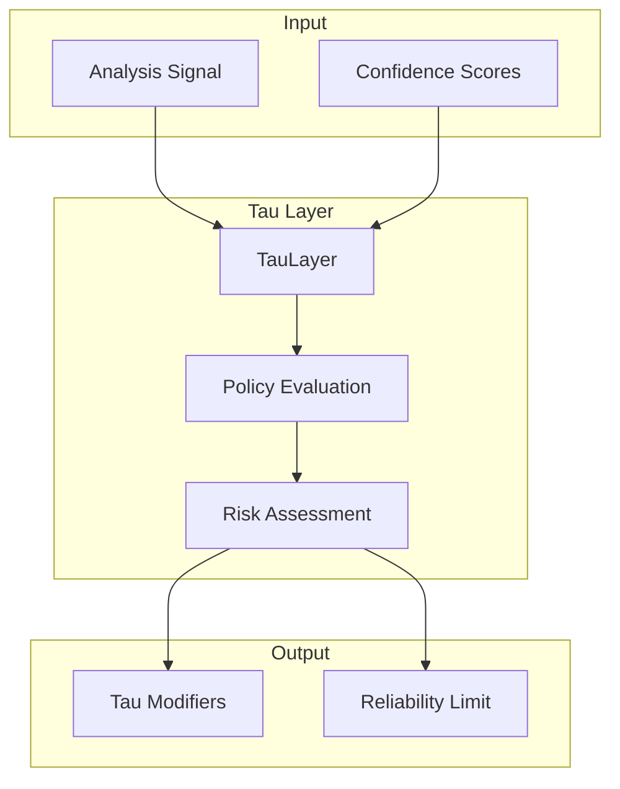

# ⚙️ Tau Engine Overview

> **Engine**: `Tau / TauLayer`  
> **Path**: `packages/engine/kaldra_engine/tau/`  
> **Node ID**: `engine_tau`  
> **Status**: ✅ Active

---

## What It Is

The Tau engine implements the **epistemic reliability limiter** — a system that constrains outputs based on confidence and reliability thresholds. It modulates the system's certainty and prevents overconfident outputs.

Components:
- **Tau Layer**: Main epistemic layer
- **Tau Policy**: Policy definitions
- **Tau Risk Model**: Risk assessment
- **Tau State**: State management

---

## Repo Paths & Entry Points

| Component | Path | Description |
|-----------|------|-------------|
| Main Directory | `packages/engine/kaldra_engine/tau/` | All Tau code |
| Entry Point | `tau_layer.py` | `TauLayer` class |
| Integration | `tau_integration.py` | Integration layer |
| Policy | `tau_policy.py` | Policy definitions |
| Risk Model | `tau_risk_model.py` | Risk modeling |
| State | `tau_state.py` | State management |

---

## Core Modules

| Module | Path | Purpose | Module Card |
|--------|------|---------|-------------|
| Tau Layer | `tau_layer.py` | Main layer | [[modules/tau_layer]] |
| Tau Policy | `tau_policy.py` | Policies | [[modules/tau_policy]] |
| Tau Risk Model | `tau_risk_model.py` | Risk | [[modules/tau_risk_model]] |

---

## Flow Diagram

---

## With What It Works

### Dependencies

| Dependency | Type | Relation |
|------------|------|----------|
| [[Core/ENGINE_OVERVIEW\|Core]] | Consumer | depends_on |
| [[UnifiedKernel/ENGINE_OVERVIEW\|Kernel]] | Registry | owned_by |

### Configurations

| Config | Path |
|--------|------|
| None | (inline) |

### Schemas

| Schema | Path | Files |
|--------|------|-------|
| Tau | `schema/tau/` | 0 ⚠️ Empty |

### Runtime

- **Environment Variables**: None
- **External Services**: None

---

## Module Cards

- [[modules/tau_layer|Tau Layer]]
- [[modules/tau_policy|Tau Policy]]
- [[modules/tau_risk_model|Tau Risk Model]]

---

## Future Implementations

1. Adaptive tau thresholds
2. Context-aware reliability
3. Tau learning from feedback
4. Multi-domain tau policies

---

## Enhancements (Short/Medium Term)

1. Add tau configuration schema
2. Improve risk modeling
3. Add tau explanations
4. Integrate with metrics

---

## Research Track (Long Term)

1. ML-based tau optimization
2. Bayesian reliability estimation
3. Temporal tau evolution
4. Cross-system tau sharing

---

## Known Limitations

1. ⚠️ **LOW TEST COVERAGE** — Only 2 test files
2. ⚠️ **MISSING SCHEMA** — `schema/tau/` is empty
3. Fixed tau policies
4. No adaptive thresholds

---

## Testing

| Test Directory | Files | Coverage |
|----------------|-------|----------|
| `tests/tau/` | 2 | ⚠️ LOW |

**Critical**: This engine needs significantly more test coverage and schema definition.

---

## Next Steps

1. [ ] **Add 8+ test files** (P0)
2. [ ] **Create tau schema** (P0)
3. [ ] Improve policy flexibility

---

## Related

- [[MOC_HOME]]
- [[SYSTEM_OVERVIEW]]
- [[TESTING_MAP]]
- [[Safeguard/ENGINE_OVERVIEW]]
