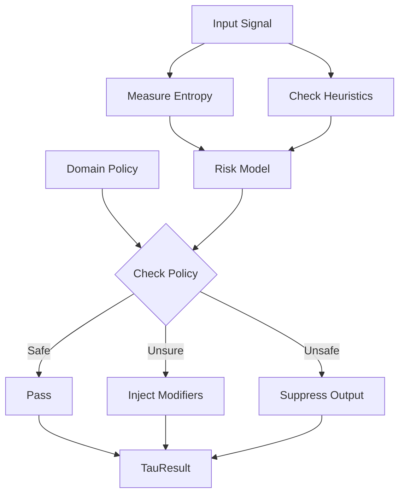

# 📦 Tau Layer Module

> **Module**: `TauLayer`  
> **Engine**: [[../ENGINE_OVERVIEW|Tau]]  
> **Path**: `src/tau/tau_layer.py`  
> **Node ID**: `mod_tau_layer`

---

## What It Is

The `TauLayer` implements the **Epistemic Reliability Limiter** (symbol: τ). In control theory, tau often represents a time constant or delay; here, it represents the "epistemic friction" required to prevent hallucination and overconfidence.

The Tau Layer's primary job is to **bound the system's certainty**. It calculates a "reliability score" (0.0 to 1.0) for the current analysis context. If reliable information is scarce, Tau suppresses high-confidence assertions from other engines.

It introduces **modifiers** to the `Delta144` engine. For example, if the system analysis is high-entropy (confused), Tau injects a "UNCERTAINTY" or "OBSCURED" modifier, forcing the archetype engine to output a more ambiguous state.

The layer operates on **Epistemic Policies**. These policies define acceptable risk levels for different domains. A "Medical" domain policy would have a very high Tau threshold (requires deep certainty), while "Creative Writing" would have a low one.

It calculates **Information Density**. Using Shannon entropy measures on the attention weights and probability distributions of the core engine, it estimates how much "real information" is present vs. noise.

The Tau Layer is the "conscience" of the system. While the `Bias` engine looks for harm, and `Safeguard` looks for danger, `Tau` looks for *truthfulness* and *justification*.

Output is a `TauResult` containing the `reliability_score`, `active_modifiers`, `suppression_mask` (which outputs to hide), and `warnings`.

---

## How It Works

### Step-by-Step Mechanics

1. **Receive Signal**: Input `KaldraSignal` (pre-final) + Context
2. **Measure Entropy**: Calculate entropy of distribution
3. **Check Heuristics**: Look for known hallucination patterns
4. **Evaluate Justification**: Does the text support the conclusion?
5. **Compute Score**: `reliability = 1.0 - (risk * uncertainty)`
6. **Apply Policy**: Compare against domain threshold
7. **Generate Modifiers**: Create Delta144 modifiers
8. **Return**: `TauResult`

### Mermaid Diagram

---

## With What It Works

### Dependencies

| Dependency | Type | Purpose |
|------------|------|---------|
| `tau_policy.py` | uses | Policy definitions |
| `tau_risk_model.py` | uses | Math for risk |

### Configurations

| Config | Path | Purpose |
|--------|------|---------|
| (Empty) | `schema/tau/` | ⚠️ Needs schema |

---

## Public Surface

| Item | Type | Description |
|------|------|-------------|
| `TauLayer` | class | Main class |
| `assess_reliability(signal)` | method | Main check |
| `get_modifiers(reliability)` | method | Get Delta adjustments |

---

## Future Implementations

1. Bayesian Truth Serum integration
2. Consensus checking (multi-model agreement)
3. Source citation verification

---

## Enhancements (Short/Medium Term)

1. **Add Configuration Schema** (Critical)
2. Better visualization of "why is this uncertain?"
3. Dynamic policy loading

---

## Research Track (Long Term)

1. Epistemic logic programming
2. Automated fact-checking
3. uncertainty quantification in LLMs

---

## Known Limitations

1. **Low Test Coverage**
2. **Missing Schema**: Hardcoded policies currently
3. Entropy is a proxy, not truth

---

## Testing

| Test File | Coverage | Notes |
|-----------|----------|-------|
| `tests/tau/` | ⚠️ Low | Critical gap |

---

## Next Steps

1. [ ] **Create Schema**
2. [ ] Write tests
3. [ ] Implement entropy metric

---

## Related

- [[../ENGINE_OVERVIEW]]
- [[../Safeguard/ENGINE_OVERVIEW]]
