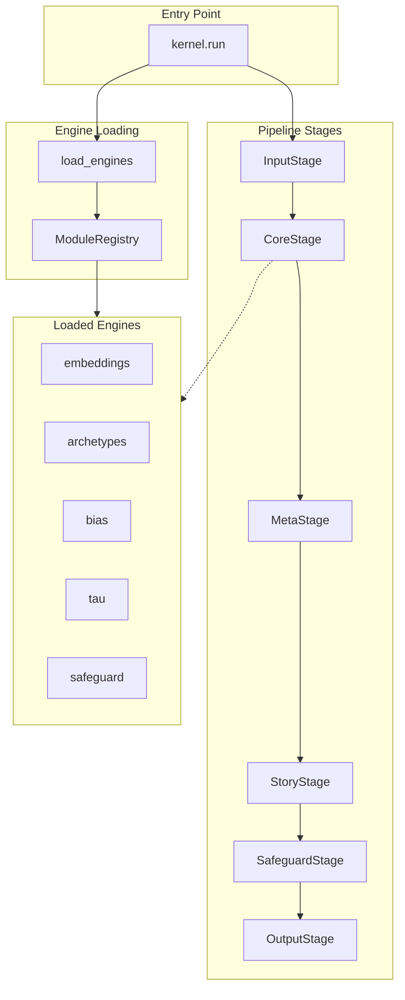

# ⚙️ UnifiedKernel Engine Overview

> **Engine**: `UnifiedKernel`  
> **Path**: `packages/engine/kaldra_engine/unification/`  
> **Node ID**: `engine_unified_kernel`  
> **Status**: ✅ Active

---

## What It Is

The UnifiedKernel is the **v3.0 entry point** for all KALDRA operations. It serves as the central orchestration layer that loads all v2.9 engines, provides a single unified interface, and maintains backward compatibility.

The kernel is designed to:
1. Load all processing engines into a registry
2. Provide a single `run()` method for all analysis modes
3. Orchestrate multi-stage pipelines
4. Handle errors gracefully with fallbacks

---

## Repo Paths & Entry Points

| Component | Path | Description |
|-----------|------|-------------|
| Main Directory | `packages/engine/kaldra_engine/unification/` | All kernel code |
| Entry Point | `kernel.py` | `UnifiedKernel` class |
| Registry | `registry.py` | `ModuleRegistry` |
| Orchestrator | `orchestrator.py` | `PipelineOrchestrator` |
| Router | `router.py` | Mode routing |
| Pipeline | `pipeline/` | Stage implementations |
| States | `states/` | State definitions |
| Exoskeleton | `exoskeleton/` | Presets and profiles |
| Adapters | `adapters/` | I/O adapters |
| Output | `output/` | Output formatters |

---

## Core Modules

| Module | Path | Purpose | Module Card |
|--------|------|---------|-------------|
| Kernel | `kernel.py` | Main entry point | [[modules/kernel]] |
| Registry | `registry.py` | Module registration | [[modules/registry]] |
| Orchestrator | `orchestrator.py` | Pipeline execution | [[modules/orchestrator]] |
| Input Stage | `pipeline/input_stage.py` | Input processing | [[modules/input_stage]] |
| Core Stage | `pipeline/core_stage.py` | Core engine call | [[modules/core_stage]] |
| Meta Stage | `pipeline/meta_stage.py` | Meta engines call | [[modules/meta_stage]] |
| Story Stage | `pipeline/story_stage.py` | Story analysis | [[modules/story_stage]] |
| Safeguard Stage | `pipeline/safeguard_stage.py` | Safety checks | [[modules/safeguard_stage]] |
| Output Stage | `pipeline/output_stage.py` | Output formatting | [[modules/output_stage]] |

---

## Flow Diagram

---

## With What It Works

### Dependencies

| Dependency | Engine | Relation |
|------------|--------|----------|
| [[Core/ENGINE_OVERVIEW\|Core]] | EmbeddingGenerator | depends_on |
| [[Delta144/ENGINE_OVERVIEW\|Delta144]] | Delta144Engine | depends_on |
| [[Bias/ENGINE_OVERVIEW\|Bias]] | BiasDetector | depends_on |
| [[Tau/ENGINE_OVERVIEW\|Tau]] | TauLayer | depends_on |
| [[Safeguard/ENGINE_OVERVIEW\|Safeguard]] | SafeguardEngine | depends_on |

### Configurations

| Config | Path |
|--------|------|
| Presets | `exoskeleton/presets.py` |
| Profiles | `exoskeleton/profiles.py` |

### Schemas

| Schema | Path |
|--------|------|
| Unified | `schema/unified/` (8 files) |

### Runtime

- **Environment Variables**: `KALDRA_EMBEDDINGS_MODE`, `KALDRA_EMBEDDINGS_API_KEY`, `KALDRA_EMBEDDINGS_MODEL`
- **External Services**: OpenAI API (for embeddings)

---

## Execution Modes

| Mode | Description |
|------|-------------|
| `signal` | Fast, core pipeline only |
| `story` | Full temporal analysis |
| `full` | Complete analysis (default) |
| `safety-first` | Strict safety checks |
| `exploratory` | Maximum depth |

---

## Module Cards

- [[modules/kernel|Kernel]]
- [[modules/registry|Registry]]
- [[modules/orchestrator|Orchestrator]]
- [[modules/input_stage|Input Stage]]
- [[modules/core_stage|Core Stage]]
- [[modules/meta_stage|Meta Stage]]
- [[modules/story_stage|Story Stage]]
- [[modules/safeguard_stage|Safeguard Stage]]
- [[modules/output_stage|Output Stage]]

---

## Future Implementations

1. Hot-reloadable engine registry
2. Dynamic mode composition
3. Distributed pipeline execution
4. Plugin architecture for external engines

---

## Enhancements (Short/Medium Term)

1. Add metrics collection per stage
2. Implement circuit breakers
3. Add async pipeline execution
4. Cache pipeline results

---

## Research Track (Long Term)

1. ML-based mode selection
2. Auto-optimization of stage order
3. Serverless stage execution
4. Multi-tenant isolation

---

## Known Limitations

1. Synchronous execution only
2. All engines loaded at startup (no lazy loading)
3. Single orchestrator instance
4. No streaming output

---

## Testing

| Test Directory | Files | Coverage |
|----------------|-------|----------|
| `tests/unification/` | 34 | ✅ Excellent |

---

## Next Steps

1. [ ] Add lazy engine loading
2. [ ] Implement streaming output
3. [ ] Add telemetry per stage

---

## Related

- [[MOC_HOME]]
- [[SYSTEM_OVERVIEW]]
- [[Core/ENGINE_OVERVIEW]]
