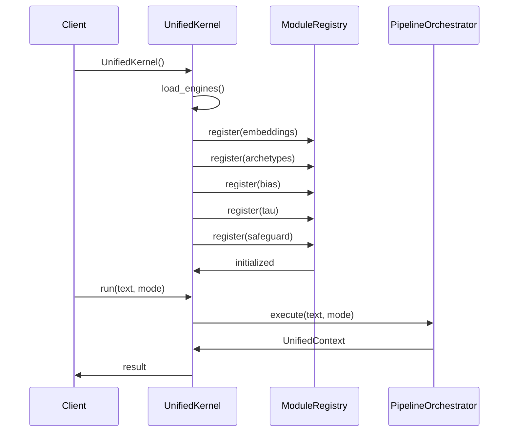

# 📦 Kernel Module

> **Module**: `UnifiedKernel`  
> **Engine**: [[../ENGINE_OVERVIEW|UnifiedKernel]]  
> **Path**: `packages/engine/kaldra_engine/unification/kernel.py`  
> **Node ID**: `mod_unified_kernel`

---

## What It Is

The `UnifiedKernel` class is the central entry point for all KALDRA v3.0 operations. It serves as the unifying layer that brings together all v2.9 engines under a single, coherent interface.

The kernel was designed with several key principles in mind. First, **unified access** — instead of requiring users to understand the intricate relationships between engines, the kernel provides a single `run()` method that handles all orchestration internally. This dramatically simplifies the API surface for consumers.

Second, **automatic engine loading** — the kernel uses a `ModuleRegistry` to track all available engines. When initialized with `auto_load=True` (the default), it automatically instantiates and registers all v2.9 engines: embeddings, archetypes, bias, tau, and safeguard.

Third, **mode-based execution** — the kernel supports five execution modes (`signal`, `story`, `full`, `safety-first`, `exploratory`), each optimized for different use cases. The mode determines which pipeline stages execute and how aggressively safety checks are applied.

Fourth, **backward compatibility** — while introducing the v3.0 unified interface, the kernel maintains full compatibility with v2.9 engines. Each engine is loaded with its original version number and can be accessed individually via `get_module()`.

Fifth, **graceful error handling** — the kernel wraps engine initialization and execution in try/catch blocks, logging errors and raising informative exceptions when something goes wrong.

The kernel follows a lazy evaluation pattern for the orchestrator. Rather than creating the `PipelineOrchestrator` at initialization time, it creates it on first use within the `run()` method. This reduces startup time when the kernel is created but not immediately used.

The registry is marked as "initialized" after all engines are loaded, preventing duplicate registrations if `load_engines()` is called multiple times. This protects against accidental re-initialization.

Each registered engine includes metadata: a version string and a description. This metadata is used for logging, monitoring, and introspection, making it easier to understand which versions are active at runtime.

The kernel is designed to be testable. The optional `registry` parameter in `__init__` allows tests to inject a mock registry, making it possible to test the kernel in isolation from actual engine implementations.

---

## How It Works

### Step-by-Step Mechanics

1. **Initialization**: Create `UnifiedKernel(auto_load=True)` → invokes `load_engines()`
2. **Load Engines**: Instantiate each v2.9 engine and register with `ModuleRegistry`
3. **Run Request**: Call `kernel.run(text, mode="full")` → validate mode
4. **Create Orchestrator**: Lazy-create `PipelineOrchestrator` if not exists
5. **Execute Pipeline**: Orchestrator runs stages based on mode
6. **Return Result**: `UnifiedContext` with complete analysis

### Mermaid Diagram



---

## With What It Works

### Dependencies

| Dependency | Type | Purpose |
|------------|------|---------|
| `ModuleRegistry` | depends_on | Engine registration |
| `PipelineOrchestrator` | depends_on | Pipeline execution |
| `EmbeddingGenerator` | depends_on | Semantic embeddings |
| `Delta144Engine` | depends_on | Archetype analysis |
| `BiasDetector` | depends_on | Bias detection |
| `TauLayer` | depends_on | Epistemic limits |
| `SafeguardEngine` | depends_on | Safety checks |

### Configurations

| Config | Path | Purpose |
|--------|------|---------|
| Embedding Config | `EmbeddingConfig` | Embedding settings |

### Runtime

- **Environment Variables**: `KALDRA_EMBEDDINGS_MODE`, `KALDRA_EMBEDDINGS_API_KEY`, `KALDRA_EMBEDDINGS_MODEL`
- **External Services**: OpenAI API (for embeddings)

---

## Connections

### Graph Relations

```csv
from,relation,to,notes
mod_unified_kernel,depends_on,mod_registry,Uses ModuleRegistry
mod_unified_kernel,depends_on,mod_orchestrator,Creates PipelineOrchestrator
mod_unified_kernel,depends_on,mod_embedding_generator,Loads EmbeddingGenerator
mod_unified_kernel,depends_on,mod_delta144_engine,Loads Delta144Engine
mod_unified_kernel,depends_on,mod_bias_detector,Loads BiasDetector
mod_unified_kernel,depends_on,mod_tau_layer,Loads TauLayer
mod_unified_kernel,depends_on,mod_safeguard_engine,Loads SafeguardEngine
```

### Obsidian Links

- Depends on: [[registry]], [[orchestrator]]
- Owns: [[input_stage]], [[core_stage]], [[meta_stage]], [[story_stage]], [[safeguard_stage]], [[output_stage]]

---

## Public Surface

| Item | Type | Description |
|------|------|-------------|
| `UnifiedKernel` | class | Main kernel class |
| `__init__(registry, auto_load)` | method | Initialize kernel |
| `load_engines()` | method | Load all v2.9 engines |
| `run(input_text, mode, context)` | method | Execute analysis |
| `get_module(name)` | method | Get registered module |
| `list_modules()` | method | List all modules |

---

## Future Implementations

1. Hot-reload engine support
2. Plugin architecture for external engines
3. Distributed kernel execution
4. Multi-tenant isolation

---

## Enhancements (Short/Medium Term)

1. Add kernel-level caching
2. Implement circuit breakers
3. Add execution metrics
4. Support async execution

---

## Research Track (Long Term)

1. Self-optimizing mode selection
2. Adaptive engine loading
3. Federated kernel instances
4. Real-time engine updates

---

## Known Limitations

1. All engines loaded at startup (no lazy loading)
2. Synchronous execution only
3. Single orchestrator instance
4. No streaming output

---

## Testing

| Test File | Coverage | Notes |
|-----------|----------|-------|
| `tests/unification/` | ✅ Good | 34 test files |

---

## Next Steps

1. [ ] Add lazy engine loading
2. [ ] Implement async run
3. [ ] Add kernel metrics

---

## Related

- [[../ENGINE_OVERVIEW]]
- [[registry]]
- [[orchestrator]]
- [[../../Core/ENGINE_OVERVIEW|Core Engine]]
